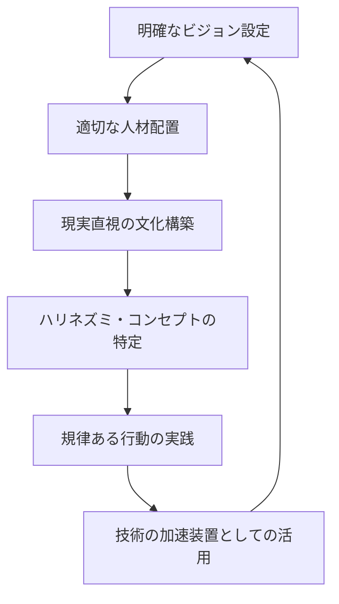

# 3賢者と学ぶPMBOK～3人よれば文殊のマネジメント～

## はじめに

本書は、世界的な経営思想家であるピーター・ドラッカー、ジム・コリンズ、大前研一という3人の賢者が架空の対談を通じてPMBOK（プロジェクトマネジメント知識体系）について語り合うという設定で構成されています。

これはあくまでも架空の対談であり、3人の発言はそれぞれの著作や講演から推測される考え方に基づいて再現しています。実際の発言や見解とは異なる可能性がありますので、あらかじめご了承ください。

この架空の対談を通じて、プロジェクトマネジメントの基礎から応用まで、3人の独自の視点から学ぶことができます。マネジメントを学び始めた方から、さらに深く理解したい方まで、幅広い読者にお役立ていただける内容となっています。

それでは、3人の賢者とともにPMBOKの世界へ足を踏み入れてみましょう。

---

## 第1章：3賢者、集う

**司会者**：本日は特別な機会として、経営学の巨人たちにお集まりいただきました。ピーター・ドラッカーさん、ジム・コリンズさん、そして大前研一さんです。まずは自己紹介をお願いいたします。

**ドラッカー**：こんにちは、ピーター・ドラッカーです。オーストリア・ウィーン生まれで、アメリカで長く活動してきました。「マネジメント」という概念を体系化した者として知られているようです。私の基本的な考え方は、組織は人間の協働の場であり、その目的は社会的な貢献にあるということです。日本には特別な関心を持っており、日本企業の強みと特質について何度か著作でも取り上げました。

**コリンズ**：ジム・コリンズです。私は「企業がなぜ偉大になれるのか」という問いを追求してきました。「ビジョナリーカンパニー」や「ビジョナリーカンパニー2」、そして「ビジョナリーカンパニー3」の著者として知られています。データに基づいた研究を通じて、優れた企業と平均的な企業の違いを明らかにしてきました。レベル5のリーダーシップや、「規律ある人、規律ある思考、規律ある行動」といった概念を提唱しています。

**大前**：大前研一です。日本人として、グローバルな視点からのビジネス戦略を専門にしてきました。マッキンゼーでの経験を活かし、3C分析（顧客、競合、自社）の枠組みを提唱しました。日本企業の強みと弱みを客観的に分析し、グローバル競争における戦略を考えてきました。現在はグローバル化とデジタル化の進展に伴う経営モデルの転換について研究しています。

**司会者**：ありがとうございます。本日のテーマは「PMBOK（プロジェクトマネジメント知識体系）」です。プロジェクトマネジメントの国際標準として広く認知されているPMBOKについて、経営学の巨人たちはどのように評価し、どのような洞察を持っているのか、お話を伺いたいと思います。

**ドラッカー**：PMBOKについて話し合う前に、まずプロジェクトとは何かを明確にしておくべきでしょう。プロジェクトとは、特定の目的を達成するための一時的な取り組みです。定常業務と異なり、明確な開始と終了があります。現代組織において、プロジェクト型の仕事はますます重要になっています。

**コリンズ**：同感です。そして、優れた企業ほどプロジェクトを効果的に管理する能力が高いという相関関係も観察されています。「ビジョナリーカンパニー」の研究では、長期的に卓越した成果を上げる企業は、大規模な変革プロジェクトを成功させる能力を持っていることがわかりました。

**大前**：私が強調したいのは、プロジェクトマネジメントの「文脈依存性」です。同じプロジェクト手法でも、文化的背景や組織構造によって効果が異なります。日本企業とアメリカ企業では、同じPMBOKの知識を適用しても、実践方法に違いが生じるのは自然なことです。

---

## 第2章：PMBOKの基礎と重要性

**司会者**：では、PMBOKの基本的な構成と重要性について掘り下げていきましょう。

**ドラッカー**：PMBOKは、プロジェクトマネジメントの知識体系を整理したものですが、重要なのはその「目的」です。プロジェクトマネジメントの目的は、単にスケジュール通りに進めることではなく、顧客や社会に価値を提供することにあります。PMBOKはツールであって、目的ではありません。

**大前**：私もその点には同意します。ただ、PMBOKの体系性は評価に値します。PMBOKは10の知識エリアと5つのプロセスグループに分類されています。これを図表で表すと理解しやすいでしょう。

```
【PMBOKの構造】

5つのプロセスグループ:
1. 立ち上げ（Initiating）
2. 計画（Planning）
3. 実行（Executing）
4. 監視・コントロール（Monitoring & Controlling）
5. 終結（Closing）

10の知識エリア:
1. プロジェクト統合管理
2. プロジェクト・スコープ管理
3. プロジェクト・スケジュール管理
4. プロジェクト・コスト管理
5. プロジェクト品質管理
6. プロジェクト資源管理
7. プロジェクト・コミュニケーション管理
8. プロジェクト・リスク管理
9. プロジェクト調達管理
10. プロジェクト・ステークホルダー管理
```

**コリンズ**：この体系的なアプローチは重要ですが、私が「ビジョナリーカンパニー」の研究で発見したのは、最高のパフォーマンスを出す企業は形式的な手順だけでなく、基本原則に忠実であるということです。PMBOKの真の価値は、その知識を状況に応じて適応させる能力にあります。

**ドラッカー**：そうですね。知識の体系を知っているだけでは不十分です。実践において重要なのは「効果的な意思決定」です。プロジェクトマネージャーは常に意思決定を迫られますが、PMBOKはその判断の質を高めるために役立ちます。

**大前**：私は戦略的視点から見ています。プロジェクトは組織の戦略を実行するための手段です。PMBOKは有用ですが、3C分析の観点から見れば、「顧客」「競合」「自社」の文脈でプロジェクトを位置づける必要があります。

---

### コラム：3C分析とは

3C分析とは、大前研一氏が提唱した戦略フレームワークで、「Customer（顧客）」「Competitor（競合）」「Company（自社）」の3つの要素から市場環境を分析する手法です。

- **Customer（顧客）**：顧客のニーズ、行動パターン、満足度などを分析
- **Competitor（競合）**：競合企業の強み、弱み、戦略、市場ポジションを分析
- **Company（自社）**：自社の強み、弱み、リソース、独自性を分析

これら3つの要素の相互関係を分析することで、効果的な戦略の立案が可能になります。プロジェクトマネジメントにおいても、この3つの視点からプロジェクトの位置づけを明確にすることが重要です。

---

**コリンズ**：大前さんの3C分析は非常に重要です。私が強調したいのは「規律」の重要性です。PMBOKを実践する上で、「規律ある人材」「規律ある思考」「規律ある行動」が必要です。特に「残酷な事実と向き合う規律（Confront the Brutal Facts）」はプロジェクト管理において不可欠です。

**ドラッカー**：その通りです。私が提唱した「マネジメント・バイ・オブジェクティブ（目標による管理）」はPMBOKのスコープ管理と密接に関連しています。プロジェクトの目標を明確にし、その達成に向けて自律的に行動できるようにすることが重要です。

**司会者**：PMBOKの基本構造について理解が深まりました。次に、PMBOKを日本企業に適用する際の特徴や課題について議論していただきたいと思います。

---

## 第3章：日本的マネジメントとPMBOK

**大前**：日本企業がPMBOKを導入する際の課題は、文化的背景にあります。日本の組織文化は「暗黙知」に基づく部分が大きく、明文化された知識体系であるPMBOKとの間にギャップがあります。日本独自の強みを活かしながら、PMBOKの形式知をどう融合させるかが鍵です。

**ドラッカー**：大前さんの指摘は重要です。私は日本企業を研究する中で、日本的な「集団による意思決定」と「ボトムアップのアプローチ」に注目してきました。これらはPMBOKの体系と一見矛盾するように見えますが、実はプロジェクト・ステークホルダー管理やコミュニケーション管理の視点では強みになり得ます。

**コリンズ**：私の研究では、文化を超えた「優れた組織の原則」が存在することを見出しました。日本企業の特徴である「長期思考」や「継続的改善」の精神は、PMBOKのリスク管理や品質管理と本質的に共鳴します。

**大前**：実際のケースを見てみましょう。日本の自動車メーカーのプロジェクト管理は、PMBOKとは異なるアプローチを取っています。例えば、トヨタの「オーベヤ方式」は、プロジェクトチームを一つの大きな部屋に集め、リアルタイムのコミュニケーションを促進します。これはPMBOKのコミュニケーション管理の原則を守りながらも、日本的な「場」の文化を活かした方法です。

```
【ケーススタディ：日本企業のPMBOK適応例】

トヨタの新車開発プロジェクト

PMBOK知識エリア | 日本的適応
--------------|---------------
統合管理      | チーフエンジニア制度（一人の責任者による統合）
スコープ管理   | 徹底的な市場調査に基づく要件定義
スケジュール管理| 「同期化」による各工程の連携
品質管理      | TQC（全社的品質管理）の適用
リスク管理    | 「予防的アプローチ」と「問題の早期可視化」
コミュニケーション管理| 「オーベヤ」方式（大部屋方式）の採用
ステークホルダー管理| サプライヤーとの長期的協力関係構築
```

**ドラッカー**：このケースは非常に興味深いですね。日本企業の「長期志向」と「関係性重視」の文化がプロジェクト管理にどう影響するかを示しています。

**コリンズ**：私が特に注目したいのは「チーフエンジニア制度」です。これは私が提唱する「レベル5のリーダーシップ」に通じるものがあります。謙虚さと職業的意志の両方を併せ持つリーダーが、複雑なプロジェクトを統合的に管理しています。

---

### コラム：レベル5のリーダーシップとは

ジム・コリンズが「ビジョナリーカンパニー2」で提唱した概念で、偉大な企業のリーダーに見られる特徴です。レベル5のリーダーは、「個人的な謙虚さ」と「職業的な意志」という一見矛盾する特質を兼ね備えています。

レベル5のリーダーの特徴：
- 自分の成功を誇示せず、組織の成功に貢献する
- 失敗の責任は自分で引き受け、成功の功績は他者や外部要因に帰する
- 静かで控えめな性格だが、組織の長期的成功に対しては断固とした決意を示す
- 後継者の育成に力を入れ、組織が自分がいなくても成功するよう準備する

プロジェクトマネジメントにおいても、このようなリーダーシップが成功の鍵を握ると考えられています。

---

**大前**：プロジェクトマネジメントを実践する上で、私は「戦略的思考」の重要性を強調したいと思います。PMBOKの知識体系は包括的ですが、それを「どのプロジェクトに」「どのように」適用するかという戦略的判断が不可欠です。

**ドラッカー**：その通りです。「何をすべきか」という問いは、「どうすべきか」という問いに先立つものです。PMBOKは「どうすべきか」に答えるツールですが、「何をすべきか」を考えるのはマネージャーの責任です。

**コリンズ**：私はプロジェクト選択の重要性を強調したいと思います。私の研究では、優れた企業は「ハリネズミ・コンセプト」に基づいて、自社が最も情熱を持ち、最も優れており、最も経済的価値を生み出せるプロジェクトに資源を集中させています。

---

## 第4章：プロジェクトリーダーシップとPMBOK

**司会者**：ここまでPMBOKの基本と日本企業への適用について議論してきました。次に、プロジェクトリーダーシップについて掘り下げたいと思います。

**コリンズ**：プロジェクトリーダーシップを考える際、私は「フライホイール効果」という概念を重視しています。大きなプロジェクトの成功は、一夜にして達成されるものではなく、小さな成功の積み重ねによって生まれます。ここで図解を見てみましょう。



**大前**：コリンズさんの「フライホイール効果」は素晴らしい概念です。私は、プロジェクトリーダーに必要な能力として「戦略思考」「論理思考」「創造思考」の3つを重視しています。PMBOKの知識を持つだけでは不十分で、これらの思考法を身につけることが必要です。

**ドラッカー**：私が強調したいのは「自己管理」の重要性です。プロジェクトリーダーは、まず自分自身を管理できなければなりません。時間管理、優先順位の設定、強みの活用、貢献の明確化―これらは効果的なリーダーシップの基盤です。

**コリンズ**：ドラッカーさんの「自己管理」の概念は重要です。私の研究では、偉大な企業のリーダーは「個人的な謙虚さ」と「職業的な意志」を兼ね備えていることがわかっています。プロジェクトリーダーにも同様の資質が求められます。

**大前**：私は文化的側面も重視しています。特に日本のプロジェクトリーダーは、欧米のリーダーシップスタイルとPMBOKの形式知、そして日本的な「和」の文化のバランスを取る必要があります。

---

### ケーススタディ：国際プロジェクトにおけるリーダーシップ

ある日本の製造業企業が、欧米企業との合弁で新製品開発プロジェクトを行うことになりました。日本人プロジェクトマネージャーの山田氏は、PMBOK認定資格を持ちながらも、異なる文化背景を持つチームメンバーをまとめるのに苦労していました。

彼が直面した課題：
1. 意思決定プロセスの違い（日本：コンセンサス重視 vs 欧米：スピード重視）
2. コミュニケーションスタイルの違い（日本：暗黙的 vs 欧米：明示的）
3. リスク許容度の違い（日本：リスク回避 vs 欧米：リスク許容）

山田氏はこれらの課題に対して以下のアプローチを採用しました：

1. **ドラッカー的アプローチ**：明確な目標設定と成果の可視化
2. **コリンズ的アプローチ**：「最初に誰を、次に何を」の原則に基づくチーム編成
3. **大前的アプローチ**：3C分析による戦略的思考の共有

結果として、文化的な違いを強みに変え、予定より3ヶ月早く製品を市場投入することに成功しました。

---

**ドラッカー**：このケーススタディは非常に示唆に富んでいます。プロジェクトリーダーは「知識労働者」のリーダーであり、命令ではなく、共通の目標と価値観によって人々を導く必要があります。

**コリンズ**：同感です。そして、「最初に誰を、次に何を」という原則が重要です。適切な人材をプロジェクトに配置し、その後で具体的な方向性を決定することで、変化する状況にも柔軟に対応できます。

**大前**：私は戦略的思考の重要性を強調したいと思います。プロジェクトリーダーは「全体最適」の視点を持ち、個々の活動がどのように全体の目標に貢献するかを常に意識する必要があります。

**司会者**：3人の対談から、プロジェクトリーダーシップの多面的な側面が見えてきました。次に、PMBOKの将来と進化について考えてみましょう。

---

## 第5章：PMBOKの進化と未来

**司会者**：PMBOKは時代とともに進化してきました。最新版では「アジャイル」や「変化への適応」が強調されています。PMBOKの未来について、皆さんはどのようにお考えですか？

**大前**：私はPMBOKが「デジタル革命」への対応を強化すべきだと考えています。AIやブロックチェーン、IoTといった技術の進展により、プロジェクトの性質自体が変化しています。従来の線形的なプロジェクト管理手法は、不確実性の高いデジタル環境では限界があります。

**コリンズ**：私は「永続的な原則」と「変化する実践」を区別することが重要だと思います。テクノロジーや方法論は変化しても、規律ある思考や優れたチームワークといった原則は変わりません。PMBOKの未来は、この「不変の原則」と「変化する実践」のバランスにあると考えます。

**ドラッカー**：私もコリンズさんに同意します。私は常々、テクノロジーは単なるツールであり、重要なのは「成果」だと言ってきました。PMBOKの未来は、テクノロジーの変化に対応しながらも、「顧客にとっての価値創造」という本質に焦点を当て続けることにあります。

**大前**：具体的な変化として、PMBOKは「リニア（線形）」から「ノンリニア（非線形）」へと進化すべきだと思います。現代のビジネス環境は予測不可能で、伝統的なウォーターフォール型のアプローチでは対応できないケースが増えています。アジャイルやスクラムといった手法の重要性が増していくでしょう。

```
【PMBOKの進化】

従来のPMBOK  →  未来のPMBOK
------------|---------------
予測可能性前提  |  不確実性前提
計画重視     |  適応重視
プロセス中心  |  価値創造中心
知識の体系   |  思考の体系
単一手法     |  状況に応じた複数手法
ドキュメント重視| 対話と協働重視
成功の三角形  |  持続可能な価値
（スコープ・コスト・時間）| （価値・持続性・学習）
```

**コリンズ**：この変化は「テクノロジーの加速装置」という私の概念に関連しています。優れた企業はテクノロジーを目的としてではなく、すでに優れた基盤の上に加速装置として活用します。同様に、PMBOKも新技術を「加速装置」として位置づけるべきでしょう。

**ドラッカー**：未来のPMBOKにおいて最も重要なのは「知識労働の生産性」に関する視点だと思います。プロジェクトは本質的に知識労働であり、その生産性向上がPMBOKの最大の課題です。特に「集中とフォーカス」「強みの活用」「自律と責任」といった原則が重要になるでしょう。

---

### コラム：2人の対談 - デジタル時代のプロジェクトマネジメント

**大前**：コリンズさん、デジタル変革時代のプロジェクトマネジメントについてお聞きしたいのですが、AIやデータ分析が進化する中で、プロジェクトリーダーの役割はどう変わると思いますか？

**コリンズ**：興味深い質問ですね。技術がどれだけ進化しても、「最高のチームを作る」という原則は変わらないと思います。AIは意思決定を支援するツールになりますが、「正しい問いを立てる」のは人間の役割です。データ分析が高度化する中で、プロジェクトリーダーには「データの洪水から意味を見出す」能力が求められるでしょう。

**大前**：同感です。私は「戦略と実行の結合」がより重要になると考えています。デジタル時代では、市場環境の変化が速すぎて、従来の「戦略→計画→実行」という線形モデルが機能しにくくなっています。戦略と実行を同時並行で進める「アンビデクストラス（両利き）型」のプロジェクト運営が必要になるでしょう。

**コリンズ**：その通りですね。私の「ビジョナリーカンパニー」研究では、最高のパフォーマンスを発揮する企業は「保存と変革」のパラドックスをマスターしていることがわかりました。核となる価値観は保存しながらも、実践や戦略は積極的に変革していく。デジタル時代のプロジェクトマネジメントもこの原則に従うべきでしょう。

**大前**：まさにそのバランスが鍵ですね。日本企業の課題は、「変革」の部分が弱い点です。伝統や調和を重んじる文化が、デジタル時代の急速な変化への適応を難しくしています。PMBOKを日本企業に導入する際は、この文化的課題を認識する必要があります。

**コリンズ**：興味深い観点です。文化的背景の違いを認識しつつ、「良いものを偉大なものへ」と変革させるための普遍的原則を見出すことが重要ですね。

---

**司会者**：PMBOKの未来について興味深い議論をありがとうございます。最後に、PMBOKを学び始める人々へのアドバイスをいただけますか？

**ドラッカー**：私からのアドバイスは、「知るために学ぶのではなく、行動するために学ぶ」ということです。PMBOKは参考書であって、聖書ではありません。重要なのは、その知識を実践し、成果に結びつけることです。そして常に問うべきは「顧客にとっての価値は何か」という問いです。

**コリンズ**：私からは「規律ある思考」の重要性を強調したいと思います。PMBOKを学ぶ際は、単に手法を覚えるだけでなく、その背後にある思考法を理解することが重要です。そして、成功したプロジェクトだけでなく、失敗したプロジェクトからも学ぶ姿勢を持ちましょう。

**大前**：私のアドバイスは、「戦略的思考」を身につけることです。PMBOKはツールボックスのようなものですが、どのツールをいつ使うかを判断するのは皆さん自身です。常に「なぜ」を問い、全体最適の視点を持ちましょう。また、日本の文脈では「暗黙知と形式知の融合」が特に重要です。

---

## おわりに

**司会者**：3人の賢者によるPMBOKについての対談はいかがでしたか？ドラッカー氏、コリンズ氏、大前氏という経営思想の巨人たちの視点から、PMBOKの本質と応用について学ぶことができました。

PMBOKは単なる知識体系ではなく、プロジェクトを通じて価値を創造するための「思考の枠組み」であることがわかりました。技術や手法は変化しても、「顧客価値の創造」「規律ある思考と行動」「戦略的思考」といった原則は普遍的です。

日本企業がPMBOKを活用する際には、文化的背景を考慮しながら、日本の強みである「長期思考」「改善文化」「チームワーク」を活かすことが重要です。

プロジェクトマネジメントを学び始める方々には、知識を得ることだけではなく、その背後にある思考法を理解し、実践を通じて学びを深めていくことをお勧めします。

3人の賢者の知恵を借りて、皆さん自身のプロジェクトマネジメントの旅を始めましょう。

---

## 付録：PMBOKの基本用語集

- **プロジェクト**：特定の目的を持ち、一時的に実施される取り組み
- **プログラム**：相互に関連したプロジェクトの集合体
- **ポートフォリオ**：戦略目標達成のために選定・管理されるプロジェクト・プログラムの集合
- **プロジェクト・ライフサイクル**：プロジェクトの開始から終了までの一連のフェーズ
- **ステークホルダー**：プロジェクトに影響を与える、または影響を受ける個人や組織
- **WBS（Work Breakdown Structure）**：プロジェクト・スコープを細分化した階層構造
- **クリティカルパス**：プロジェクト完了までの最短時間を決定する一連のアクティビティ
- **EVM（Earned Value Management）**：プロジェクトの進捗と実績を測定する手法
- **リスク・レジスター**：プロジェクトのリスクを記録し管理する文書
- **コミュニケーション・マネジメント・プラン**：ステークホルダーとの効果的なコミュニケーション方法を定義した文書

---

**著者プロフィール**

本書は、架空の対談を通じてPMBOKの重要性と応用について学ぶことを目的としています。登場する3人の賢者の思想や著作に敬意を表しつつ、プロジェクトマネジメントの本質と実践について考察しました。

実際のプロジェクトマネジメントにおいては、PMBOKの知識を基盤としながらも、状況に応じて柔軟に対応することが重要です。本書が読者の皆様のプロジェクトマネジメント能力向上の一助となれば幸いです。
