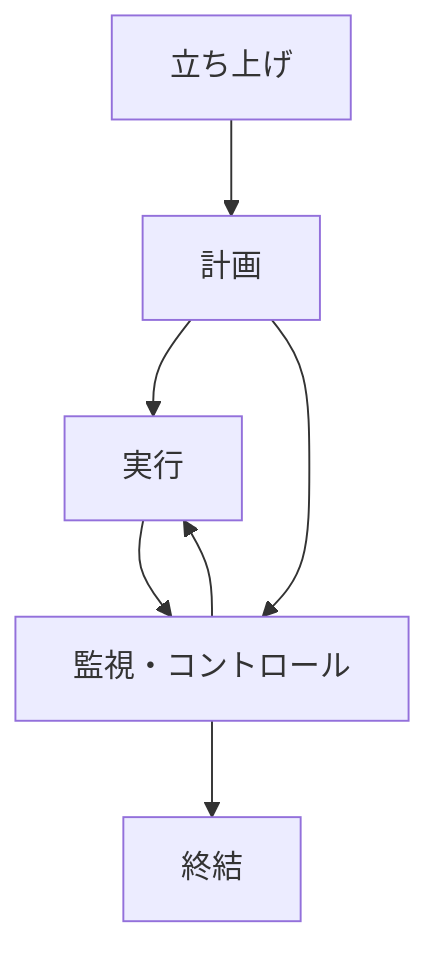
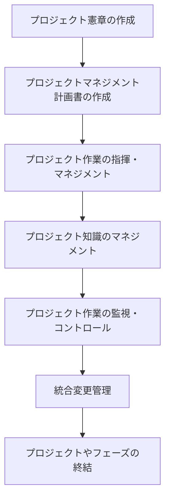
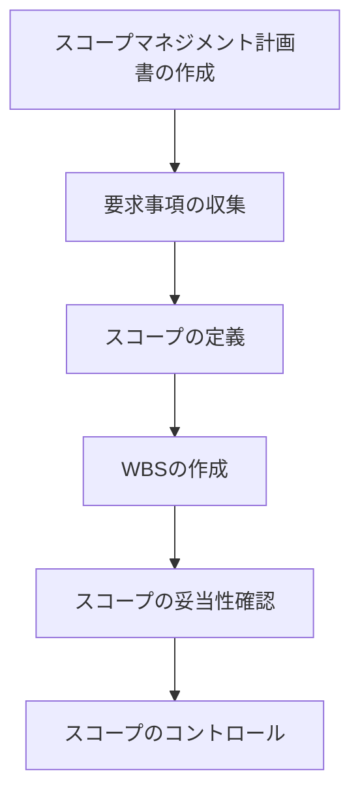
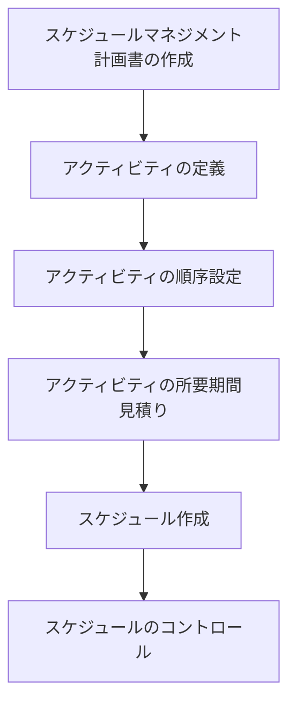
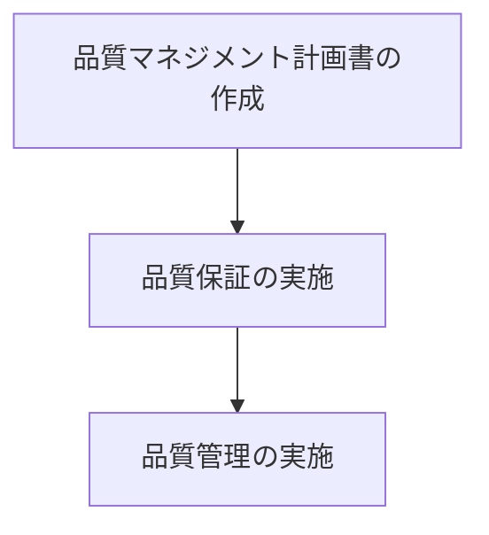
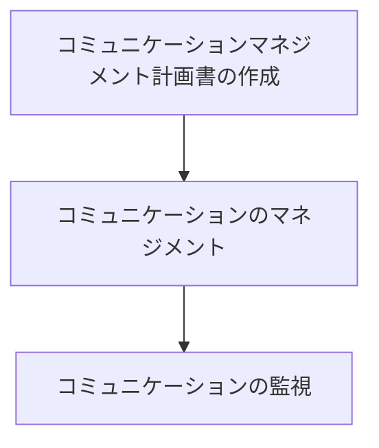
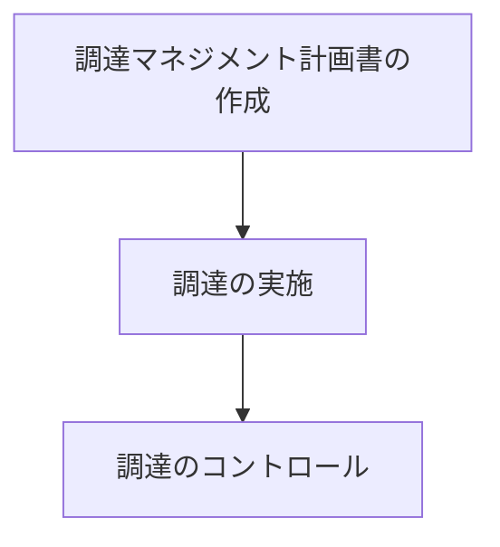

# PMBOKを3賢者と学ぶ～10の知識エリアとは～

## はじめに

本書は、プロジェクトマネジメントの国際標準として広く認められている「PMBOK（Project Management Body of Knowledge）」の10の知識エリアについて、経営学の偉大な思想家であるピーター・ドラッカー、ジム・コリンズ、大前研一という3人の賢者による架空の対談を通じて学ぶものです。

3人の賢者はそれぞれの経営哲学や視点からPMBOKについて語り合い、読者の皆様にプロジェクトマネジメントの本質と実践について深い洞察を提供します。実際の発言ではないことをあらかじめご了承ください。

それでは、プロジェクトマネジメントの世界へ、3人の賢者と共に旅立ちましょう。

---

## 第1章 3人の賢者、集う

### 自己紹介

**ドラッカー**：皆さん、ピーター・F・ドラッカーです。1909年オーストリア生まれ、「現代経営学の父」と呼ばれることもあります。私は経営とは何か、組織とは何か、そして何よりも「人」とは何かについて長年考察してきました。マネジメントとは単なる技術ではなく、社会的な機能であり、組織の目的を達成するために人を生かす術だと考えています。日本との縁も深く、日本の経営者や組織から多くを学びました。今日はPMBOKという体系について、私なりの視点からお話しできることを楽しみにしています。

**コリンズ**：ジム・コリンズです。私はビジネススクールの教壇に立った後、「ビジョナリーカンパニー」や「ビジョナリーカンパニー2」、「ビジョナリーカンパニー3」などの著書を通じて、偉大な企業の条件とは何かを研究してきました。「レベル5のリーダーシップ」や「フライホイール効果」といった概念を提唱し、組織が持続的に成功するための要因を探求しています。プロジェクトマネジメントも、組織の目標達成のための重要な要素と考えています。

**大前**：大前研一です。日本のマッキンゼーの創設メンバーとして経営コンサルティングに携わった後、独立して世界各地でビジネススクールや企業の経営指導に関わってきました。「企業参謀」や「3C分析」などの概念を通じて、戦略立案の方法論を提唱してきました。日本と世界の架け橋として、グローバルな視点と日本的経営の良さを融合させる方法を模索しています。PMBOKというグローバルスタンダードを日本の文脈で考えることは、非常に意義深いと思います。

**ドラッカー**：さて、これからPMBOKの10の知識エリアについて議論していくわけですが、まずはPMBOKとは何か、なぜそれが重要なのかについて話し合いましょう。

---

## 第2章 PMBOKとは何か

**大前**：PMBOKとは、Project Management Body of Knowledgeの略で、プロジェクトマネジメント協会（PMI）が開発した、プロジェクト管理の知識体系です。世界中のプロジェクトマネジャーに共通の言語と基準を提供するものですね。

**コリンズ**：そうですね。プロジェクトマネジメントの良い実践例を体系化したもので、プロジェクトを成功に導くために必要な知識、スキル、ツール、テクニックが整理されています。大切なのは、これが単なる理論ではなく、実践から導き出された知恵の集大成という点です。

**ドラッカー**：私が常々言っているように、「知識労働者の生産性向上」が現代社会の重要課題です。PMBOKは、まさにプロジェクトという複雑な知識労働を効果的に管理する方法を示しているという点で、非常に価値があります。

**大前**：ここでPMBOKの全体像を示すスライドを用意しました。PMBOKは10の知識エリアに分けられていますが、これらは相互に関連し合っています。

```
【PMBOKの10の知識エリア】

1. 統合マネジメント (Integration Management)
2. スコープマネジメント (Scope Management)
3. スケジュールマネジメント (Schedule Management)
4. コストマネジメント (Cost Management)
5. 品質マネジメント (Quality Management)
6. 資源マネジメント (Resource Management)
7. コミュニケーションマネジメント (Communications Management)
8. リスクマネジメント (Risk Management)
9. 調達マネジメント (Procurement Management)
10. ステークホルダーマネジメント (Stakeholder Management)
```

**コリンズ**：さらに、これらの知識エリアは、プロジェクトの5つのプロセス群にわたって適用されます。



**ドラッカー**：このような体系化された知識は非常に価値がありますが、忘れてはならないのは、これらはすべて「成果」を生み出すための手段だということです。PMBOKを学ぶ目的は、単に知識を得ることではなく、実際のプロジェクトを成功させることにあります。

**大前**：その通りです。日本企業の多くは、方法論に忠実であることを重視する傾向がありますが、大切なのは「なぜ」それをするのか、「何のため」にするのかを理解することです。PMBOKも同様で、形式的に従うだけでは意味がありません。

**コリンズ**：私の研究では、偉大な組織は「規律ある思考」と「規律ある行動」の両方を持っていることがわかっています。PMBOKは「規律ある行動」のためのフレームワークを提供してくれますが、それを支える「規律ある思考」がなければ、真の成果は生まれません。

---

## コラム：「3C分析とは？」

大前研一が提唱した「3C分析」は、戦略策定のためのフレームワークで、以下の3つの要素を分析します：

1. **Customer（顧客）**：顧客のニーズや行動を理解する
2. **Competitor（競合）**：競合他社の強みと弱みを把握する
3. **Company（自社）**：自社の強みと弱みを認識する

これら3つの要素の相互関係を分析することで、効果的な戦略を立案することができます。プロジェクトマネジメントにおいても、この3C分析の考え方は、プロジェクトの方向性を決定する際の重要な視点となります。

---

## 第3章 統合マネジメント

**ドラッカー**：まず最初の知識エリアである「統合マネジメント」について議論しましょう。これはプロジェクトの様々な要素を調整し、全体として一貫性を保つための活動です。

**大前**：統合マネジメントは、PMBOKの中心的な役割を果たしています。他の9つの知識エリアを横断的に調整し、プロジェクト全体としての整合性を保つことが目的です。

**コリンズ**：私の研究では、偉大な組織は「整合性」を非常に重視していることがわかっています。組織の様々な要素が互いに矛盾せず、同じ方向を向いていることが重要です。プロジェクトも同様で、統合マネジメントはその整合性を確保する役割を担っています。

**大前**：統合マネジメントの主なプロセスを図示しました。



**ドラッカー**：私が特に重要だと考えるのは、「プロジェクト憲章の作成」です。ここで、プロジェクトの目的と意義を明確にすることが、後の成功を大きく左右します。目的が曖昧なプロジェクトは、どれだけ効率的に実行しても成功しません。

**コリンズ**：同感です。プロジェクト憲章は、組織の「BHAGs（Big Hairy Audacious Goals：大胆で野心的な目標）」とプロジェクトの関係を明確にする機会でもあります。プロジェクトが組織の大きな目標にどう貢献するのかを示すことで、メンバーのモチベーションも高まります。

**大前**：日本企業では、プロジェクト憲章を形式的に作成することはあっても、その本質的な意味を理解していないケースが多いと感じます。プロジェクト憲章は単なる文書ではなく、プロジェクトの「存在意義」を表明するものです。

**ドラッカー**：そして、「統合変更管理」も重要です。プロジェクトは常に変化する環境の中で行われるものであり、計画通りに進まないことの方が多いでしょう。しかし、変更に対応する際も、プロジェクトの目的や全体の整合性を見失わないことが大切です。

**コリンズ**：変更管理においては、「何を変えるか」と同時に「何を変えないか」を明確にすることが重要です。偉大な企業は、核となる価値観や目的は不変に保ちながら、戦略や戦術は柔軟に変化させています。プロジェクトも同様のアプローチが有効でしょう。

**大前**：統合マネジメントの難しさは、「全体最適」と「部分最適」のバランスをとることにあります。各知識エリアで最適な判断が、必ずしもプロジェクト全体として最適とは限りません。ここにプロジェクトマネージャーの真価が問われます。

---

## ケーススタディ：新製品開発プロジェクトの統合マネジメント

大手電機メーカーA社は、競合他社に先駆けて新型スマートデバイスの開発プロジェクトを立ち上げました。当初は18か月の開発期間を予定していましたが、市場の変化により12か月に短縮する必要が生じました。

プロジェクトマネージャーの佐藤氏は、統合変更管理のプロセスに従い、以下のステップで対応しました：

1. 変更の影響分析：スケジュール短縮が品質、コスト、スコープに与える影響を評価
2. ステークホルダーとの協議：マーケティング部門、開発部門、経営層との調整会議
3. トレードオフの決定：一部の機能（スコープ）を次期バージョンに延期し、品質基準は維持
4. 変更計画の策定：新たなマイルストーンとリソース配分を決定
5. 変更の承認：ステークホルダーから正式な承認を取得
6. 変更の実施：計画の更新と関係者への伝達

結果として、A社は短縮されたスケジュールで製品を市場に投入することに成功し、競合他社に対する優位性を確保しました。このケースは、統合マネジメントの重要性と、変化する環境への適応能力の価値を示しています。

---

## 第4章 スコープマネジメント

**大前**：次は「スコープマネジメント」について議論しましょう。スコープとは、プロジェクトで実施する作業の範囲を定義するものです。

**ドラッカー**：スコープマネジメントは、「何をするか」と同時に「何をしないか」を明確にすることでもあります。多くのプロジェクトが失敗する原因は、途中でスコープが無秩序に拡大する「スコープクリープ」にあります。

**コリンズ**：その通りです。偉大な企業は「やらないことリスト」を持っていることが特徴です。スコープマネジメントも同様に、プロジェクトの境界線を明確に引くことが成功の鍵となります。

**大前**：スコープマネジメントの主なプロセスを図示しました。



**コリンズ**：この中で特に注目したいのは「WBS（Work Breakdown Structure：作業分解構造）」です。これは大きな目標を達成可能な小さな作業に分解するものですが、これがフライホイール効果を生み出す基盤となります。

**ドラッカー**：WBSは「知識労働の構造化」とも言えますね。複雑な知識労働を分解して可視化することで、効率的な管理が可能になります。しかし、単なる作業の細分化ではなく、各作業の「成果」を明確にすることが重要です。

**大前**：日本企業では、WBSを作成する際に細部にこだわりすぎる傾向があります。もちろん緻密さは日本の強みですが、あまりに詳細にこだわると全体像を見失うリスクがあります。

**ドラッカー**：また、「要求事項の収集」も重要なプロセスです。ここで見落としや誤解があると、後々大きな問題になります。顧客や利用者の声に耳を傾け、真のニーズを理解する努力が必要です。

**コリンズ**：要求事項の収集では、表面的なニーズだけでなく、根本的な目的を理解することが大切です。「なぜそれが必要なのか」を深く掘り下げることで、より良いソリューションを提供できる可能性があります。

**大前**：スコープマネジメントにおいて、日本企業が苦手とする部分は「スコープの妥当性確認」と「スコープのコントロール」だと感じます。特に、顧客からの追加要望に対して「ノー」と言うことを避ける傾向があります。

**ドラッカー**：確かに、顧客志向は重要ですが、すべての要望に応えることがプロジェクトの成功につながるわけではありません。時には「選択と集中」が必要であり、それがプロジェクトの本来の目的を達成する上で不可欠です。

---

## コラム：「ドラッカーの5つの質問」

ピーター・ドラッカーは、組織やプロジェクトの方向性を明確にするための5つの質問を提唱しています：

1. **我々の使命は何か？** - プロジェクトの根本的な目的
2. **我々の顧客は誰か？** - 誰のためのプロジェクトか
3. **顧客は何を価値あるものと考えるか？** - 真の価値の所在
4. **我々の成果は何か？** - 成功の定義
5. **我々の計画は何か？** - 目的達成のための道筋

これらの質問は、スコープを定義する際の指針となります。特に「顧客は何を価値あるものと考えるか」という問いは、本当に必要な機能と単なる「あったら良いもの」を区別する上で役立ちます。

---

## 第5章 スケジュールマネジメント

**コリンズ**：続いて「スケジュールマネジメント」についてディスカッションしましょう。これはプロジェクトを期限内に完了させるための活動ですね。

**大前**：スケジュールマネジメントは、日本企業が比較的得意とする分野だと思います。「締め切りを守る」という文化が根付いているからです。しかし、スケジュールの「質」については改善の余地があるでしょう。

**ドラッカー**：私は常々、「時間は最も希少な資源である」と言ってきました。スケジュールマネジメントは、この貴重な資源をいかに効果的に配分するかという問題でもあります。

**大前**：スケジュールマネジメントの主なプロセスを示します。



**コリンズ**：「アクティビティの順序設定」は特に重要なプロセスです。これは、「先に何をすべきか」という優先順位の問題でもあります。偉大な組織は「まず誰を乗せるか」を決めてから「どこに向かうか」を決めますが、プロジェクトでも同様の考え方が適用できます。

**ドラッカー**：「アクティビティの所要期間見積り」では、楽観的すぎる見積もりに注意する必要があります。多くのプロジェクトでは、作業の難しさや不確実性を過小評価し、結果として期限を守れなくなります。

**大前**：日本企業では「締め切り直前の集中作業」でスケジュールを守ることが多いですが、これは品質やチームの健康に悪影響を及ぼす可能性があります。より計画的なアプローチが望ましいでしょう。

**ドラッカー**：また、スケジュールは単なる作業計画ではなく、「成果」のタイミングを示すものでもあります。各マイルストーンが何らかの価値を生み出すものであることが重要です。

**コリンズ**：「フライホイール効果」の観点からも、小さな成功を積み重ねるようなスケジュール設計が効果的です。大きな成果を一度に求めるのではなく、段階的に進捗を確認できるよう計画することで、モメンタムを維持できます。

**大前**：スケジュール作成では、クリティカルパス（全体の期間を左右する重要な作業の連鎖）を特定することが重要です。これは戦略的思考でいう「重点領域の特定」に似ています。

**ドラッカー**：「スケジュールのコントロール」においては、単に遅れを取り戻すことだけでなく、なぜ遅れが生じたのかを理解し、学習することが大切です。それが組織の知識として蓄積されていきます。

**コリンズ**：プロジェクトの途中で問題が発生したとき、スケジュールを守るために範囲や品質を犠牲にするのか、あるいはスケジュールを延長するのかという判断が必要になります。この決断には「核となる価値観」が指針となるべきです。

---

## ケーススタディ：大規模システム更新プロジェクトのスケジュール管理

金融機関B社は、基幹システムの大規模更新プロジェクトを進めていました。当初の計画では24か月の予定でしたが、6か月経過時点で既に2か月の遅れが生じていました。

プロジェクトマネージャーの鈴木氏は、以下の対策を講じました：

1. クリティカルパス分析：遅れの原因となっている作業を特定
2. 「ファストトラッキング」の適用：一部の作業を並行して実施する計画に変更
3. リソースの再配分：重要な作業にベテラン技術者を追加配置
4. スコープの見直し：優先度の低い機能を後続フェーズに移行
5. バッファの再設計：残りの工程に現実的なバッファを追加

これらの対策により、プロジェクトは最終的に当初の計画から1か月の遅れで完了することができました。鈴木氏は、「遅れを認識した早い段階で対策を講じたこと」と「透明性を持ってステークホルダーと緊密にコミュニケーションを取ったこと」が成功の鍵だったと振り返っています。

---

## 第6章 コストマネジメント

**大前**：次は「コストマネジメント」について考えましょう。プロジェクトを予算内で完了させるための活動です。

**ドラッカー**：コストは常に結果との関係で考えるべきです。単にコストを削減することが目的ではなく、投入したコストに対して適切な価値が生み出されているかが重要です。

**コリンズ**：その通りです。偉大な企業は「コスト削減」と「価値創造」のバランスを巧みにとっています。プロジェクトでも同様に、単なるコスト最小化ではなく、投資対効果を最大化する視点が必要です。

**大前**：コストマネジメントの主なプロセスをスライドにまとめました。

```
【コストマネジメントのプロセス】

1. コストマネジメント計画書の作成
   - コスト見積り、予算設定、コントロールの方法を決定

2. コストの見積り
   - 各作業に必要なコストを予測

3. 予算の設定
   - 見積りから全体予算を策定、時系列で配分

4. コストのコントロール
   - 実績と計画の差異を分析し、必要に応じて是正
```

**ドラッカー**：「コストの見積り」は難しい作業です。特に新しい技術や手法を用いるプロジェクトでは不確実性が高く、過去の経験則だけでは正確な見積りは困難です。

**コリンズ**：見積りの精度を上げるには、チームの「誠実な対話」が鍵となります。楽観的すぎる見積りや、政治的な理由で歪められた見積りではなく、現実に基づいた厳しい事実を直視する文化が必要です。

**大前**：日本企業では、予算を獲得するために意図的に低い見積りを出し、後で追加予算を要求するという行動パターンが見られることがあります。これは健全なコストマネジメントを妨げます。

**ドラッカー**：「予算の設定」では、単に総額を決めるだけでなく、時系列での配分も重要です。特に長期プロジェクトでは、インフレや為替変動などのリスク要因も考慮する必要があります。

**コリンズ**：また、予算設定においては「20マイルマーチ」の考え方が役立ちます。これは、外部環境に関わらず一定のペースを保つという概念ですが、資金の流れにも適用できます。

**大前**：「コストのコントロール」では、単に超過を検知するだけでなく、その原因分析が重要です。根本原因を特定し、再発防止につなげることで、組織としての学習が促進されます。

**ドラッカー**：コストと時間は密接に関連しています。スケジュールの遅延はしばしばコスト超過につながります。両者を総合的に管理する視点が必要です。

**コリンズ**：最終的には、コストマネジメントも「規律ある思考と行動」の一環です。短期的な予算達成と長期的な価値創造のバランスをとりながら、一貫した姿勢でコストを管理することが成功への道です。

---

## コラム：「大前研一の視点で見るEVMの活用」

EVMは、Earned Value Management（アーンドバリューマネジメント）の略称です。プロジェクトの進捗とコストを統合的に管理する手法です。

#### EVMの3つの要素

1. **PV（Planned Value：計画値）** - 計画していた作業量とそのコスト
2. **EV（Earned Value：出来高）** - 実際に完了した作業量とそのコスト
3. **AC（Actual Cost：実コスト）** - 実際にかかったコスト

これら3つの値を比較することで、プロジェクトの「スケジュール」と「コスト」のパフォーマンスを同時に評価できます。

#### EVMを戦略的に活用するポイント

EVMは単なる数値管理ツールではなく、戦略的なプロジェクト運営のための情報源です。以下のように活用しましょう：

- **早期警戒システムとして** - 問題が深刻化する前に兆候を捉える
- **傾向分析に基づく予測** - 将来のパフォーマンスを予測し、先手を打つ
- **リソース配分の最適化** - 課題のある領域に適切にリソースを投入

EVMを形式的に導入するだけでなく、「意思決定のためのインテリジェンス」として活用することが、競争優位につながります。

---

## 第7章 品質マネジメント

**ドラッカー**：次は「品質マネジメント」について議論しましょう。これはプロジェクトの成果物が要求を満たすことを確実にするための活動です。

**大前**：品質は日本企業の強みとして長く認識されてきた分野です。「品質は製造工程で作り込むもの」という考え方は、プロジェクトマネジメントにも適用できます。

**コリンズ**：品質への取り組み方は、組織文化を映し出す鏡でもあります。偉大な企業は、短期的な利益よりも長期的な評判を重視し、一貫して高品質を追求します。

**大前**：品質マネジメントの主なプロセスを図示しました。



**ドラッカー**：「品質マネジメント計画書の作成」では、何を「品質」と定義するかが重要です。品質とは単に欠陥がないことではなく、顧客の期待を満たし、価値を提供することです。

**コリンズ**：その通りです。「良い」の定義を明確にしなければ、「良い仕事」をすることはできません。品質基準の設定は、プロジェクトの方向性を定める重要な活動です。

**大前**：日本では品質に対する意識が高いですが、時として過剰品質になることがあります。必要以上の品質は、コストとスケジュールに悪影響を及ぼす可能性があります。

**ドラッカー**：「品質保証」と「品質管理」の違いも理解しておくべきです。品質保証は「正しいことをする」ための活動であり、品質管理は「物事を正しく行う」ための活動です。両方が必要です。

**コリンズ**：品質への取り組みは、「基本に忠実であり続ける」という姿勢とも関連しています。日々の小さな選択の積み重ねが、最終的な品質を左右します。

**大前**：品質マネジメントにおいて、プロセスの標準化と継続的改善のバランスが重要です。標準化によって一定水準の品質を確保しつつ、常に改善を追求する文化を育むことが理想的です。

**ドラッカー**：また、品質は「測定可能」であるべきです。「良い」の定義が主観的では、品質管理は困難です。可能な限り客観的な指標を設定することが重要です。

**コリンズ**：品質への取り組みは、短期的にはコストを増加させるように見えることもありますが、長期的には手戻りや修正コストを減らし、顧客満足度と評判を高めます。これは「フライホイール効果」の一例でもあります。

**大前**：品質マネジメントの成功には、トップのコミットメントが不可欠です。品質は組織文化の問題であり、リーダーの言動がチームの行動に大きな影響を与えます。

---

## 二人対談コラム：「日本的品質管理とPMBOK」

**ドラッカー**：大前さん、日本的品質管理の特徴とPMBOKの関係について、お考えをお聞かせいただけますか？

**大前**：日本の品質管理の特徴は、「全員参加」と「継続的改善」にあると思います。品質は特定の部門や専門家だけの責任ではなく、全員が関与するものであり、常に改善の余地があるという考え方です。

**ドラッカー**：そうですね。私が日本企業を研究した際に感銘を受けたのも、その点でした。「カイゼン」の文化は、品質を静的なものではなく、動的なプロセスとして捉えている点が素晴らしいです。

**大前**：PMBOKの品質マネジメントは、どちらかというと欧米的なアプローチ、つまりプロセスの標準化や検査による品質確保に重点を置いています。これに日本的な「品質は工程で作り込む」という考え方を組み合わせると、より効果的だと考えています。

**ドラッカー**：まさにその統合が重要ですね。PMBOKのフレームワークに日本的な品質文化のエッセンスを取り入れることで、より強力な品質マネジメントが実現できるでしょう。

**大前**：具体的には、PMBOKの品質計画・品質保証・品質管理のサイクルに、小集団活動やQCサークルのような参加型の取り組みを統合することが考えられます。

**ドラッカー**：それは優れた提案です。結局のところ、品質は文書や手順だけでは達成できません。人々の意識と行動が鍵となります。日本的アプローチはまさにその人的側面に焦点を当てているのです。

**大前**：そうですね。PMBOKという国際標準と日本の強みを融合させることで、グローバルで通用しつつも競争力のあるプロジェクトマネジメントが実現できると思います。

---

## 第8章 資源マネジメント

**コリンズ**：続いて「資源マネジメント」について話し合いましょう。これは、プロジェクトに必要な人材、設備、材料などの資源を効果的に活用するための活動です。

**ドラッカー**：私がかねてから強調しているように、「人」は最も重要な資源です。特に知識労働が中心となる現代のプロジェクトでは、人材の知識、スキル、モチベーションがプロジェクトの成否を左右します。

**大前**：日本企業の強みは「人財育成」にあります。プロジェクトを単なる成果物の創出ではなく、人材育成の機会としても捉えることで、長期的な組織力の向上につながります。

**コリンズ**：資源マネジメントの主なプロセスを示します。

```
【資源マネジメントのプロセス】

1. 資源マネジメント計画書の作成
2. 資源の見積り
3. 資源の獲得
4. チームの育成
5. チームのマネジメント
6. 資源のコントロール
```

**ドラッカー**：「資源の獲得」については、単に必要な人数を確保するだけでなく、適切なスキルと経験を持つ人材を配置することが重要です。時には、少数精鋭のチームの方が大人数のチームよりも効果的です。

**コリンズ**：まさに「バスに誰を乗せるか」の問題です。私の研究でも、偉大な企業はまず「誰と」働くかを決め、そのあとで「何を」するかを決定していることがわかっています。

**大前**：日本企業では、プロジェクトへの人材配置が組織の都合で決まることが多く、最適な人材が必ずしも配置されないケースがあります。より戦略的な人材配置が必要でしょう。

**ドラッカー**：「チームの育成」も非常に重要です。プロジェクトは単なる成果物の創出ではなく、組織の学習と成長の機会でもあります。メンバーが新しいスキルや知識を獲得できるような環境を整えることが、長期的な組織力につながります。

**コリンズ**：チーム育成において、「レベル5のリーダーシップ」の概念が役立ちます。これは個人的な謙虚さと職業的な意志の強さを兼ね備えたリーダーシップであり、チームの成長を促進します。

**大前**：「チームのマネジメント」では、日本的な「現場力」の概念が有効です。現場に近いところで意思決定ができるよう権限を委譲しつつ、全体としての方向性を保つバランスが重要です。

**ドラッカー**：資源マネジメントでは、「人」だけでなく「時間」も重要な資源です。時間は再生不可能な資源であり、その効率的な活用がプロジェクトの成功を左右します。

**コリンズ**：また、「資源のコントロール」においては、単なる数量的な管理ではなく、資源が生み出す価値に焦点を当てるべきです。投入された資源に対して、適切な価値が創出されているかを常に評価することが重要です。

**大前**：グローバルプロジェクトでは、文化的多様性も資源として捉えることができます。異なる視点や考え方が集まることで、より創造的な解決策が生まれる可能性があります。

---

## ケーススタディ：バーチャルチームのマネジメント

ソフトウェア開発企業C社は、日本、インド、アメリカの3拠点にまたがるバーチャルチームで新サービス開発プロジェクトを進めていました。時差や文化の違いから、当初はコミュニケーションの問題が頻発していました。

プロジェクトマネージャーの田中氏は、以下の対策を講じました：

1. チーム体制の再構築：機能ごとではなく、製品機能ごとのクロスロケーションチームを編成
2. コミュニケーションルールの確立：週次の全体ミーティング、日次の小チームミーティング、文書化のルール
3. 共通の目標設定：プロジェクトの目的と各チームの貢献を明確化
4. 文化的交流の促進：各国の文化や習慣に関する相互理解のセッションを実施
5. ツールの統一：プロジェクト管理、コミュニケーション、コード管理のツールを標準化

これらの対策により、チームの一体感が醸成され、プロジェクトは当初の計画通りに進行するようになりました。田中氏は「距離や文化の違いは課題ではあるが、それ以上に多様な視点がもたらす創造性が価値となる」と振り返っています。

---

## 第9章 コミュニケーションマネジメント

**大前**：次は「コミュニケーションマネジメント」について議論しましょう。これはプロジェクト情報の生成、収集、配布、保管、取得のプロセスを管理する活動です。

**ドラッカー**：コミュニケーションは組織の神経系とも言えるものです。適切な情報が適切なタイミングで適切な人に届かなければ、組織は効果的に機能しません。

**コリンズ**：その通りです。私の研究では、偉大な組織は「厳しい事実に向き合う文化」を持っていることがわかっています。これは、オープンで誠実なコミュニケーションがあってこそ可能になります。

**大前**：コミュニケーションマネジメントの主なプロセスを図示しました。



**ドラッカー**：「コミュニケーションマネジメント計画書の作成」では、「誰に」「何を」「いつ」「どのように」伝えるかを計画します。ここで重要なのは、受け手の視点に立つことです。情報の送り手ではなく、受け手のニーズを中心に考えるべきです。

**コリンズ**：また、コミュニケーションには「形式」と「内容」の両方が重要です。形式的には完璧でも、内容が曖昧だったり誠実さに欠けたりすれば、効果的なコミュニケーションとは言えません。

**大前**：日本企業では「阿吽の呼吸」や「暗黙知」に依存したコミュニケーションが多いですが、グローバルプロジェクトでは明示的なコミュニケーションが必要です。文化的背景が異なるメンバー間では、明確さと具体性が重要になります。

**ドラッカー**：「コミュニケーションのマネジメント」では、情報の質と量のバランスが重要です。情報過多も情報不足も問題です。必要な情報を、必要なときに、必要な形で提供することが求められます。

**コリンズ**：効果的なコミュニケーションには「一貫性」も重要です。言葉と行動が一致していなければ、信頼は築けません。特にリーダーは、自らの言動を通じてメッセージを発信していることを常に意識すべきです。

**大前**：「コミュニケーションの監視」では、情報が正しく理解されているかを確認することが重要です。特に複雑な情報や重要な決定事項については、理解度を確認するプロセスを設けるべきでしょう。

**ドラッカー**：また、コミュニケーションには「フィードバック」の仕組みが不可欠です。一方通行のコミュニケーションでは、効果的な情報交換や組織の学習は難しいでしょう。

**コリンズ**：危機的状況におけるコミュニケーションも重要なテーマです。問題や障害が発生したとき、それを隠すのではなく、適切に情報を共有し、対策を講じる文化が必要です。

**大前**：デジタル時代のコミュニケーションツールの選択も戦略的に行うべきです。ツールの特性を理解し、目的に応じて使い分けることが効果的です。

---

## 独白コラム：「ドラッカーのコミュニケーション観」

組織におけるコミュニケーションについて、私はかねてから次のように考えています。

コミュニケーションは単なる情報の伝達ではありません。それは「理解」を創造するプロセスです。送り手が何を意図したかではなく、受け手が何を理解したかによって、コミュニケーションの成否が決まります。

効果的なコミュニケーションのためには、まず「聴く」ことから始めなければなりません。相手の言葉だけでなく、その背後にある関心事、期待、不安を理解する努力が必要です。

また、コミュニケーションには「言葉」だけでなく「行動」も含まれます。特にリーダーは、自らの行動を通じて最も強力なメッセージを発信しています。言葉と行動の不一致は、最も有害なコミュニケーション障害です。

さらに、コミュニケーションには「文脈」が重要です。同じメッセージでも、文脈によって全く異なる意味を持ちます。効果的なコミュニケーターは、この文脈の重要性を理解し、適切な「場」を設定します。

そして最後に、コミュニケーションは「継続的なプロセス」です。一度伝えればそれで終わりではなく、理解を深め、調整し、発展させていく継続的な営みです。これこそが、組織の学習と成長の基盤となります。

---

## 第10章 リスクマネジメント

**コリンズ**：続いて「リスクマネジメント」についてディスカッションしましょう。これは、プロジェクトに影響を与える可能性のある不確実性を管理する活動です。

**ドラッカー**：リスクは避けるべきものではなく、管理すべきものです。リスクを取らないことが最大のリスクになることもあります。重要なのは、どのリスクを取り、どのリスクを避けるかの選択です。

**大前**：日本企業はリスク回避的な傾向がありますが、グローバル競争の中で成功するには、適切なリスクテイクが必要です。リスクマネジメントは、リスクを排除することではなく、リスクと機会のバランスを取ることと理解すべきです。

**コリンズ**：リスクマネジメントの主なプロセスをスライドにまとめました。

```
【リスクマネジメントのプロセス】

1. リスクマネジメント計画書の作成
2. リスクの特定
3. 定性的リスク分析の実施
4. 定量的リスク分析の実施
5. リスク対応計画の作成
6. リスク対応策の実施
7. リスクの監視
```

**ドラッカー**：「リスクの特定」は、可能な限り網羅的に行うべきです。しかし、すべてのリスクを予測することは不可能です。そのため、想定外の事態に対応できる柔軟性も同時に備えておく必要があります。

**コリンズ**：リスク分析では、「定性的分析」と「定量的分析」の両方が重要です。定性的分析では「どんなリスクか」を理解し、定量的分析では「どの程度のリスクか」を数値化します。両方の視点があってこそ、適切な対応が可能になります。

**大前**：日本企業では、しばしば「リスク対応計画」が形式的になりがちです。真に効果的なリスク対応計画は、具体的なトリガー条件と責任者を明確にし、実行可能なものでなければなりません。

**ドラッカー**：「リスク対応策の実施」においては、予防的な対策と対処的な対策のバランスが重要です。すべてのリスクを予防することは不可能であり、コスト効率も悪いため、一部のリスクについては発生した際の対処法を準備しておく方が合理的です。

**コリンズ**：また、リスクには「上方リスク（機会）」と「下方リスク（脅威）」があることを忘れてはなりません。リスクマネジメントは脅威の最小化だけでなく、機会の最大化も目的とすべきです。

**大前**：「リスクの監視」は継続的なプロセスです。プロジェクトの進行に伴い、リスクプロファイルは変化します。新たなリスクが現れたり、既存のリスクの重要度が変わったりするため、定期的な見直しが必要です。

**ドラッカー**：リスクマネジメントでは、「組織としての学習」も重要です。過去のプロジェクトから得た教訓を蓄積し、活用することで、リスクマネジメントの質は向上します。

**コリンズ**：リスクマネジメントにおいても「規律ある思考」が鍵となります。楽観的すぎる見通しや、逆に悲観的すぎる見通しではなく、現実を直視し、データに基づいた分析を行うことが重要です。

**大前**：最後に、リスクマネジメントは特定の専門家だけの仕事ではなく、プロジェクトチーム全員の責任であることを強調したいと思います。リスク意識の高い文化を醸成することが、効果的なリスクマネジメントの基盤となります。

---

## 三人対談コラム：「不確実性の時代のリスクマネジメント」

**ドラッカー**：現代は変化の速度が加速し、不確実性が高まっています。このような時代のリスクマネジメントについて、お二人はどうお考えですか？

**コリンズ**：重要なのは「両面思考」だと考えています。つまり、最悪のシナリオに備えながらも、最良の結果を信じる姿勢です。私の研究では、偉大な企業は楽観と悲観のバランスが取れていることがわかっています。

**大前**：同感です。さらに、リスクマネジメントのパラダイムシフトが必要だと思います。従来の「予測と対応」から「適応と学習」へと重点を移す必要があります。予測が困難な環境では、素早い適応能力と継続的な学習が競争優位の源泉となります。

**ドラッカー**：両者のご意見に共感します。私はかねてから「断続的不均衡」の時代が来ると予測していました。このような時代には、リスクを「管理する」というよりも「活用する」という発想が必要になります。変化をリスクではなく機会と捉える組織が成功するでしょう。

**コリンズ**：「備える」という点で重要なのは、「ブレット」と「キャノンボール」の考え方です。不確実な環境では、大きな賭け（キャノンボール）をする前に、小さな実験（ブレット）で検証することが重要です。これにより、リスクを取りながらも、その影響を限定的にすることができます。

**大前**：日本企業に足りないのは、まさにその「実験精神」ですね。完璧を求めるあまり、行動を起こすのが遅くなりがちです。不確実性の高い環境では、スピードと学習サイクルの速さが重要です。「失敗から学ぶ」文化を育てることが必要です。

**ドラッカー**：そして、リスクマネジメントにおいても「成果」に焦点を当てることが重要です。リスク対策自体が目的化すると、過剰な対策によって機会を失うことになります。常に「何のため」というプロジェクトの目的に立ち返ることが必要です。

**コリンズ**：そうですね。リスクマネジメントも「良い会社から偉大な会社へ」の要素の一つです。リスクに対する姿勢が、平凡な組織と卓越した組織を分ける一因となります。

**大前**：最終的には、リスクに対する「組織的なケイパビリティ」を構築することが重要です。これは単なる手順やツールではなく、組織文化や意思決定のあり方、さらには人材の育成にまで及ぶものです。

**ドラッカー**：まさにその通りです。不確実性に対処する最良の方法は、変化に適応し、機会を見出し、学習を継続できる「自己変革力」を組織に埋め込むことなのです。

---

## 第11章 調達マネジメント

**大前**：次は「調達マネジメント」について考えましょう。これは、プロジェクトに必要な製品やサービスを外部から調達するためのプロセスを管理する活動です。

**ドラッカー**：調達の基本的な問いは「自社で行うか、外部に任せるか」です。これは単にコストの問題ではなく、組織の強みと集中すべき領域に関わる戦略的な決断です。

**コリンズ**：その通りです。偉大な企業は「何に集中すべきか」を明確に理解しています。自社の「ハリネズミ・コンセプト」に合致しない活動は、外部に委託することで効率と専門性を高めることができます。

**大前**：調達マネジメントの主なプロセスを図示しました。



**ドラッカー**：「調達マネジメント計画書の作成」では、何を調達するか、どのように調達するか、いつ調達するかを計画します。ここで重要なのは、単に「安いもの」を探すのではなく、プロジェクトの目的に最も適した調達方法を選ぶことです。

**コリンズ**：調達先の選定においては、価格だけでなく、品質、信頼性、パートナーシップの可能性などを総合的に評価すべきです。最も安い選択肢が、長期的に見て最もコスト効率が良いとは限りません。

**大前**：日本企業の調達は、長期的な関係構築を重視する傾向がありますが、これにはメリットとデメリットがあります。長期的な関係は安定と信頼をもたらしますが、革新的な調達先を見逃す可能性もあります。

**ドラッカー**：「調達の実施」においては、契約管理が重要です。良い契約は、単に法的なリスクを軽減するだけでなく、両者の協力関係の基盤となるものです。

**コリンズ**：契約では「明確さ」と「柔軟性」のバランスが重要です。予期せぬ状況に対応できる柔軟性を持ちつつも、責任と期待値は明確に定義するべきです。

**大前**：「調達のコントロール」では、納入物の質と納期を管理するだけでなく、調達先との関係も管理することが重要です。特に重要な調達先とは、単なる取引関係ではなく、戦略的パートナーシップを構築すべきでしょう。

**ドラッカー**：また、調達においても「知識の管理」が重要です。過去の調達経験から学び、組織として知識を蓄積していくことで、調達の質は向上します。

**コリンズ**：調達先の選定においても「誰をバスに乗せるか」の原則が適用できます。価値観や目標を共有できるパートナーを選ぶことで、困難な状況でも協力して問題を解決できる関係が構築できます。

**大前**：グローバル時代の調達においては、文化的な違いや地理的な分散がもたらす課題にも注意が必要です。これらの課題に対処するためには、明確なコミュニケーションと相互理解が不可欠です。

---

## コラム：「調達における3つの落とし穴と対策」

プロジェクトの調達管理において、よく見られる3つの落とし穴と、その対策をご紹介します。

**落とし穴1：過度の価格重視**
調達先の選定を価格のみで判断すると、品質の問題や追加コスト、遅延などの隠れたコストが発生する可能性があります。

*対策*：「総所有コスト（TCO）」の考え方を導入し、調達価格だけでなく、品質、サポート、信頼性などを含めた総合的な評価を行う。

**落とし穴2：リスクの転嫁**
契約によってリスクを相手に押し付けようとすると、関係の悪化や隠れたコストの増加につながります。

*対策*：「Win-Win関係」を目指し、リスクを適切に共有する契約を結ぶ。リスクは最もそれを管理できる側が負うべきです。

**落とし穴3：コミュニケーション不足**
要件の曖昧さや期待値のミスマッチは、調達の失敗につながる主要因です。

*対策*：詳細な要件定義と定期的なコミュニケーションの仕組みを確立する。相互理解を深めるためのプロセスを設ける。

これらの落とし穴を回避することで、調達プロセスの質を高め、プロジェクトの成功確率を向上させることができます。

---

## 第12章 ステークホルダーマネジメント

**コリンズ**：最後の知識エリアは「ステークホルダーマネジメント」です。これは、プロジェクトに影響を与えたり、プロジェクトから影響を受けたりする個人やグループを特定し、彼らの期待と影響を管理する活動です。

**ドラッカー**：組織の成果は、組織の外部にあります。プロジェクトも同様で、その成功はステークホルダーの期待に応えることで定義されます。そのため、ステークホルダーの理解は極めて重要です。

**大前**：日本企業は伝統的に多様なステークホルダーを意識してきましたが、そのバランスの取り方は欧米とは異なります。グローバルスタンダードを取り入れつつ、日本の良さも活かすアプローチが必要でしょう。

**コリンズ**：ステークホルダーマネジメントの主なプロセスをスライドにまとめました。

```
【ステークホルダーマネジメントのプロセス】

1. ステークホルダーの特定
   - プロジェクトに関わる全ての個人・組織を洗い出す

2. ステークホルダー・エンゲージメント計画書の作成
   - 各ステークホルダーとの関わり方を計画

3. ステークホルダー・エンゲージメントのマネジメント
   - 関係の構築と管理を実施

4. ステークホルダー・エンゲージメントの監視
   - 関係の変化を観察し、必要に応じて対応
```

**ドラッカー**：「ステークホルダーの特定」では、直接的な関係者だけでなく、間接的に影響を与えたり受けたりする人々も考慮すべきです。見落としがちなステークホルダーが、後になって大きな影響力を持つことがあります。

**コリンズ**：ステークホルダーを特定したら、彼らの「影響力」と「関心」を評価することが重要です。これにより、限られたリソースを最も効果的に配分できます。

**大前**：日本企業では、ステークホルダー間の「根回し」を重視する文化がありますが、これをもっと体系的に行うことで効果が高まります。PMBOKのフレームワークは、この「根回し」をより戦略的に行うための指針となります。

**ドラッカー**：「ステークホルダー・エンゲージメント計画書の作成」では、各ステークホルダーの期待、関心事、影響力を理解し、それに基づいたコミュニケーション戦略を立てることが重要です。

**コリンズ**：ステークホルダーとの関係構築においても「核となる価値観」が重要です。短期的な利益のために価値観を曲げるような関係は、長期的には持続しません。誠実さと一貫性がステークホルダーの信頼を得る鍵となります。

**大前**：「ステークホルダー・エンゲージメントのマネジメント」では、単なる情報提供だけでなく、真の「対話」が重要です。ステークホルダーの声に耳を傾け、彼らの視点でプロジェクトを見ることで、新たな洞察が得られます。

**ドラッカー**：また、ステークホルダーのニーズや期待は時間とともに変化することを理解しておく必要があります。固定的なステークホルダー計画ではなく、変化に対応できる柔軟なアプローチが必要です。

**コリンズ**：「ステークホルダー・エンゲージメントの監視」においては、定期的な評価と調整が重要です。特に、ステークホルダーの姿勢や影響力の変化には敏感に対応すべきです。

**大前**：最終的には、ステークホルダーマネジメントは「価値創造」のプロセスでもあります。プロジェクトを通じて、いかに多様なステークホルダーに価値を提供できるかが、真の成功の鍵となります。

---

## ケーススタディ：地域開発プロジェクトのステークホルダーマネジメント

不動産開発会社D社は、地方都市での複合施設開発プロジェクトを計画していました。当初は地元住民の反対が強く、プロジェクトの遅延が懸念されていました。

プロジェクトマネージャーの山田氏は、以下のステークホルダーマネジメント戦略を実施しました：

1. ステークホルダーの徹底分析：地元住民、商店主、行政、環境団体など、多様なステークホルダーを特定し、それぞれの関心事と懸念点を整理

2. 早期の対話開始：計画の初期段階から住民説明会を開催し、懸念点を直接聞く場を設定

3. 計画の共同修正：住民の懸念に対応し、緑地スペースの拡大、地元商店の優先テナント入居、バリアフリー設計の強化など、計画を修正

4. 透明性の確保：進捗状況や決定事項を定期的に公開し、情報の非対称性を減らす努力

5. 長期的関係構築：プロジェクト完了後も地域との関係を維持するための委員会を設立

これらの取り組みにより、当初は反対が強かった地元住民からも次第に支持を得られるようになり、計画は修正されつつも、大幅な遅延なく進行することができました。山田氏は「ステークホルダーを単なる障害ではなく、プロジェクトを改善する協力者と見なす姿勢が重要だった」と振り返っています。

---

## 第13章 総括：3賢者がPMBOKから学んだこと

**ドラッカー**：PMBOKの10の知識エリアについて議論してきましたが、最後に私たちがPMBOKから学んだことを共有しましょう。

私が考えるPMBOKの最大の価値は、プロジェクトマネジメントを「体系化された知識」として確立したことです。しかし、この知識は単なる手順やテクニックではなく、「成果を上げるための思考法」と捉えるべきでしょう。

PMBOKは「何をすべきか」を教えてくれますが、「なぜそれをすべきか」を常に問い続けることが重要です。形式的な遵守ではなく、プロジェクトの本質的な目的と価値の創造に焦点を当ててこそ、PMBOKは真の力を発揮します。

**コリンズ**：私にとってPMBOKの価値は、「規律ある思考と行動」のフレームワークを提供してくれる点にあります。偉大な組織は、カオスの中でも規律を保ち、一貫した行動をとることができます。PMBOKはそのための指針となります。

しかし、フレームワークには常に「例外」があることを忘れてはなりません。PMBOKを教条的に適用するのではなく、状況に応じた柔軟な適用が重要です。「原則に忠実であること」と「機械的に適用しないこと」のバランスが、真の卓越性につながります。

**大前**：私がPMBOKから学んだのは、「グローバルスタンダード」と「日本の強み」を融合させる可能性です。PMBOKは世界共通の言語とフレームワークを提供してくれますが、それを日本の文脈で活かすには独自の解釈と適用が必要です。

特に、日本の「人」を中心とした経営哲学とPMBOKの体系的アプローチを組み合わせることで、より強固なプロジェクトマネジメントが実現できると考えています。形式と精神、構造と文化、グローバルと日本的という二項対立を超えた、新たな統合が可能だと感じています。

**ドラッカー**：総じて言えることは、PMBOKは「手段」であって「目的」ではないということです。プロジェクトマネジメントの真の目的は、顧客や社会に価値を提供することにあります。

**コリンズ**：その通りです。そして、最終的には「人」がプロジェクトを成功させるのであって、手法やツールではありません。「バスに誰を乗せるか」という人選と、「フライホイール」をどう回し始めるかという初期の推進力が、プロジェクトの成否を決定づけます。

**大前**：そして、急速に変化する環境の中で生き残るためには、PMBOKの知識を基盤としつつも、絶えず学び、適応し、イノベーションを起こす姿勢が不可欠です。知識は重要ですが、それを活かす「知恵」と「行動力」こそが、真の競争優位の源泉となります。

**ドラッカー**：最後に、読者の皆さんへのメッセージとして、PMBOKを学ぶ目的は「資格を取ること」や「手法を知ること」ではなく、「より良いプロジェクトを通じて、より良い社会を創ること」だと強調したいと思います。

**コリンズ**：そして、PMBOKの知識を単に「知っている」だけでなく、日々の実践の中で「生きたもの」として活用し、継続的に改善していくことが重要です。知識と実践の間には大きな隔たりがありますが、その隔たりを埋める努力こそが、「良い」から「偉大」への道です。

**大前**：最後に、日本の読者の皆さんには、グローバルスタンダードを学びつつも、日本の強みを失わないバランス感覚を持っていただきたいと思います。PMBOKという「共通言語」を身につけながらも、日本固有の価値観や強みを活かすことで、世界で通用する独自の競争力を築いていけるでしょう。

---

## あとがき

本書では、経営学の3人の賢者、ピーター・ドラッカー、ジム・コリンズ、大前研一による架空の対談を通じて、PMBOKの10の知識エリアについて考察してきました。

彼らの視点を通じて見ることで、PMBOKは単なる知識体系ではなく、組織や社会に価値を創出するための思考法であり、実践法であることが浮き彫りになったのではないでしょうか。

マネジメントを学ぶ上で大切なのは、形式的な知識を得ることではなく、その本質を理解し、実践に活かすことです。本書がそのための一助となれば幸いです。

最後になりますが、本書は架空の対談という形式を取りましたが、3人の賢者の思想や哲学については、できる限り忠実に表現するよう努めました。しかし、あくまで著者の解釈に基づくものであり、実際の3人の考えとは異なる可能性があることをご了承ください。

読者の皆様が、本書を通じてPMBOKの知識を深めるとともに、マネジメントの本質について考えるきっかけとなれば、これに勝る喜びはありません。

---

## 参考文献

1. Project Management Institute, "A Guide to the Project Management Body of Knowledge (PMBOK® Guide) – Seventh Edition"
2. ピーター・F・ドラッカー, "マネジメント - 課題、責任、実践"
3. ジム・コリンズ, "ビジョナリー・カンパニー"
4. ジム・コリンズ, "ビジョナリー・カンパニー2 - 飛躍の法則"
5. 大前研一, "企業参謀"
6. 大前研一, "新・企業参謀"
