# PMBOKを3賢者と学ぶ
## ～これからのIT企業のプロジェクトマネジメント～

---

### はじめに

本書は架空の設定に基づいています。マイクロソフト創業者ビル・ゲイツ氏、アップル創業者スティーブ・ジョブズ氏、そしてGoogle CEOのスンダー・ピチャイ氏が一堂に会し、プロジェクトマネジメント知識体系ガイド（PMBOK®ガイド）について議論するという想像上のシナリオです。司会進行は、日本を代表するジャーナリスト池上彰氏が務めます。

実際の人物の発言や見解とは異なる場合がありますが、各人物の経営哲学や価値観を踏まえつつ、PMBOKの理解を深めることを目的としています。

---

## 目次

1. [プロローグ：3人の巨人、1つの部屋](#プロローグ3人の巨人1つの部屋)
2. [第1章：プロジェクトマネジメントとは何か](#第1章プロジェクトマネジメントとは何か)
3. [第2章：PMBOKの基本構造とプロジェクト統合マネジメント](#第2章pmbok基本構造とプロジェクト統合マネジメント)
4. [第3章：プロジェクトスコープマネジメント](#第3章プロジェクトスコープマネジメント)
5. [第4章：プロジェクトスケジュールマネジメント](#第4章プロジェクトスケジュールマネジメント)
6. [第5章：プロジェクトコストマネジメント](#第5章プロジェクトコストマネジメント)
7. [第6章：プロジェクト品質マネジメント](#第6章プロジェクト品質マネジメント)
8. [第7章：プロジェクトリソースマネジメント](#第7章プロジェクトリソースマネジメント)
9. [第8章：プロジェクトコミュニケーションマネジメント](#第8章プロジェクトコミュニケーションマネジメント)
10. [第9章：プロジェクトリスクマネジメント](#第9章プロジェクトリスクマネジメント)
11. [第10章：プロジェクト調達マネジメント](#第10章プロジェクト調達マネジメント)
12. [第11章：プロジェクトステークホルダーマネジメント](#第11章プロジェクトステークホルダーマネジメント)
13. [第12章：アジャイルプロジェクトマネジメントとPMBOK](#第12章アジャイルプロジェクトマネジメントとpmbok)
14. [第13章：デジタル時代のプロジェクトマネジメント](#第13章デジタル時代のプロジェクトマネジメント)
15. [エピローグ：3賢者からの最後のメッセージ](#エピローグ3賢者からの最後のメッセージ)

---

## プロローグ：3人の巨人、1つの部屋

*高層ビルの最上階、大きな窓から東京の街並みを一望できる会議室。テーブルの周りに4つの席が用意されている。徐々に参加者が入室してくる。*

**池上彰**：皆さん、こんにちは。本日は特別な対談にお集まりいただき、誠にありがとうございます。私、司会進行を務めます池上彰です。長年にわたりジャーナリストとして活動し、複雑な問題を分かりやすく説明することをモットーにしてきました。今日は「PMBOK」という専門的な知識体系についても、できるだけ分かりやすくお伝えできればと思います。

**ビル・ゲイツ**：(*眼鏡を軽く直しながら*) こんにちは、ビル・ゲイツです。マイクロソフトを創業し、現在はビル＆メリンダ・ゲイツ財団を通じて世界の健康問題や教育問題の解決に取り組んでいます。実はプロジェクトマネジメントは、ソフトウェア開発でも慈善事業でも非常に重要です。今日はその知見を共有できればと思います。

**スティーブ・ジョブズ**：(*黒いタートルネックを着て、手を軽く動かしながら*) スティーブ・ジョブズです。アップルを創業し、Pixar、そしてNeXTでも働きました。私はいつも「シンプルさは究極の洗練である」と信じてきました。プロジェクトマネジメントにおいても、複雑さを減らし本質に集中することが大切だと考えています。

**スンダー・ピチャイ**：(*穏やかな笑顔で*) スンダー・ピチャイです。Googleの最高経営責任者として、テクノロジーを通じて世界中の人々の生活を向上させることに情熱を注いでいます。特に人工知能やクラウドコンピューティングの分野では、効果的なプロジェクトマネジメントが革新的な製品開発の鍵になっています。

**池上**：素晴らしい顔ぶれが揃いました。今日は「PMBOK（Project Management Body of Knowledge）」について、IT業界を革新してきた3人の賢者からその重要性や実践方法を学んでいきたいと思います。PMBOKはプロジェクトマネジメント協会（PMI）が開発した、プロジェクトマネジメントの知識体系です。では早速、第1章から始めましょう。

---

## 第1章：プロジェクトマネジメントとは何か

**池上**：まずは基本的な質問からです。皆さんにとって「プロジェクトマネジメント」とは何でしょうか？ ゲイツさんからお願いします。

**ゲイツ**：プロジェクトマネジメントの本質は、限られた資源を効率的に活用して、明確な目標を達成するための体系的なアプローチだと考えています。マイクロソフトでWindows 95を開発していた時、300人以上のエンジニアが関わる巨大プロジェクトでした。各コンポーネントの進捗を追跡し、何千もの相互依存関係を管理する必要がありました。その経験から、プロジェクトマネジメントは単なる管理ツールではなく、ビジョンを現実に変えるための「翻訳機」だと思うようになりました。

**ジョブズ**：(*少し身を乗り出して*) 私はプロジェクトマネジメントを「創造性と規律の結婚」だと考えています。iPhoneを開発した時、我々は前例のない製品を作ろうとしていました。そこでは技術的な制約、デザインの完璧さ、そして納期という現実との絶え間ない戦いがありました。優れたプロジェクトマネジメントがなければ、革新的なアイデアは単なる夢物語で終わってしまいます。だからこそ、ビジョンを守りながらも現実的な制約の中で進めるバランス感覚が重要なんです。

**ピチャイ**：私はお二人の意見に加えて、プロジェクトマネジメントには「適応性」が不可欠だと思います。Googleでは、Chrome開発においても、常に変化する技術環境やユーザーニーズに対応するため、計画をしつつも柔軟に方向転換できる能力を重視しています。特にAIのような新興技術では、予測不可能な要素が多いため、伝統的なウォーターフォール型のアプローチだけでなく、アジャイルや実験的手法を組み合わせることが必要です。

**池上**：興味深い視点をありがとうございます。では、スライドを使って、PMBOKの基本的な概念を確認してみましょう。

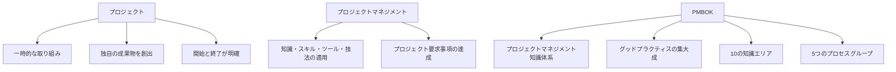

**池上**：これがPMBOKの基本的な概念です。プロジェクトとは「一時的」であり、「独自の成果物」を生み出し、「明確な開始と終了」を持つ取り組みです。プロジェクトマネジメントはこれを実現するための知識や技法の適用です。PMBOKはこれらのグッドプラクティスを体系化したものというわけですね。

**ジョブズ**：(*図を見て*) シンプルな図解ですね。私はいつも「複雑なことを単純にする」ことの重要性を説いてきました。PMBOKは一見複雑に見えますが、本質は「プロジェクトを成功に導くための知恵の集大成」です。

**ゲイツ**：確かに。ただ、PMBOKをただの規範として盲目的に従うのではなく、各プロジェクトの状況に応じて適用することが重要です。私たちがMicrosoft Officeを開発した際も、業界標準のプラクティスを基盤としつつも、当社の文化や技術的要件に合わせてカスタマイズしました。

**ピチャイ**：そうですね。私たちはGoogle検索エンジンの継続的改善において、PMBOKの原則を活用しつつも、Googleのデータ駆動型の文化に合わせた独自のアプローチを取り入れています。PMBOKは土台となる知識を提供してくれますが、イノベーションのためには、時にはフレームワークを超えた発想も必要です。

### コラム：3つの企業文化とプロジェクトマネジメント

**池上**：ここで少し、3社それぞれの企業文化がプロジェクトマネジメントにどう影響しているか、お聞きしたいと思います。

**ゲイツ**：マイクロソフトでは、初期からコードの品質とドキュメンテーションを重視する文化がありました。この「記録を残す」文化がプロジェクト管理にも表れていて、詳細な計画と進捗報告を大切にしています。

**ジョブズ**：(*少し笑いながら*) ビルのところは文書作成ソフトを作っているから、ドキュメントが多いのは当然かもしれませんね。

**ゲイツ**：(*親しげに*) そうかもしれないね、スティーブ。君のところは逆にメモ帳アプリも最小限だったりして。

**ジョブズ**：(*笑いながら*) いや、Notes（メモ）アプリは結構機能満載ですよ。でも確かに、アップルではプロダクトの美しさと使いやすさを最優先しています。そのため、プロジェクト管理においても、ユーザー体験を中心に考え、細部までこだわり抜く文化があります。会議でも「これは十分に素晴らしいか？」という問いが常にあります。

**ピチャイ**：Googleでは「ユーザーに焦点を当て、他のことは後からついてくる」という哲学があります。また、データに基づく意思決定を重視しています。プロジェクト管理においても、仮説を立ててテストし、データに基づいて迅速に方向転換することを奨励しています。「20%ルール」もその一例で、エンジニアが勤務時間の20%を自分のプロジェクトに費やせるようにしています。

**池上**：興味深いですね。3社それぞれの企業文化がプロジェクト管理手法にも表れているわけですね。それでは、PMBOKの基本構造について詳しく見ていきましょう。

---

## 第2章：PMBOKの基本構造とプロジェクト統合マネジメント

**池上**：PMBOKの基本構造についてお話しいただく前に、なぜIT企業にとってPMBOKが重要なのかについて、ピチャイさんからお聞きしたいと思います。

**ピチャイ**：IT業界は常に急速に変化しています。新技術の登場、市場ニーズの変化、競合他社の動向など、多くの不確実性があります。その中でプロジェクトを成功させるためには、体系的なアプローチが必要です。PMBOKは世界中の経験から導き出されたベストプラクティスを提供してくれます。

Googleでは、例えばAndroid OSの開発のような複雑なプロジェクトを管理する際に、PMBOKの原則を適用しています。特に、多くのパートナー企業とも協力しながら進める必要があるため、共通言語としてのPMBOKの価値は非常に高いです。

**ゲイツ**：補足すると、IT企業は「無形の成果物」を扱うことが多いため、進捗の可視化が難しい傾向があります。コードは目に見えませんし、90%完成したと思っていた機能が実は50%だったということもよくあります。PMBOKのようなフレームワークは、この「見えない進捗」を可視化し、客観的に管理するための手段を提供してくれます。

**ジョブズ**：私は少し異なる視点から見ています。IIT企業の多くは創造性と革新性を重視しますが、それだけでは製品を市場に届けることはできません。PMBOKは、創造的なカオスに秩序をもたらし、アイデアを実際の製品に変換するための道筋を提供します。iPhoneの開発では、革新的なタッチスクリーン技術、バッテリー寿命、デザインなど、あらゆる要素を調和させる必要がありました。その複雑な調整にはPMBOKのような体系的なアプローチが不可欠でした。

**池上**：なるほど、IT企業特有の課題に対応するためにPMBOKが重要なのですね。では、PMBOKの基本構造について見ていきましょう。

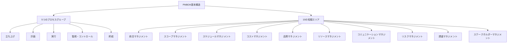

**池上**：こちらが現在のPMBOK第7版の基本構造です。5つのプロセスグループと10の知識エリアで構成されています。それでは、まず「プロジェクト統合マネジメント」について議論していきましょう。

**ゲイツ**：プロジェクト統合マネジメントは、PMBOKの中でも特に重要な知識エリアです。これは様々なプロジェクト要素を一つにまとめ、調整する役割を果たします。例えば、Windows開発では、ユーザーインターフェース、セキュリティ、パフォーマンスなど様々な側面を統合する必要がありました。

具体的には、プロジェクト憲章の作成、プロジェクトマネジメント計画の策定、作業の指揮と管理、プロジェクト知識の管理、変更のモニタリングとコントロール、そしてプロジェクトのクローズが含まれます。

**ジョブズ**：私はその中でも特に「プロジェクト憲章」の重要性を強調したいです。これはプロジェクトの存在理由、目的、目標を明確にするものです。iPadを開発する際、私たちは「コンピュータとモバイルデバイスの間の革命的な製品を作る」という明確なビジョンを持っていました。この共通ビジョンがなければ、チームは様々な方向に分散してしまいます。

**ピチャイ**：私は「プロジェクト知識の管理」に注目したいです。Googleでは、あるプロジェクトで学んだことを組織全体で共有する文化があります。例えば、Google検索アルゴリズムの改善プロジェクトで得た知見は、他の製品開発にも活かされています。PMBOKでは、この知識移転のプロセスも体系化されています。

**池上**：なるほど。では、プロジェクト統合マネジメントの実践例として、皆さんの会社での具体的な取り組みを教えていただけますか？

**ゲイツ**：マイクロソフトでは、複数の国と地域にまたがる大規模なソフトウェア開発プロジェクトを管理する必要がありました。その際、「One Microsoft」という統合的なアプローチを採用しました。これは、地理的に分散したチーム間でも一貫したプロセスとツールを使い、リアルタイムで情報を共有することで、プロジェクト全体の一体感を保つ取り組みです。

**ジョブズ**：アップルでは週次デザインレビューという仕組みがありました。これは各プロジェクトのリーダーが一堂に会し、進捗や課題を共有するミーティングです。私自身も参加し、製品間の一貫性やアップルの哲学に合致しているかを確認していました。これはPMBOKでいう「統合変更管理」の実践例と言えるでしょう。

**ピチャイ**：Googleでは「OKR」（Objectives and Key Results）という目標設定・進捗管理の手法を全社的に採用しています。これにより、会社の目標からチーム、個人の目標まで一貫性を持たせ、プロジェクト間の調整を容易にしています。また、「ポストモーテム」と呼ばれるプロジェクト振り返りの文化も根付いており、成功や失敗から学び、知識を蓄積・共有しています。

### ケーススタディ：Microsoft Officeの統合開発

**ゲイツ**：Microsoft Officeは、Word、Excel、PowerPointなど複数のアプリケーションを統合したスイートですが、その開発は統合マネジメントの好例です。初期のバージョンでは、各アプリケーションは独立して開発されていましたが、Office 95からは共通のコードベースと開発プロセスを採用しました。

これにより、ユーザーインターフェースの一貫性、ファイル形式の互換性、機能間の連携などが大幅に向上しました。特に重要だったのは、プロジェクト管理ツールの統一です。これにより、複数の製品チームが同じマイルストーンに向かって進捗を管理できるようになりました。

**ジョブズ**：(*興味深そうに*) 確かに、Office製品間の一貫性は印象的でした。ユーザーがWordからExcelへ移動しても、学習曲線が緩やかになる。これはユーザー体験の観点から非常に重要ですね。

**ピチャイ**：Googleでも同様の課題に直面し、Google Workspaceの開発で同様のアプローチを採用しています。特にクラウドベースのサービスでは、異なるアプリ間でのリアルタイムコラボレーションが重要になりますので。

**池上**：プロジェクト統合マネジメントは、複数の要素を調和させる「オーケストラの指揮者」のような役割を果たすのですね。では次に、プロジェクトスコープマネジメントについて見ていきましょう。

---

## 第3章：プロジェクトスコープマネジメント

**池上**：プロジェクトスコープマネジメントとは、簡単に言うと「何をするか、何をしないか」を明確にし、管理するプロセスです。これについてジョブズさん、アップルでの経験を踏まえていかがでしょうか？

**ジョブズ**：(*情熱的に*) スコープマネジメントは私が最も重視している分野の一つです。優れた製品を作るには、何を含めるかだけでなく、何を除外するかの決断がより重要です。初代iPhoneを開発した時、当時の標準だったフルキーボードを省略するという大胆な決断をしました。

スコープを明確にすることで、チームのエネルギーと資源を最も重要な機能に集中させることができます。実際、アップルの製品開発プロセスでは「フォーカスグループ」を否定し、代わりに「1000のノーと1つのイエス」を原則としています。これはまさにスコープマネジメントの哲学です。

**ゲイツ**：スティーブの視点は興味深いですね。マイクロソフトでは、特にエンタープライズ向け製品において、「機能の網羅性」がしばしば重視されます。しかし、Windows 7の開発では、Vista で批判された多くの機能を見直し、本当に必要なものに集中するアプローチを取りました。

スコープマネジメントの鍵は、「スコープクリープ」（要求の際限ない追加）との戦いです。開発途中で「この機能も追加しよう」という誘惑は常にあります。それを管理するため、私たちは「スコープ変更管理委員会」を設置し、変更要求を厳格に評価するプロセスを確立しました。

**ピチャイ**：GoogleではMVP（Minimum Viable Product：必要最小限の製品）の概念を活用しています。まず最小限の機能セットを定義し、それを迅速にリリースして、実際のユーザーフィードバックを基に機能を追加していくアプローチです。

Gmailもベータ版として長期間運用され、ユーザーのフィードバックを基に機能を追加していきました。これは「漸進的にスコープを拡大する」方法で、当初のスコープを小さく保ちながらも、最終的には完成度の高い製品に育てることができます。

**池上**：スコープマネジメントのプロセスをもう少し詳しく見てみましょう。

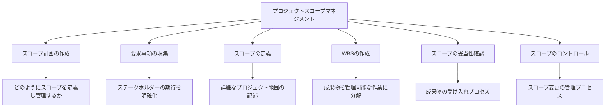

**池上**：こちらがPMBOK第7版におけるプロジェクトスコープマネジメントのプロセスです。特に「WBS（Work Breakdown Structure：作業分解構造）」は重要な要素ですね。これについて、ゲイツさんからご説明いただけますか？

**ゲイツ**：WBSは、プロジェクトの全体像を階層的に分解し、管理可能な単位に分けるツールです。これにより、複雑なプロジェクトを可視化し、各チームや個人の責任範囲を明確にすることができます。

例えば、Windows開発では、「ユーザーインターフェース」「セキュリティ」「パフォーマンス」などの大きなカテゴリーに分け、さらにそれぞれを具体的な作業単位に分解します。この階層構造により、「木を見て森を見ず」あるいは「森を見て木を見ず」という状況を避けることができます。

**ジョブズ**：WBSは有用ですが、時に官僚的になりすぎる危険もあります。アップルでは、WBSを作成しつつも、常に最終的なユーザー体験を念頭に置くよう心がけています。技術的な作業分解だけでなく、「この機能がユーザーにもたらす価値は何か」という視点を失わないことが重要です。

**ピチャイ**：Googleでは、WBSに加えて「ユーザーストーリー」という概念も取り入れています。これは「ユーザーとして、私は〜したい。なぜなら〜だからだ」という形式で要求を記述するもので、技術的な分解だけでなく、ユーザー価値を明確にする方法です。

また、大規模なプロジェクトでは、WBSを動的に管理するツールとして、独自のプロジェクト管理システムを開発し、リアルタイムで進捗を追跡できるようにしています。

### コラム：ビル・ゲイツとスティーブ・ジョブズの機能論争

**池上**：ここで少し、お二人の間で有名な「機能の多さ vs シンプルさ」の議論について触れてみたいと思います。これはスコープマネジメントの哲学にも関わる話ですね。

**ジョブズ**：(*笑いながら*) ああ、あの議論ですね。ビルとは長年の友人であり、ライバルでもありますが、製品哲学で最も異なるのはこの点かもしれません。

マイクロソフトのOfficeは非常に多機能で、95%のユーザーが使わない機能も含まれています。一方、私たちのアプローチは「80%のユーザーが使う20%の機能に完璧を期す」というものでした。例えば、初代iPadでは、あえてマルチタスキングを制限し、バッテリー寿命とパフォーマンスを優先しました。

**ゲイツ**：(*穏やかに*) スティーブの言う通り、我々のアプローチは異なります。マイクロソフトは多様なユーザーニーズに応えることを重視してきました。ExcelがCPAから学生まで使える理由は、その柔軟性と機能の豊富さにあります。

ただ、Vista以降は「すべての機能を詰め込む」アプローチの限界も認識し、よりフォーカスしたアプローチに移行してきました。Windows 10は、その両方のバランスを取ろうとする試みだったと思います。

**ピチャイ**：興味深い議論ですね。Googleは両方のアプローチを状況に応じて使い分けています。Gmailのような製品では、パワーユーザー向けの高度な機能と一般ユーザー向けのシンプルなインターフェースの両立を目指しています。

特にAI時代では、ユーザーインターフェースをシンプルに保ちながらも、裏側の機能は非常に強力にするという新しいバランスが可能になってきています。例えば、Google検索は非常にシンプルなインターフェースですが、裏側では極めて複雑なアルゴリズムが動いています。

**池上**：なるほど。スコープマネジメントは、単に機能のリストを管理するだけでなく、製品哲学や企業文化とも深く結びついているのですね。では次に、プロジェクトスケジュールマネジメントに移りましょう。

---

## 第4章：プロジェクトスケジュールマネジメント

**池上**：プロジェクトスケジュールマネジメントは、プロジェクトを期限内に完了させるための重要な知識エリアです。ピチャイさん、Googleでのスケジュール管理の経験をお聞かせいただけますか？

**ピチャイ**：はい。IT業界、特にGoogleのような急速に変化する環境では、スケジュール管理は非常に難しい課題です。プロジェクトの遅延は市場機会の喪失につながるリスクがある一方で、品質を犠牲にして急いでリリースすれば、ユーザーの信頼を失うことになります。

Googleでは「OKR」（Objectives and Key Results）システムを四半期ごとに設定し、これをプロジェクトのマイルストーンと連動させています。また、「SLI/SLO」（Service Level Indicators/Objectives）という指標を用いて、進捗だけでなく品質も同時に測定しています。

特に重要なのは、「並行開発」のアプローチです。例えば、Chrome OSの開発では、多数の機能を並行して開発し、準備ができたものから段階的にリリースする方法を採用しています。これにより、一部の機能の遅延が全体のスケジュールに影響を与えるリスクを軽減しています。

**ゲイツ**：Googleのアプローチは興味深いですね。マイクロソフトでも似たような課題に直面していました。Windows開発では、何千もの機能とコンポーネントを調整する必要があり、スケジュール管理は極めて複雑でした。

私たちが採用した方法の一つは「マイルストーン駆動型開発」です。プロジェクトを複数のマイルストーンに分け、各マイルストーンで完全に機能する製品バージョンを作成します。これにより、常に「出荷可能な状態」を維持しながら開発を進めることができます。

また、「クリティカルパス分析」も重要なツールでした。これは、プロジェクト完了までの最長経路を特定し、そこにリソースを集中させる方法です。Windows 7開発では、この分析により、グラフィックドライバの開発がクリティカルパスであることが判明し、そこに追加リソースを投入することで全体のスケジュールを短縮できました。

**ジョブズ**：私はスケジュール管理において「締切の力」を信じています。適切なプレッシャーがなければ、完璧を求めるあまり永遠に製品を出荷できなくなる危険があります。iPhoneの開発では、「Macworld 2007で発表する」という明確な締切を設定し、これを絶対に動かさないことでチームを集中させました。

同時に、「スコープの柔軟性」も重要です。締切が近づくにつれ、「必須」「重要」「あれば良い」という3つのカテゴリに機能を分類し、必要に応じて後者を次バージョンに回すことで、核となる価値を提供する製品を期限内にリリースすることができました。

**池上**：スケジュールマネジメントの基本プロセスを図で見てみましょう。

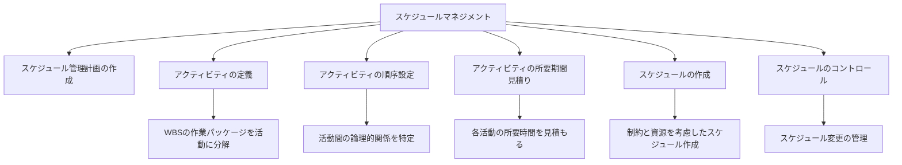

**池上**：特に「アクティビティの所要期間見積り」は難しい部分ですね。ジョブズさん、アップルではどのように所要期間を見積もっていたのでしょうか？

**ジョブズ**：ソフトウェア開発の見積もりは本質的に難しいものです。私たちは「3点見積法」を採用していました。これは最短・最長・最も可能性の高い期間を見積もり、重み付き平均を計算する方法です。

ただ、見積もりだけでなく「トラッキング」も重要です。アップルでは週次のデザインレビューを行い、進捗を細かく追跡していました。また、あえて見積もりに「バッファ」を含めず、問題が早期に表面化するようにしていました。問題は早く見つかるほど、解決も容易になります。

**ゲイツ**：見積もりに関しては、「過去の実績」を参考にすることも重要です。マイクロソフトでは、過去のプロジェクトのメトリクスを蓄積し、それを基に将来の見積もりの精度を高めていました。特に大規模なプロジェクトでは、ヒストリカルデータは貴重な資産となります。

**ピチャイ**：Googleでは、従来の見積もり手法に加えて、「データ駆動型見積もり」も活用しています。例えば、コードの変更量と必要なテスト時間の相関関係をAIで分析し、より正確な見積もりを導き出す試みも行っています。

また、「アジャイルストーリーポイント」という相対的な複雑さの指標を用いて、絶対的な時間ではなく、タスク間の相対的な難易度を評価する方法も採用しています。これにより、チームの能力に合わせた現実的なスケジュールを作成できます。

### ケーススタディ：iPhone開発スケジュール管理

**ジョブズ**：iPhoneの開発は、アップル史上最も野心的なプロジェクトの一つでした。ハードウェア、ソフトウェア、サービスを同時に開発する必要があり、スケジュール管理は極めて重要でした。

開発開始から約2年半、200以上のコンポーネントを含む複雑なプロジェクトでしたが、いくつかの鍵となるアプローチがありました：

1. **逆算スケジューリング**：発表日から逆算してスケジュールを設定
2. **並行開発ストリーム**：ハードウェア、OS、アプリケーションの並行開発
3. **週次統合**：各コンポーネントを週単位で統合し、問題を早期発見
4. **絶対優先順位**：「マストハブ」機能を明確にし、リソースを集中
5. **エグゼクティブレビュー**：私自身が週次レビューに参加し、意思決定を迅速化

特に重要だったのは「決断の速さ」です。スケジュールの遅延が発生した場合、すぐに判断を下し、必要であれば機能をカットするという決断の速さが、最終的な成功につながりました。

**ゲイツ**：(*興味深そうに*) 「決断の速さ」は本当に重要ですね。多くのプロジェクトが遅延するのは、技術的な問題よりも、意思決定の遅れが原因であることが多いです。

**ピチャイ**：確かに。Googleでも同様の経験があります。Android OSの開発では、「フィーチャーフリーズ」という概念を導入し、特定の日付以降は新機能の追加を認めないルールを設けました。これにより、締切に向けた収束を容易にしています。

**池上**：なるほど。スケジュール管理は単なる計画作成ではなく、「決断」や「優先順位付け」のプロセスでもあるのですね。次に、プロジェクトコストマネジメントについて見ていきましょう。

---

## 第5章：プロジェクトコストマネジメント

**池上**：プロジェクトコストマネジメントは、予算内でプロジェクトを完了させるための知識エリアです。ゲイツさん、マイクロソフトでのコスト管理の経験をお聞かせいただけますか？

**ゲイツ**：プロジェクトコスト管理は、単に「お金を節約する」ことではなく、「限られた資源を最適に配分する」ことです。マイクロソフトのような大規模なソフトウェア企業では、最大のコストは人件費です。例えば、Windows開発では、数千人のエンジニアが関わり、その人件費は数十億ドルに達します。

私たちが採用していた方法の一つは「価値ベースの予算配分」です。これは、ビジネスインパクトが最も大きいと予想される分野に重点的に投資する方法です。例えば、Windows 7では、ユーザーインターフェースとパフォーマンスに多くのリソースを割り当てました。なぜなら、Vistaのこれらの側面が最も批判されていたからです。

また、「段階的コミットメント」のアプローチも重要でした。プロジェクトの初期段階では小額の予算をコミットし、進捗や市場状況に応じて追加投資を決定するというものです。これにより、失敗のコストを最小化し、成功の見込みが高いプロジェクトにリソースを集中させることができます。

**ジョブズ**：コスト管理について、私の哲学は少し異なります。「安いコストで作るのではなく、正しい製品を作るための適切なコスト」を考えるべきだと思います。iPadを開発した際、安いコンポーネントを使用してコストを下げるのではなく、ユーザー体験を最大化するために必要な投資を行いました。

同時に、「集中と選択」も重要です。アップルは常に製品ラインを限定し、リソースを集中させてきました。私がAppleに戻った時、70以上あった製品ラインを4つに削減しました。これにより、各製品に十分なリソースを投入できるようになりました。

**ピチャイ**：Googleでは「data-driven cost management」（データ駆動型コスト管理）を実践しています。例えば、クラウドインフラのコストは、使用パターンを分析し、最適化するアルゴリズムを開発して管理しています。

また、「10倍思考」というコンセプトも採用しています。これは「従来の方法で10%改善するのではなく、全く新しいアプローチで10倍の改善を目指す」という考え方です。例えば、Project Loonでは、従来の通信インフラ構築ではなく、気球を使ったアプローチを採用し、コストを劇的に削減しました。

コストマネジメントの中でも特に重要なのは「投資対効果（ROI）の最適化」です。単に予算内に収めることだけでなく、投資した各ドルが最大の価値を生み出すことを確認する必要があります。

**池上**：コストマネジメントの基本プロセスを見てみましょう。

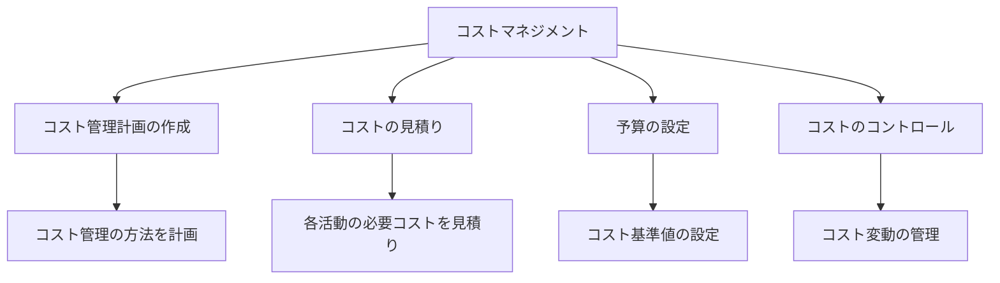

**池上**：「コストの見積り」については特に難しい面があると思いますが、それぞれの会社での工夫はありますか？

**ゲイツ**：ソフトウェア開発のコスト見積りで最も難しいのは、「隠れたコスト」を予測することです。例えば、バグ修正、テスト、文書作成、トレーニングなどは、しばしば過小評価されます。

マイクロソフトでは、「アクティビティベースのコスト見積り」を採用していました。これは、開発だけでなく、テスト、デプロイメント、サポートまでを含む全ライフサイクルのコストを見積もる方法です。また、過去のプロジェクトのデータを体系的に収集し、見積りの精度を向上させる取り組みも行っていました。

**ジョブズ**：アップルでは「デザイン主導のコスト見積り」というアプローチを取っていました。まず理想的な製品を設計し、その後でコスト削減の可能性を探るというものです。これにより、コスト削減が製品の本質的な価値を損なわないようにしています。

例えば、MacBook Airの開発では、まず理想的な薄さと軽さを設計目標として設定し、その後でそれを実現するための技術的な解決策とコスト最適化を行いました。この「価値優先」のアプローチが、革新的な製品を生み出す鍵だと考えています。

**ピチャイ**：Googleでは「モンテカルロシミュレーション」という確率的なコスト見積り手法を採用しています。これは、各コスト要素の不確実性を考慮し、何千ものシナリオをシミュレーションして、コスト分布を予測する方法です。

また、オープンソースの活用もコスト管理の重要な側面です。自社開発よりもオープンソースソリューションを採用することで、開発コストを大幅に削減できる場合があります。Androidプラットフォームはその良い例です。

### コラム：池上彰と3賢者のコスト意識対談

**池上**：皆さんのお話を聞いていると、「コスト意識」の違いが興味深いですね。少し個人的な質問ですが、皆さんは普段の生活でもコスト意識が高いのでしょうか？

**ゲイツ**：(*笑いながら*) 私は節約家として知られています。何兆円もの資産があっても、$10のTシャツを着ることもあります。これは単なる節約ではなく、「価値」への意識です。無駄なことにお金を使わず、本当に価値のあることに投資するという考え方です。ただ、ビル＆メリンダ・ゲイツ財団の活動のように、社会的リターンが高いと判断した場合は惜しみなく投資します。

**ジョブズ**：私はゲイツとは少し違います。品質とデザインに対しては惜しみなくお金を使いますが、無駄なものには一切興味がありません。例えば、私の自宅は最小限の家具しかありませんでした。高価なものを持つことは目的ではなく、本質的に優れたものを持つことが重要だと考えています。

**ピチャイ**：私は「持続可能性」という観点からコストを考えることが多いです。例えば、Googleのデータセンターは、エネルギー効率を最大化するために多額の投資を行っていますが、長期的には環境にも財務的にもプラスになります。個人的にも、長期的な価値を生み出す投資を重視しています。

**池上**：なるほど、皆さんそれぞれのコスト哲学が会社の経営方針にも表れているのですね。次に、プロジェクト品質マネジメントに移りましょう。

---

## 第6章：プロジェクト品質マネジメント

**池上**：プロジェクト品質マネジメントは、プロジェクトとその成果物が要求事項を満たすことを確実にするプロセスです。ジョブズさん、アップルは品質に対するこだわりで知られていますが、その管理方法についてお聞かせいただけますか？

**ジョブズ**：(*情熱的に*) 品質は何よりも大切です。アップルの哲学は「詳細へのこだわり」です。見えない部分にも美しさを求める。例えば、Macの内部配線でさえ美しく整理することにこだわりました。なぜなら、その姿勢が製品全体の品質に表れると信じているからです。

品質マネジメントには3つの側面があります。まず「品質計画」。これは何が「良い」製品なのかを明確に定義することです。iPhoneでは、反応速度が0.5秒以内、バッテリー寿命が1日以上など、具体的な指標を設定しました。

次に「品質保証」。これは「プロセスの品質」を確保することです。アップルでは、デザインレビュー、ユーザビリティテスト、工学的テストなど、様々なチェックポイントを設けています。

最後に「品質管理」。これは最終製品が基準を満たしているかを確認するプロセスです。アップルでは私自身が最終製品を使用し、「これでいいのか？」と常に問いかけていました。

**ゲイツ**：品質に関して、マイクロソフトはエンタープライズ市場向けという性質上、「信頼性」と「後方互換性」を特に重視してきました。数千の異なるハードウェア構成で動作し、何百万行ものレガシーコードとも互換性を持つ必要があります。

そのため、「自動テスト」に多大な投資をしてきました。例えば、Windows 7の開発では、数十万の自動テストケースを実行するインフラを構築しました。また、「ドッグフーディング」と呼ばれるプラクティスも重要で、社内で実際に使用することで早期に問題を発見します。

品質マネジメントにおいて特に重要なのは「品質メトリクス」です。何を測定するかによって、何が改善されるかが決まります。例えば、バグの数だけでなく、ユーザー体験の指標、パフォーマンス指標なども含めた多角的な評価が必要です。

**ピチャイ**：Googleでは「データ駆動型の品質マネジメント」を実践しています。例えば、検索エンジンの品質は、複雑なアルゴリズムと人間の評価者によって測定され、常に改善が図られています。

また、「カナリアリリース」という方法も採用しています。これは新機能を一部のユーザーにのみ提供し、フィードバックや問題を収集してから全ユーザーに展開する方法です。

品質マネジメントにおいて特筆すべきは「SRE（Site Reliability Engineering）」という取り組みです。これは開発と運用を融合させ、システムの信頼性を向上させるアプローチで、従来の品質管理を超えた概念です。

**池上**：品質マネジメントの基本プロセスを見てみましょう。

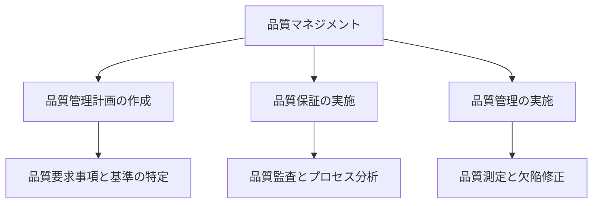

**池上**：「品質保証」と「品質管理」の違いについて、ピチャイさん、もう少し詳しく説明していただけますか？

**ピチャイ**：はい。この2つの違いは重要です。「品質保証（QA）」は予防的なアプローチで、プロセスに焦点を当てています。つまり、「正しいことを正しく行う」ためのプロセスを確立することです。例えば、コードレビュー、自動テスト、開発標準などの実践がこれに当たります。

一方、「品質管理（QC）」は検出的なアプローチで、成果物に焦点を当てています。実際の製品が要求事項を満たしているかをチェックし、欠陥を特定・修正します。例えば、テスト実行、バグ修正、ユーザビリティテストなどがこれに該当します。

Googleでは、この2つを組み合わせたアプローチを取っています。例えば、コードの品質については、自動化された静的解析ツール（QA）とコードレビュー（QA）に加えて、統合テスト（QC）を実施しています。

**ゲイツ**：補足すると、品質保証は「問題が発生しないようにする」ことに重点を置き、品質管理は「発生した問題を特定して修正する」ことに重点を置いています。理想的には、強力な品質保証により、品質管理で発見される問題が最小限になるはずです。

マイクロソフトでは、この両方にバランス良く投資していました。例えば、「セキュリティ開発ライフサイクル（SDL）」というフレームワークは、セキュリティの問題を予防するための包括的なプロセス（QA）を提供しながら、セキュリティテスト（QC）も組み込んでいます。

**ジョブズ**：私の視点を加えると、品質は「適合性」だけでなく「ユーザー満足度」という側面も重要です。仕様書どおりに動作しても、ユーザーが喜ばなければ真の品質とは言えません。

アップルでは、技術的な品質テスト（QC）に加えて、「実際にその製品を使いたいと思うか？」という基準（QA的な視点）も重視していました。例えば、最初のiPadは、技術的には完璧でも、使いたいと思えるまで何度も設計をやり直しました。

### ケーススタディ：Googleの検索品質管理

**ピチャイ**：Googleの検索エンジンは、品質管理の興味深い事例です。毎日数十億の検索クエリを処理し、常に最も関連性の高い結果を提供する必要があります。その品質管理プロセスには以下のような要素があります：

1. **サーチクオリティレーティング**：世界中の評価者が検索結果の質を評価
2. **A/Bテスト**：新アルゴリズムを一部のユーザーにのみ提供し、効果を測定
3. **ユーザーフィードバック分析**：実際のユーザーからのフィードバックを分析
4. **オフライン指標**：既知の高品質なクエリセットに対するアルゴリズムの性能を測定
5. **リアルタイムモニタリング**：異常な検索パターンや問題を即時に検出

特に重要なのは「品質の定義」です。Googleの検索では、単に技術的に正確であるだけでなく、「有用性」「新鮮さ」「多様性」「権威性」など、複数の次元で品質を定義しています。

さらに、「継続的改善」のプロセスも重要です。例えば、「パンダアップデート」や「ペンギンアップデート」のような大規模なアルゴリズム更新は、検索品質を向上させるための取り組みの一部です。

**ゲイツ**：非常に包括的なアプローチですね。特に、技術的な指標だけでなく、実際のユーザー体験に基づく評価を取り入れている点が印象的です。

**ジョブズ**：そうですね。技術とユーザー体験のバランスが素晴らしい。アップルも同様のアプローチを取っていますが、Googleの規模でそれを実現するのは大変な挑戦だと思います。

**池上**：品質マネジメントは、技術的な側面だけでなく、ユーザー視点や継続的改善のプロセスも含む包括的な取り組みであることがわかりました。次に、プロジェクトリソースマネジメントについて見ていきましょう。

---

## 第7章：プロジェクトリソースマネジメント

**池上**：プロジェクトリソースマネジメントは、必要なリソース（人材、設備、材料など）を特定し、調達し、管理するプロセスです。ゲイツさん、マイクロソフトでの人材管理の経験をお聞かせいただけますか？

**ゲイツ**：プロジェクトにおいて最も重要なリソースは「人」です。特にソフトウェア開発では、優秀なエンジニアと平均的なエンジニアの生産性差は10倍以上と言われています。そのため、「適切な人材をプロジェクトの適切な位置に配置する」ことが成功の鍵となります。

マイクロソフトでは「スモールチーム」の哲学を持っていました。大規模なプロジェクトでも、小さな自律的なチームに分割し、各チームに明確な責任範囲を与えるというアプローチです。例えば、Windowsの開発では、UIチーム、カーネルチーム、ネットワーキングチームなど、専門分野ごとにチームを編成していました。

また、「T型人材」の育成も重視していました。これは、一つの分野で深い専門知識を持ちながら（縦棒）、他分野にも広い理解を持つ（横棒）人材です。例えば、データベースの専門家でありながら、UXやセキュリティについても理解がある人材は、チーム間の橋渡し役として非常に価値があります。

**ジョブズ**：人材に関して、私は「Aクラスの人材はAクラスの人材を引き寄せ、Bクラスの人材はCクラスの人材を引き寄せる」という原則を信じていました。そのため、妥協せずに最高の人材を採用し、高い期待値を設定することが重要です。

アップルでは「機能横断的なチーム」という概念も重視していました。例えば、iPhoneの開発では、ハードウェアエンジニア、ソフトウェアエンジニア、デザイナー、マーケティング担当者などが一つのチームとして働く体制を作りました。これにより、部門間のサイロ化を防ぎ、製品全体としての一貫性を確保しました。

また、「権限委譲とオーナーシップ」も重要です。各機能やコンポーネントに「DRI」（Directly Responsible Individual：直接責任者）を任命し、明確な責任所在を確立しました。これにより、意思決定が迅速になり、品質への責任感も高まります。

**ピチャイ**：Googleでは「20%ルール」という独自のリソース管理アプローチを採用しています。これは、エンジニアが勤務時間の20%を自分の興味のあるプロジェクトに費やせるというものです。Gmail、Google News、Google Translateなど、多くの革新的な製品がこの20%の時間から生まれました。

また、「リソースの流動性」も重視しています。プロジェクトの優先順位や市場環境の変化に応じて、人材を柔軟に再配置する文化があります。これを可能にするのが「OKR」（Objectives and Key Results）フレームワークで、会社全体の目標を透明化し、リソース配分の意思決定を支援しています。

**池上**：人材以外のリソース管理についてはいかがでしょうか？

**ゲイツ**：ソフトウェア開発では、クラウドコンピューティングの登場により、コンピューティングリソースの管理も重要になっています。マイクロソフトではAzureというクラウドプラットフォームを開発し、需要に応じてリソースを動的に割り当てる技術を確立しました。

特に重要なのは「リソースの最適化」です。例えば、開発環境、テスト環境、本番環境でのリソース配分を適切に管理することで、コストを削減しながらも必要な時に十分なリソースを確保できます。

**ピチャイ**：Googleでは「サステナビリティ」も重要なリソース管理の視点です。例えば、データセンターのエネルギー効率を最大化するための投資や、再生可能エネルギーの活用など、環境への影響を最小化しながらリソースを最適化する取り組みを行っています。

**ジョブズ**：アップルでは「サプライチェーンリソース」の管理も重視していました。製品の部品調達から製造、物流まで、全体を最適化することで、高品質を維持しながらもコスト効率を向上させる取り組みを行っていました。例えば、フラッシュメモリを大量に先行発注することで、コスト削減と安定供給の両方を実現しました。

**池上**：リソースマネジメントの基本プロセスを見てみましょう。

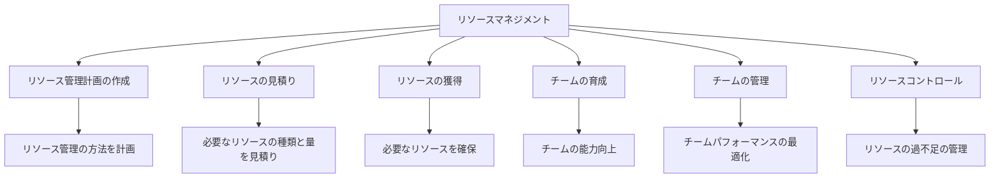

### コラム：3賢者のチームビルディング哲学

**池上**：皆さんのお話を聞いていると、「チームビルディング」に対する考え方がそれぞれ異なりますね。もう少し詳しく教えていただけますか？

**ゲイツ**：私のチームビルディング哲学は「知的多様性」に基づいています。異なる背景、思考スタイル、専門知識を持つ人々が集まることで、より革新的な解決策が生まれると考えています。

マイクロソフトでは、新入社員の採用において「頭の良さ」と「問題解決能力」を重視していました。技術的なスキルも重要ですが、それよりも「複雑な問題をシンプルな部分に分解して解決する能力」を評価していました。

また、「建設的な対立」も奨励していました。アイデアについて激しく議論することはあっても、それは個人ではなくアイデア自体に対するものであるべきです。このようなオープンな議論文化が、より良い製品を生み出すと信じています。

**ジョブズ**：私のアプローチは「少数精鋭」です。「AクラスのプレイヤーはAクラスのプレイヤーと一緒に働きたがる」という信念に基づき、各分野で最高の人材を集めることに注力していました。

チーム内では「共通のビジョン」を最も重視していました。技術的なスキルだけでなく、製品に対する情熱や美的センスも重要な採用基準でした。「なぜこの製品を作るのか」という根本的な問いに共感できる人材を求めていました。

また、「直接的なフィードバック」の文化も重要でした。問題点や改善点を遠慮なく指摘し合える環境が、卓越した製品を生み出すと考えていました。時には厳しい状況もありましたが、それは製品への愛から来るものです。

**ピチャイ**：Googleでのチームビルディングは「心理的安全性」という概念を中心に据えています。Googleの研究によれば、チームの成功を予測する最大の要因は、メンバーが自由に意見を述べ、リスクを取ることができる環境であることが分かっています。

採用においては「文化への適合性」と「成長マインドセット」を重視しています。特定のスキルセットだけでなく、学習意欲や協調性も重要な基準です。また、「多様性と包括性」も積極的に推進しています。多様な視点がより良い製品を生み出すと信じています。

チーム運営では「データ駆動型の意思決定」を奨励しています。個人の意見や直感だけでなく、データと実験に基づいて判断することで、より客観的な結論に達することができます。

**池上**：興味深い対比ですね。ゲイツさんの「知的多様性」、ジョブズさんの「少数精鋭とビジョン共有」、ピチャイさんの「心理的安全性とデータ駆動」と、それぞれ異なるアプローチで成功を収めてきたわけですね。次に、プロジェクトコミュニケーションマネジメントについて見ていきましょう。

---

## 第8章：プロジェクトコミュニケーションマネジメント

**池上**：プロジェクトコミュニケーションマネジメントは、プロジェクト情報の適切な作成、収集、配布、保存、取得、管理、監視、そして最終的な処分を行うプロセスです。ジョブズさん、アップルでのコミュニケーション戦略についてお聞かせいただけますか？

**ジョブズ**：(*身を乗り出して*) コミュニケーションは、単なる情報伝達ではなく、「共通の理解と情熱を創り出すこと」だと考えています。アップルでは「シンプルで明確なコミュニケーション」を重視していました。技術者でも技術に詳しくない人でも理解できるように、複雑な概念を分かりやすく伝える努力をしていました。

特に重要だったのは「ビジョンの共有」です。私は週次のエグゼクティブミーティングを主催し、会社の方向性や製品の哲学について率直に議論していました。この場で形成された共通理解が、組織全体に浸透していくのです。

また、「選択的な透明性」も重要でした。全ての情報を全員と共有するのではなく、各人が自分の役割を果たすために必要な情報を提供するアプローチです。例えば、iPhoneの開発では、セキュリティ上の理由から、一部のチームメンバーは全体像を知らされないことがありました。

**ゲイツ**：マイクロソフトでは「体系的なドキュメンテーション」を重視していました。大規模なソフトウェア開発では、意思決定の背景や技術的選択の理由を文書化することが不可欠です。これにより、後から参加したメンバーも文脈を理解できますし、将来の参照のためにも役立ちます。

特に「デザインドキュメント」は重要なコミュニケーションツールでした。これは単なる技術仕様ではなく、問題定義、解決策の比較検討、選択した解決策の根拠などを含む包括的な文書です。これにより、技術者だけでなく、マーケティングや営業部門とも共通理解を形成できました。

また、「コードレビュー」もコミュニケーションの一形態として重視していました。これは単にバグを見つけるだけでなく、知識共有や継続的な学習の機会としても機能していました。

**ピチャイ**：Googleでは「情報の民主化」を重視しています。週次の全体会議「TGIF」では、経営陣が社員からの質問に直接答え、透明性の高いコミュニケーションを実現しています。また、「meme（ミーム）」と呼ばれる内部文書システムにより、プロジェクトの進捗や意思決定の背景などを広く共有しています。

「非同期コミュニケーション」も重要な要素です。世界中にオフィスがあるGoogle では、リアルタイムのミーティングだけでなく、ドキュメント共有やコメント機能を活用した時間差のコミュニケーションも重視しています。これにより、異なるタイムゾーンにいるチームメンバーでも効果的に協働できます。

また、「データ可視化」もコミュニケーションの重要な形態です。複雑なデータを理解しやすいビジュアルに変換することで、より効果的な意思決定が可能になります。例えば、ユーザーの行動パターンやシステムパフォーマンスを視覚化するダッシュボードを作成し、誰もが同じデータを基に議論できるようにしています。

**池上**：コミュニケーションマネジメントの基本プロセスを見てみましょう。

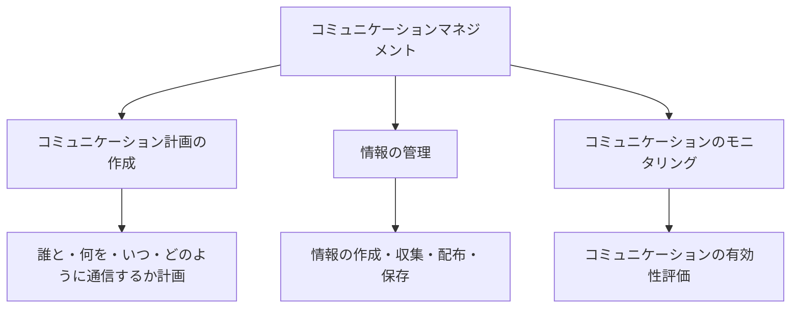

**池上**：3人の方々の会社では、テクノロジーを活用したコミュニケーションツールの開発や使用も進んでいますね。その点についてもお聞かせいただけますか？

**ゲイツ**：マイクロソフトでは、社内コミュニケーションツールの開発と活用を積極的に行ってきました。例えば、Microsoft Teamsは当初、社内のコラボレーションニーズから生まれたものです。

特に重要なのは「統合されたコミュニケーション環境」です。メール、チャット、ビデオ会議、ファイル共有などが一つのプラットフォームで連携することで、コンテキストスイッチングのコストを削減し、情報の一貫性を確保できます。

また、AIを活用した「情報フィルタリング」も進めていました。膨大な情報の中から関連性の高いものだけを提示することで、情報過多を防ぎ、効率的な意思決定をサポートするという考え方です。

**ジョブズ**：アップルでは「対面コミュニケーション」の価値を常に重視してきました。テクノロジーは素晴らしいツールですが、複雑なアイデアの交換や創造的なブレインストーミングには、物理的な共存が重要だと考えています。

Apple Parkのデザインもこの哲学を反映しています。偶発的な出会いや部門を超えた交流を促進するオープンスペースと、集中作業のためのプライベートスペースのバランスを重視しました。

また、「ビジュアルコミュニケーション」も重要視していました。製品のモックアップや試作品を早い段階で作成し、抽象的な議論よりも具体的な体験に基づいて会話を進める方法です。「百聞は一見に如かず」という言葉通り、実際に見て触れることで共通理解が深まります。

**ピチャイ**：Googleでは「協調編集ツール」が革新的なコミュニケーション方法をもたらしました。Google DocsやSheetsなどのツールにより、複数の人が同時に同じドキュメントを編集し、コメントやディスカッションを行うことができます。

また、「機械翻訳」技術も国際的なチーム間のコミュニケーションを支援しています。異なる言語を話すチームメンバーでも、リアルタイム翻訳により効果的に協働できるようになってきています。

さらに、「コンテキスト認識型コミュニケーション」も進めています。例えば、会議の前に関連資料が自動的に提示されたり、過去の関連ディスカッションが要約されたりする機能です。AIによる自動化で、コミュニケーションの質を向上させることを目指しています。

### ケーススタディ：Googleの分散チームコミュニケーション

**ピチャイ**：Googleは世界50カ国以上にオフィスを持ち、多くのプロジェクトが地理的に分散したチームによって開発されています。Androidの開発もその一例で、米国、ヨーロッパ、アジアなど各地のエンジニアが協働しています。

このような分散環境でのコミュニケーション戦略には、いくつかの特徴があります：

1. **「シングルソースオブトゥルース」** - 全ての情報が集約される単一の信頼できる情報源を確立。例えば、プロジェクト計画、API仕様、ロードマップなどをGoogle Driveで一元管理し、いつでも最新情報にアクセスできるようにしています。

2. **「非同期と同期のバランス」** - 時差がある中でも効率的に協働できるよう、リアルタイムミーティング（同期）と文書ベースのコミュニケーション（非同期）をバランス良く活用しています。例えば、重要な意思決定にはビデオ会議を設定し、日常的な更新は文書共有で行います。

3. **「コンテキスト共有の徹底」** - 決定事項だけでなく、その背景や検討されたオプションも共有することで、不在者も意思決定プロセスを理解できるようにしています。例えば、「決定ログ」と呼ばれるドキュメントで意思決定の履歴を記録しています。

4. **「包括的な議事録」** - 全てのミーティングに詳細な議事録をつけ、参加できなかったメンバーも内容を把握できるようにしています。特に、「アクションアイテム」と「決定事項」を明確に記録することを重視しています。

5. **「ビルド通知システム」** - コードベースの変更や新しいビルドの生成を自動的に関係者に通知するシステムを構築し、複数のタイムゾーンにまたがっても開発の連続性を維持しています。

この包括的なアプローチにより、地理的分散という課題を克服し、効率的な協働を実現しています。

**ジョブズ**：Googleのアプローチは包括的ですね。アップルでも国際的なチームがありますが、私たちはより集中型のアプローチを取ってきました。重要な意思決定者を同じ場所に集め、対面でのインタラクションを重視していました。どちらのアプローチにも長所があると思います。

**ゲイツ**：確かに。マイクロソフトもグローバルな開発体制を持っていましたが、Googleほど体系化されたアプローチではなかったかもしれません。特に「シングルソースオブトゥルース」の考え方は非常に重要だと思います。

**池上**：多様なコミュニケーション戦略があり、それぞれの会社の文化や状況に合わせて適用されているのですね。次に、プロジェクトリスクマネジメントについて見ていきましょう。

---

## 第9章：プロジェクトリスクマネジメント

**池上**：プロジェクトリスクマネジメントは、プロジェクトの目標達成を脅かす不確実性を特定、分析、対応するプロセスです。ビル・ゲイツさん、マイクロソフトでのリスク管理アプローチについてお聞かせいただけますか？

**ゲイツ**：リスクマネジメントは、プロジェクト成功の鍵を握る重要な要素です。マイクロソフトでは「積極的リスク管理」のアプローチを採用していました。これは、リスクを恐れるのではなく、それを特定し、理解し、積極的に管理するという考え方です。

特に重視していたのは「早期リスク特定」です。プロジェクトの初期段階で潜在的なリスクを洗い出し、対応策を計画することで、後になってからの大きな問題を回避できます。例えば、Windows開発では、四半期ごとに「リスクアセスメントデー」を設け、全チームがリスクを再評価する機会を設けていました。

また、「定量的リスク分析」も重要視していました。単に「高・中・低」といった主観的評価ではなく、発生確率と影響度を数値化し、期待値（確率×影響度）を計算することで、リスクの優先順位付けを行っていました。例えば、新技術採用によるスケジュール遅延リスクを「発生確率40%、影響度8週間」のように定量化していました。

**ジョブズ**：アップルでは「ユーザー体験リスク」を特に重視していました。技術的な問題やスケジュールのリスクももちろん重要ですが、最終的なユーザー体験に影響を与えるリスクを最優先で管理していました。

特に効果的だったのは「対抗計画」（Plan B）の策定です。重要な技術や機能について、常に代替案を用意しておくというアプローチです。例えば、初代iPhoneでは、タッチスクリーン技術について複数の選択肢を並行して開発し、どれかが失敗しても全体のスケジュールに影響が出ないようにしていました。

また、「リスク受容の文化」も重要です。革新的な製品を開発するためには、ある程度のリスクを受け入れる必要があります。問題は「リスクを取らないこと」ではなく、「間違ったリスクを取ること」です。私たちは、ユーザー体験を向上させるリスクは積極的に取り、それ以外のリスクは最小化するというアプローチを取っていました。

**ピチャイ**：Googleでは「データ駆動型リスク管理」を実践しています。過去のプロジェクトデータを分析し、リスクパターンを特定するというアプローチです。例えば、特定の種類の機能開発が遅延しやすいという傾向が見られれば、将来のプロジェクトでその種類の機能に追加のバッファを設定します。

また、「継続的リスクモニタリング」も重視しています。四半期ごとの評価ではなく、リアルタイムでリスク指標を追跡し、問題が小さいうちに対応するというアプローチです。例えば、コードの複雑度や技術的負債の指標を監視し、早期警告システムとして活用しています。

さらに、「実験文化」もリスク管理に寄与しています。新機能や技術を小規模な実験として導入し、データを収集した上で本格展開するというアプローチです。例えば、Gmailの新機能は最初に内部ユーザーに提供し、フィードバックを基に改善してから一般ユーザーにリリースします。

**池上**：リスクマネジメントの基本プロセスを図で見てみましょう。

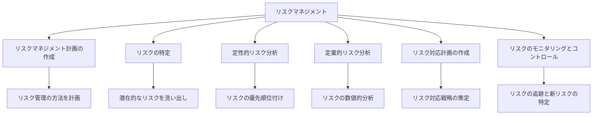

**池上**：ここで重要なポイントとして、「定性的リスク分析」と「定量的リスク分析」の違いについてピチャイさん、説明していただけますか？

**ピチャイ**：はい。この2つは補完的なアプローチです。「定性的リスク分析」は、リスクの影響度と発生確率を「高・中・低」のような定性的なスケールで評価し、優先順位付けを行う方法です。比較的シンプルで迅速に実施できるため、初期評価やリソースが限られている状況に適しています。

一方、「定量的リスク分析」は、より数値的なアプローチです。例えば、リスクの発生確率を「75%」、影響度を「プロジェクトコストの15%増加」のように数値で表現します。これにより、期待金銭価値（EMV：Expected Monetary Value）のような指標を計算し、より客観的な評価が可能になります。

Googleでは両方のアプローチを状況に応じて使い分けています。例えば、初期のリスク評価では定性的分析を行い、重要なリスクについては定量的分析を追加するというアプローチが一般的です。また、モンテカルロシミュレーションのような高度な技術も活用し、複数のリスクが同時に発生した場合の全体的な影響を予測しています。

**ゲイツ**：補足すると、定量的分析の大きな利点は「意思決定の客観性」です。例えば、リスク対応に投資すべき金額を決定する際、定量的分析により「このリスク対応に100万ドル投資することで、期待損失を300万ドル減らせる」といった具体的な根拠を示すことができます。

ただし、定量的分析は精度の高いデータを必要とするため、不確実性が非常に高い状況やデータが限られている場合には、定性的分析が現実的な選択となることも多いです。

**ジョブズ**：私の経験では、定量的分析は重要ですが、それに過度に依存するリスクもあります。数字に基づく分析は安心感を与えますが、革新的な製品開発においては、数値化できないリスクや機会も多くあります。

アップルでは、定量的・定性的分析を行いつつも、最終的には「この製品は本当にユーザーを感動させるか？」という定性的な判断を重視していました。時には数字が示す以上のリスクを取ることで、画期的な製品が生まれるケースもあります。

### コラム：未知のリスクにどう対応するか

**池上**：ここで少し、「未知のリスク」、つまり事前に特定できなかったリスクへの対応について議論してみましょう。IT業界のような急速に変化する環境では、予期せぬ問題が発生することも多いと思います。

**ゲイツ**：「未知のリスク」、あるいは「ブラックスワン」と呼ばれる予測不可能な事象は、確かに難しい課題です。マイクロソフトでは、これに対して「リザーブ」と「柔軟性」の二つのアプローチを取っていました。

「リザーブ」とは、予測できないリスクに対応するためのバッファをスケジュールや予算に意図的に組み込むことです。例えば、プロジェクト予算の10-15%を「マネジメントリザーブ」として確保し、未知のリスクが顕在化した際に活用していました。

「柔軟性」は、計画を柔軟に変更できる能力を維持するということです。例えば、重要な意思決定ポイントを計画に組み込み、そこで最新情報に基づいて方向性を調整できるようにしていました。

**ジョブズ**：私は「直感と熟練度」の重要性を強調したいです。経験豊富なリーダーは、明確に表現できなくても、潜在的な問題を「感じる」ことができます。これは科学というよりも芸術に近いかもしれませんが、実際のプロジェクトでは非常に価値があります。

アップルでは、ベテランのエンジニアやデザイナーの「これは上手くいかないかもしれない」という直感を尊重し、それを深掘りする文化がありました。時にはその直感が具体的なリスクの発見につながることがあります。

また、「早期プロトタイピング」も未知のリスクへの効果的な対応策です。実際に製品の試作品を作ることで、計画段階では想定できなかった問題が顕在化することがあります。

**ピチャイ**：Googleでは「フェイルファスト」（素早く失敗する）という哲学が未知のリスク対応に役立っています。完璧な計画を立てようとするのではなく、迅速に実験し、失敗から学び、軌道修正するというアプローチです。

具体的には、「MVP（Minimum Viable Product：必要最小限の製品）」の考え方を採用し、最小限の機能セットを早期にリリースして、実際のユーザーフィードバックから学ぶという方法を取っています。

また、「事後分析（ポストモーテム）」の文化も重要です。リスクが顕在化した後、責任追及ではなく、学習と改善を目的とした分析を行います。これにより、同様の状況で未知のリスクが再度発生することを防止できます。

**池上**：多様なアプローチがありますね。次に、プロジェクト調達マネジメントについて見ていきましょう。

---

## 第10章：プロジェクト調達マネジメント

**池上**：プロジェクト調達マネジメントとは、プロジェクトに必要な製品やサービスを外部から調達するプロセスです。IT企業においても、ハードウェア、ソフトウェアライセンス、クラウドサービス、外部の開発リソースなど、様々な調達が必要になります。ゲイツさん、マイクロソフトでの調達管理の経験をお聞かせいただけますか？

**ゲイツ**：マイクロソフトのような大規模なIT企業では、調達マネジメントは非常に重要な役割を果たします。ソフトウェア企業と思われがちですが、実際にはハードウェアコンポーネント、データセンター設備、オフィス機器、そして外部の専門サービスなど、多くの調達活動があります。

私たちが重視していた原則の一つは「戦略的パートナーシップ」です。単なる取引先ではなく、長期的なパートナーとしてサプライヤーと関係を構築することで、より良い条件、優先的な対応、そして革新的なアイデアの共有が可能になります。例えば、Intel とは長年にわたる戦略的パートナーシップを維持し、Windows と Intel プロセッサの最適化という相互利益を追求してきました。

また、「ベンダー多様化」も重要な戦略でした。重要なコンポーネントやサービスについては、複数のサプライヤーを確保することでリスクを分散させていました。例えば、クラウドサービスのバックアップデータセンターは複数のベンダーから調達し、単一障害点を排除していました。

**ジョブズ**：アップルでは「垂直統合」と「調達の卓越性」を組み合わせたアプローチを取っていました。重要な技術やコンポーネントは自社開発する一方で、それ以外の部分は最高のサプライヤーから調達するというハイブリッドモデルです。

特に重視していたのは「品質とイノベーション」です。単に最安値を追求するのではなく、ユーザー体験に直接影響する部品については、最高品質のものを調達する方針でした。例えば、iPhoneのディスプレイやカメラモジュールは、コストよりも品質を優先して選定していました。

また、「戦略的投資」という形での調達も行っていました。重要なサプライヤーに前払いで大規模な注文を行い、その見返りとして専用生産ラインの確保や優先的な供給を受けるという方法です。これにより、サプライチェーンにおける優位性を確保していました。

**ピチャイ**：Googleでは「TCO（Total Cost of Ownership：総所有コスト）」を重視した調達アプローチを取っています。初期コストだけでなく、運用コスト、保守コスト、廃棄コストまでを含めた総合的な評価に基づいて調達決定を行っています。

例えば、データセンターのサーバー調達では、購入価格だけでなく、電力効率、冷却コスト、信頼性（ダウンタイムのコスト）などを総合的に評価しています。これは環境への影響も考慮する「サステナブル調達」にもつながっています。

また、「オープンソース活用」も調達戦略の一部です。ソフトウェアコンポーネントについては、可能な限りオープンソースソリューションを評価し、必要に応じてコミュニティに貢献するという形で「調達」しています。例えば、Androidの基盤となるLinuxカーネルでは、積極的にコミュニティに貢献しています。

**池上**：調達マネジメントの基本プロセスを見てみましょう。

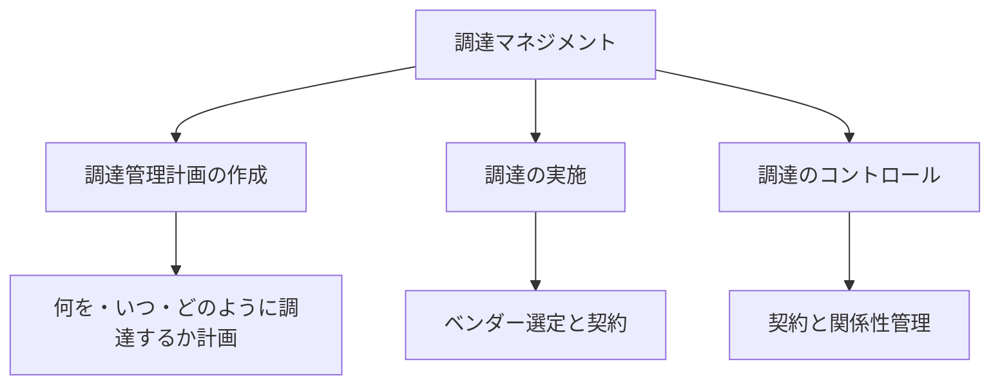

**池上**：特にIT業界では、調達においてどのような特殊な課題がありますか？

**ピチャイ**：IT業界特有の課題としては「技術の変化の速さ」があります。従来の長期契約モデルだと、契約期間中により良い技術が登場しても対応できないリスクがあります。

Googleでは、この課題に対応するため「変更条項を含む柔軟な契約」を重視しています。技術の変化に応じて契約内容を見直せる条項を組み込み、常に最適な技術を利用できるようにしています。また、「段階的コミットメント」も採用しており、小規模なPoC（Proof of Concept）から始めて、成功すれば段階的に規模を拡大するという方法でリスクを抑えています。

**ゲイツ**：もう一つの課題は「IP（知的財産）管理」です。外部ベンダーと協働する際、開発された技術や知識の所有権や使用権を明確にする必要があります。

マイクロソフトでは、戦略的に重要な技術については、契約で明確にIP権を確保するか、共同所有するかを定めていました。また、「NDA（秘密保持契約）」の徹底も重要で、新製品の開発情報が漏洩しないよう厳格に管理していました。

**ジョブズ**：「調達とイノベーションのバランス」も大きな課題です。外部調達に頼りすぎると自社の技術力が低下するリスクがある一方、全てを自社開発すると効率性が失われます。

アップルでは、「コア」となる差別化技術は自社開発し、それ以外の部分は戦略的に調達するというバランスを取っていました。例えば、iPhoneのプロセッサは自社設計する一方、製造はTSMCに委託するというアプローチです。これにより、両者の強みを最大化できます。

### ケーススタディ：アップルのサプライチェーン戦略

**ジョブズ**：アップルのサプライチェーン戦略は、プロジェクト調達マネジメントの興味深い事例です。iPhoneのような複雑な製品では、数百の部品サプライヤーと複数の組立パートナーが関わるため、調達管理が成功の鍵を握ります。

この戦略には以下のような特徴があります：

1. **「戦略的コンポーネント確保」** - 重要部品の大量一括購入により、コスト低減と供給確保を実現。例えば、フラッシュメモリを業界全体の供給量の大部分購入することで、競合他社の調達を制限することもできました。

2. **「Just-In-Timeインベントリ管理」** - 部品の在庫を最小限に抑え、効率的なサプライチェーンを構築。これにより資本効率を高め、製品の迅速な更新にも対応できます。

3. **「サプライヤーの地理的分散」** - リスク軽減のため、重要部品を複数の地域から調達。自然災害や地政学的リスクの影響を最小化します。

4. **「独自技術とカスタム部品」** - 標準部品ではなく、アップル専用にカスタマイズされた部品を開発。これにより製品の差別化を図るとともに、競合他社がコピーすることを困難にしています。

5. **「垂直統合とアウトソーシングの最適バランス」** - 戦略的に重要な技術（例：A-seriesチップ）は自社開発し、製造など他の部分はアウトソーシングするバランス戦略。

この包括的なアプローチにより、アップルは製品の品質とイノベーションを維持しながら、効率的な調達を実現しています。結果として、ハードウェア企業としては例外的な高い利益率を達成しています。

**ピチャイ**：アップルの戦略は非常に印象的ですね。特に「戦略的コンポーネント確保」の部分は、サプライチェーンを競争優位の源泉として活用する良い例です。Googleでも異なる形ですが、例えば海底ケーブルへの戦略的投資を通じて、クラウドサービスの信頼性と性能を高めています。

**ゲイツ**：「垂直統合とアウトソーシングのバランス」は特に興味深いですね。マイクロソフトもSurfaceシリーズでハードウェア事業に参入した際、似たような課題に直面しました。アップルの長年の経験には学ぶべき点が多いです。

**池上**：プロジェクト調達マネジメントは、単なる購買活動ではなく、戦略的な経営判断の一部であることがよくわかりました。次に、プロジェクトステークホルダーマネジメントについて見ていきましょう。

---

## 第11章：プロジェクトステークホルダーマネジメント

**池上**：プロジェクトステークホルダーマネジメントは、プロジェクトに影響を与える、あるいはプロジェクトから影響を受ける個人やグループを特定し、彼らの期待やニーズを管理するプロセスです。ピチャイさん、Googleでのステークホルダーマネジメントについてお聞かせいただけますか？

**ピチャイ**：ステークホルダーマネジメントは、特に大規模なプロジェクトにおいて成功の鍵を握ります。Googleのようなグローバル企業では、多種多様なステークホルダーがおり、その管理は複雑な課題です。

まず重要なのは「ステークホルダーの特定と分析」です。Googleでは、プロジェクト開始時に包括的なステークホルダー分析を行い、影響力と関心度に基づいてマッピングします。例えば、Androidの新バージョン開発では、内部ステークホルダー（経営陣、製品チーム、エンジニアなど）と外部ステークホルダー（端末メーカー、アプリ開発者、ユーザーなど）を特定し、それぞれの期待を理解します。

次に「エンゲージメント戦略」の策定です。ステークホルダーごとに最適なコミュニケーション方法と頻度を決定します。例えば、経営陣には月次の進捗報告、開発者コミュニティにはAPIドキュメントと開発者向けブログ、一般ユーザーにはプレビュー版の提供など、それぞれに適したアプローチを取ります。

特に重視しているのは「透明性」です。可能な限り情報を共有し、ステークホルダーの不安や懸念を軽減するよう努めています。例えば、Googleマップの大幅なUIリニューアル時には、変更の背景や期待される利点について事前に説明し、フィードバックを求めました。

**ゲイツ**：ステークホルダー管理において、私が特に重要だと考えるのは「期待値のマネジメント」です。しばしばプロジェクトの失敗は技術的な問題ではなく、ステークホルダーの期待と現実のギャップから生じます。

マイクロソフトでは、「明確なコミュニケーション」と「早期の巻き込み」を重視していました。例えば、Windowsの新バージョン開発では、主要企業顧客やOEMパートナーを早期段階から巻き込み、彼らの要望を取り入れることで、リリース後の満足度を高めていました。

また、「難しい決断の際の根回し」も重要です。プロジェクトの方向性を大きく変更する必要がある場合、影響を受けるステークホルダーに事前に相談し、理解を得るプロセスを取っていました。この「驚きを避ける」アプローチが、後の抵抗を最小化するのに役立ちました。

**ジョブズ**：私のアプローチは少し異なります。もちろんステークホルダーの意見は重要ですが、時には「彼らが望むものではなく、彼らが必要とするもの」を提供することも必要です。特に革新的な製品では、ユーザーは自分が何を望むか明確に表現できないことがあります。

アップルでは「ビジョン主導型」のステークホルダーマネジメントを実践していました。まず明確なビジョンを持ち、それをステークホルダーに情熱的に伝えることで、彼らの支持を獲得するアプローチです。例えば、iPadの開発では、多くの人が「大きなiPhoneにすぎない」と懐疑的でしたが、私たちは「コンピューティングの未来」というビジョンを伝え続けました。

同時に、「核となるステークホルダーの深い理解」も重視していました。ユーザーの日常生活や課題を徹底的に研究し、表面的なフィードバックの背後にある本質的なニーズを理解することで、革新的な解決策を提示できます。

**池上**：ステークホルダーマネジメントの基本プロセスを見てみましょう。

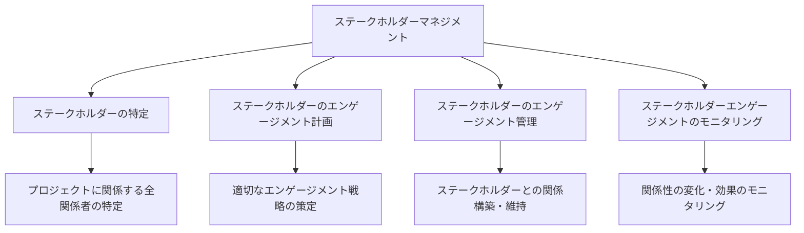

**池上**：「内部ステークホルダー」と「外部ステークホルダー」の管理方法の違いについて、それぞれの視点をお聞かせいただけますか？

**ゲイツ**：内部ステークホルダー（経営陣、他部門、チームメンバーなど）と外部ステークホルダー（顧客、パートナー、規制当局など）では、確かにアプローチが異なります。

内部ステークホルダーに対しては、「組織目標との整合性」を重視していました。例えば、新製品の開発が会社全体の戦略にどう貢献するかを明確に説明し、社内の支持を得るよう努めていました。また、「フォーマルとインフォーマルの両方のコミュニケーション」も重要で、公式会議だけでなく、廊下でのカジュアルな会話も大切にしていました。

外部ステークホルダーに対しては、「一貫したメッセージング」が鍵となります。特に市場に対する約束は慎重に管理し、過度の期待を生まないよう注意していました。また、「フィードバックループの確立」も重要で、例えばベータプログラムを通じて早期に顧客の声を取り入れる仕組みを作っていました。

**ジョブズ**：内部ステークホルダーに対しては、「ビジョンの共有とインスピレーション」を重視していました。単に情報を伝えるだけでなく、なぜそのプロジェクトが重要なのか、世界をどう変えるのかを情熱的に伝えることで、チームのモチベーションを高めていました。

また、「明確な責任と権限の付与」も重要です。各リーダーに明確な責任範囲を与え、その範囲内での意思決定権を認めることで、所有意識を高めていました。

外部ステークホルダーに対しては、「選択的な情報共有」というアプローチを取っていました。全ての情報を全てのステークホルダーと共有するのではなく、それぞれに必要な情報を適切なタイミングで提供するというものです。例えば、新製品の詳細を早期に公開することで競合に情報を与えるリスクを避けていました。

**ピチャイ**：Googleでは、内部ステークホルダーに対して「データとインサイトの共有」を重視しています。意思決定の背景や根拠となるデータを透明に共有することで、理解と支持を得るアプローチです。例えば、製品の方向性変更を決定した場合、その根拠となるユーザーデータや市場調査結果を共有します。

また、「オープンフォーラム」の文化も重要で、TGIF（Thanks God It's Friday）と呼ばれる全社集会では、どんな質問も受け付ける透明性の高いコミュニケーションを実践しています。

外部ステークホルダーに対しては、「エコシステムの発展」という視点を持っています。例えば、Androidのようなプラットフォームでは、端末メーカーやアプリ開発者も含めたエコシステム全体の健全な発展を目指し、単にGoogleの短期的利益だけでなく、エコシステム全体の価値を高める決定を心がけています。

### コラム：3賢者の危機コミュニケーション術

**池上**：ステークホルダーマネジメントで特に難しいのが「危機的状況でのコミュニケーション」だと思います。プロジェクトが大幅に遅延したり、重大な問題が発見されたりした場合、どのように対応されてきましたか？

**ゲイツ**：危機的状況では「迅速、正確、透明」の三原則が重要です。問題が発生した場合、隠そうとするのではなく、素早く事実を認め、対応策を示すことが信頼を維持する鍵となります。

ビスタの開発遅延の際は、当初予定していた機能の一部を次バージョンに先送りすることを決断し、その理由を明確に説明しました。「品質を犠牲にするよりも、一部機能を延期する」という決断の背景を透明に伝えることで、多くのステークホルダーの理解を得ることができました。

また、「階層的コミュニケーション」も有効です。まず核となるステークホルダーに直接伝え、その後段階的に範囲を広げていくことで、噂や誤情報の拡散を防ぎます。

**ジョブズ**：危機状況では「率直さとビジョンの再確認」が重要だと考えています。問題を小さく見せようとするのではなく、率直に認めた上で、長期的なビジョンを再確認し、この危機がその道筋にどう影響するかを伝えるアプローチです。

iPhone 4のアンテナ問題（「アンテナゲート」）の際は、初期の対応に不備がありましたが、最終的には記者会見を開き、問題を率直に認めた上で、具体的な解決策（無料のケース提供）を提示しました。また、「完璧な電話機はない」という業界全体の課題として位置づけることで、問題を適切な文脈で理解してもらう努力もしました。

危機からは「学びを得る機会」という側面もあります。問題が発生した後、社内で厳格なレビューを行い、同様の問題が再発しないよう対策を講じることも重要です。

**ピチャイ**：Googleでは危機対応において「事実に基づいた冷静な分析」を心がけています。感情的になるのではなく、問題の原因を客観的に分析し、データに基づいた対応策を講じるアプローチです。

例えば、Google+のプライバシー問題が発覚した際は、技術的な問題の詳細を透明に公開し、影響範囲を明確にした上で、具体的な対応策と再発防止策を公表しました。この透明性重視のアプローチが、長期的な信頼維持につながると考えています。

また、「先手を打つコミュニケーション」も重要です。問題が外部から指摘される前に、自ら積極的に公表し、対応することで、誠実さを示すことができます。

**池上**：三者三様のアプローチがありますが、共通するのは「透明性」と「誠実さ」の重要性ですね。次に、アジャイルプロジェクトマネジメントとPMBOKの関係について見ていきましょう。

---

## 第12章：アジャイルプロジェクトマネジメントとPMBOK

**池上**：近年、IT業界ではアジャイル開発手法が広く採用されています。PMBOKは伝統的にウォーターフォール型の開発を前提としていたイメージがありますが、最新のPMBOK第7版ではアジャイルアプローチも取り入れられています。ピチャイさん、Googleでのアジャイル開発の実践とPMBOKの関係についてお聞かせいただけますか？

**ピチャイ**：はい。アジャイル開発は現代のIT企業にとって不可欠なアプローチとなっています。Googleでは、製品やチームによって様々なアジャイル手法（スクラム、カンバン、XPなど）を採用していますが、興味深いのは、PMBOKの原則とアジャイルは対立するものではなく、補完し合うものだということです。

例えば、PMBOKの「スコープマネジメント」はアジャイルの「プロダクトバックログ」に、「リスクマネジメント」は「継続的インテグレーション」や「短いイテレーション」によるリスク軽減に対応します。違いは、PMBOKが「計画主導型」であるのに対し、アジャイルは「変化対応型」だということです。

Googleでは「ハイブリッドアプローチ」を採用しています。例えば、プロジェクトの大枠（ビジョン、主要マイルストーン、予算）はPMBOKのような体系的な計画で管理し、実際の開発はアジャイルで進めるというものです。Androidの開発では、リリースの全体スケジュールは伝統的なプロジェクト管理で設定しつつ、各機能の開発はスクラムで進めています。

**ゲイツ**：マイクロソフトも同様の進化を遂げました。初期のWindowsやOfficeの開発は典型的なウォーターフォールモデルでしたが、市場の変化が急速になるにつれ、より反復的なアプローチに移行していきました。

重要なのは「状況に応じたアプローチの選択」です。例えば、基盤となるOSカーネルのような安定性が最も重要な部分には、より体系的な計画と検証が必要です。一方、ユーザーインターフェースのような頻繁なフィードバックと調整が必要な部分には、アジャイルが適しています。

PMBOK第7版が取り入れている「テーラリング」（状況に合わせた方法論のカスタマイズ）の概念は非常に重要です。「一つの方法論がすべてに適合する」のではなく、プロジェクトの性質に応じて最適なアプローチを選択すべきです。

**ジョブズ**：私はアジャイルの「ユーザーフィードバックの重視」と「迅速な反復」の側面に強く共感します。アップルでは常に「プロトタイピングと改善の繰り返し」を重視し、早い段階から実際に製品を使ってみることで課題を発見してきました。

同時に、全体のビジョンとデザイン原則は明確に定義し、それが失われないよう注意していました。これはPMBOKの「プロジェクト憲章」や「スコープステートメント」に通じるもので、方向性を見失わないための重要なガードレールになります。

アップルの製品開発プロセスは「アジャイルとデザイン思考のハイブリッド」と言えるかもしれません。ユーザー体験を中心に据え、迅速に繰り返し検証しながらも、全体としての一貫性と完成度を追求するアプローチです。

**池上**：PMBOKとアジャイルの関係を図で見てみましょう。

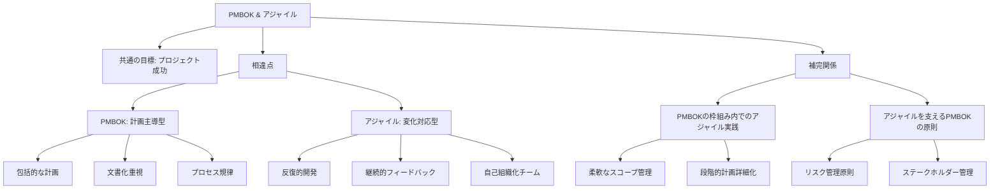

**池上**：アジャイル開発で重要な「スプリント」と「バックログ」という概念について、ゲイツさん、もう少し詳しく説明していただけますか？

**ゲイツ**：スプリントとは、アジャイル開発、特にスクラムフレームワークにおける固定期間（通常1〜4週間）の反復的な開発サイクルです。各スプリントは、計画、実装、テスト、レビューの一連のプロセスを含む「ミニプロジェクト」と考えることができます。

スプリントの重要な特徴は「タイムボックス」と呼ばれる厳格な期間設定です。これにより、作業を小さな単位に分割し、頻繁にフィードバックを得ることができます。例えば、Microsoftの開発チームでは2週間のスプリントを採用することが多く、各スプリント終了時に動作するソフトウェアの増分（インクリメント）をデモする「スプリントレビュー」を行います。

一方、バックログは「今後行うべき作業のリスト」です。「プロダクトバックログ」はプロジェクト全体で実装すべき機能や改善点のリストであり、優先順位付けされています。「スプリントバックログ」は現在のスプリントで取り組む項目のサブセットです。

バックログの管理は「プロダクトオーナー」の主要な責任であり、ビジネス価値、技術的な依存関係、リスクなどを考慮して優先順位を決定します。これはPMBOKの「スコープマネジメント」や「統合マネジメント」の原則を異なる形で適用していると言えます。

**ピチャイ**：補足すると、GoogleではKanbanという別のアジャイルアプローチも広く使われています。これは、スプリントのような固定期間ではなく、「仕掛中の作業を制限する」ことで流れを管理する方法です。例えば、「分析中」「開発中」「テスト中」「完了」のような状態を視覚化し、各状態にある作業項目の数を制限することでボトルネックを防ぎます。

また、「ハイブリッドアプローチ」も一般的で、例えば「スクラムバン」（スクラムとKanbanの組み合わせ）のように、複数の方法論から最適な要素を取り入れたカスタム手法も使われています。

**ジョブズ**：アジャイルの価値ある側面の一つは「顧客協働」の重視です。アップルでは、開発中の製品を社内のユーザーに試してもらい、フィードバックを集める「ドッグフーディング」を積極的に行っていました。これはアジャイル宣言の「契約交渉よりも顧客との協働を」という価値観に合致します。

同時に、一般的なアジャイルとは異なり、アップルでは「完璧なユーザー体験」を重視するため、一部の機能が完成度に達していないと判断される場合は、出荷を遅らせることもあります。これは「動くソフトウェア優先」という一般的なアジャイルの価値観とは異なる部分かもしれません。

### ケーススタディ：Microsoft DevOpsとアジャイル変革

**ゲイツ**：マイクロソフトのDevOps（開発と運用の統合）への移行は、アジャイルとPMBOKの原則を組み合わせた良い例です。かつてのOffice製品は3年ごとの大型リリースでしたが、Office 365への移行により、継続的な小規模アップデートモデルに変わりました。

この変革には以下のような要素がありました：

1. **「組織構造の再編」** - 機能別の縦割り組織から、製品機能を横断した「フィーチャーチーム」へ。これにより、顧客価値の提供に集中できるようになりました。

2. **「継続的インテグレーション/継続的デリバリー（CI/CD）」** - 自動化されたビルド、テスト、デプロイのパイプラインを構築し、コード変更からデプロイまでの時間を短縮。これにより、フィードバックサイクルが加速しました。

3. **「テレメトリとデータ駆動型意思決定」** - 実際のユーザー行動データを収集・分析し、どの機能が使われているか、どこで問題が発生しているかを把握。これにより、より的確な優先順位付けが可能になりました。

4. **「PMBOKの原則の適用」** - 全体のロードマップ、リソース計画、リスク管理には従来のプロジェクト管理手法を適用しつつ、実装の詳細はアジャイルで進める「ハイブリッドモデル」を採用。

この変革により、リリースサイクルは3年から月次、さらには週次へと短縮され、顧客フィードバックへの対応速度が大幅に向上しました。同時に、品質指標（バグ、システムダウンタイムなど）も改善され、カスタマーサティスファクションスコアも上昇しました。

**ピチャイ**：Microsoftの変革は印象的です。Googleでも似たような取り組みを行っていますが、特に「データ駆動型意思決定」の部分は共感します。Chromeブラウザの開発では、実際のユーザー行動データに基づいて、どの機能を優先的に開発するか決定しています。

**ジョブズ**：組織構造の変更は特に重要だと思います。アップルでも「機能横断的なチーム」を重視し、エンジニア、デザイナー、マーケティング担当者などが一つのチームとして協働する体制を作っていました。これにより、部門間のサイロ化を防ぎ、顧客価値に集中できます。

**池上**：アジャイルとPMBOKは対立するものではなく、状況に応じて適切に組み合わせることで、より効果的なプロジェクト管理が可能になるのですね。次に、デジタル時代のプロジェクトマネジメントについて見ていきましょう。

---

## 第13章：デジタル時代のプロジェクトマネジメント

**池上**：AIやクラウドコンピューティング、ブロックチェーンなど、新たなデジタル技術の台頭により、プロジェクトマネジメントも変革を迫られています。ピチャイさん、Googleの視点から、デジタル技術がプロジェクトマネジメントにもたらす変化についてお聞かせいただけますか？

**ピチャイ**：デジタル技術はプロジェクトマネジメントの本質を変えつつあります。特に重要なのは「データ駆動型の意思決定」です。AIや機械学習により、プロジェクトデータの分析がますます高度化し、予測の精度が向上しています。

例えば、Googleでは「機械学習を活用したプロジェクト予測」を導入し、過去のプロジェクトデータに基づいて、現在のプロジェクトの進捗や潜在的なリスクを予測しています。例えば、コード変更のパターンと過去のバグ発生率の相関を分析することで、潜在的な問題を早期に発見できます。

また、「クラウドベースのコラボレーション」もプロジェクト管理を変革しています。Google Workspaceのようなツールにより、地理的に分散したチームでもリアルタイムでドキュメントを共同編集し、ビデオ会議で即座にコミュニケーションを取ることが可能になりました。これにより、PMBOKの「コミュニケーションマネジメント」はより即時的かつ双方向的になっています。

さらに、「自動化」も重要なトレンドです。CI/CD（継続的インテグレーション/継続的デリバリー）パイプラインにより、コード統合、テスト、デプロイが自動化され、プロジェクトマネージャーは以前より高度な課題に集中できるようになりました。

**ゲイツ**：ピチャイの指摘に加えて、「デジタルツインとシミュレーション」の可能性も注目しています。これは物理的なシステムやプロセスのデジタルコピーを作り、様々なシナリオをシミュレーションする技術です。

例えば、新しいデータセンターの設計では、デジタルツインを作成し、様々な構成や負荷条件をシミュレーションすることで、最適な設計を見つけることができます。これはPMBOKの「リスクマネジメント」や「スコープマネジメント」に新たな次元をもたらします。

また、「ブロックチェーン」もプロジェクト管理に影響を与える可能性があります。特に複数の組織が関わる複雑なプロジェクトでは、透明性のある変更記録や契約の自動執行（スマートコントラクト）が価値を持ちます。例えば、マイルストーン達成時に自動的に支払いが行われるスマートコントラクトによって、調達管理が効率化される可能性があります。

**ジョブズ**：技術の進化は確かに重要ですが、私は「人間中心のデジタル変革」の重要性を強調したいです。テクノロジーはあくまで手段であり、目的ではありません。プロジェクトマネジメントのデジタル化においても、ユーザー体験と人間の創造性を中心に据えるべきです。

例えば、AIツールはタスクの自動化やデータ分析に役立ちますが、最終的な判断や創造的な問題解決は人間に委ねるべきです。アップルでは「テクノロジーと人間性の融合」を重視し、最先端のツールを活用しつつも、直感や美的センスといった人間特有の能力を大切にしていました。

また、「デザイン思考」とプロジェクトマネジメントの融合も重要です。ユーザーの潜在的なニーズを深く理解し、共感することから始まるデザイン思考のアプローチは、技術偏重に陥りがちなデジタルプロジェクトに人間的な視点をもたらします。

**池上**：デジタル時代のプロジェクトマネジメントの主要トレンドを図で見てみましょう。

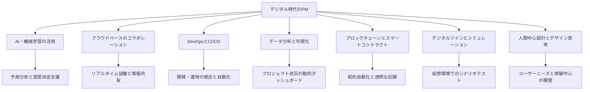

**池上**：このようなデジタル技術がプロジェクトマネジメントに組み込まれることで、PMBOKの知識エリアはどのように変化すると思いますか？

**ピチャイ**：PMBOKの各知識エリアはデジタル技術によって進化していくと考えています。例えば、「スコープマネジメント」では、AIを活用して過去のプロジェクトから学習し、より現実的なスコープ設定をサポートする可能性があります。

「リソースマネジメント」では、機械学習アルゴリズムがチームメンバーのスキル、経験、現在の作業負荷などを分析し、最適な人材配置を提案するようになるでしょう。Googleでは既に「Resource Management AI」の実験を行っており、プロジェクト要件とチームメンバーのプロファイルをマッチングする機能を開発しています。

「リスクマネジメント」については、予測分析が大きく貢献します。過去のプロジェクトデータと現在のプロジェクト状況を分析し、潜在的なリスクを早期に特定するシステムが一般的になるでしょう。

**ゲイツ**：「コミュニケーションマネジメント」も大きく変わると思います。AIを活用した自動翻訳や要約技術により、グローバルチーム間のコミュニケーションバリアが低減されるでしょう。例えば、異なる言語を話すチームメンバー間でもリアルタイム翻訳によるスムーズなコミュニケーションが可能になります。

「品質マネジメント」では、自動テストとAI駆動の品質保証がますます重要になります。コードが書かれた瞬間に自動的に分析され、潜在的な問題が特定されるようになるでしょう。

また、「調達マネジメント」では、ブロックチェーンとスマートコントラクトによる透明性と効率性の向上が期待されます。契約条件が満たされると自動的に支払いが行われ、全ての取引が改ざん不可能な形で記録されます。

**ジョブズ**：私は「ステークホルダーマネジメント」の進化に注目しています。デジタルツールにより、ステークホルダーの関心や懸念をリアルタイムで追跡し、パーソナライズされたコミュニケーションが可能になるでしょう。

例えば、各ステークホルダーの情報消費パターンを分析し、最適なタイミングと形式で情報を提供するシステムが考えられます。「このステークホルダーは朝にビジュアル中心の簡潔なレポートを好む」といった学習に基づいて、コミュニケーションを最適化することが可能になります。

同時に、こうしたデジタル化の中でも「人間的なつながり」の価値は変わらないと考えています。むしろ、ルーチンタスクが自動化されることで、プロジェクトマネージャーは創造的な問題解決や人間関係構築により多くの時間を費やせるようになるでしょう。

### コラム：3賢者のAIプロジェクトマネジメント対談

**池上**：最近特に注目されている「AI活用のプロジェクトマネジメント」について、皆さんの見解をお聞かせください。

**ピチャイ**：AIプロジェクトは従来のITプロジェクトと異なる特性を持っており、プロジェクト管理にも特別なアプローチが必要です。特に「データの質と量」が成功の鍵を握るという点が特徴的です。

Googleでは、AIプロジェクトの初期段階で「データ戦略」の策定に多くの時間を費やします。必要なデータの特定、収集方法、前処理パイプラインの構築などを計画し、これをプロジェクト計画の中核に位置づけています。

また、「実験的アプローチ」も重要です。AIモデルの開発は本質的に反復的であり、最初から最適な結果を得ることは稀です。そのため、「実験→評価→改善」のサイクルを高速に回せるインフラと文化を構築することが重要です。

**ゲイツ**：AIプロジェクトでは「成功の定義」も従来と異なります。100%の精度や完璧な予測が現実的でない場合も多く、「どの程度の精度が許容可能か」を事前に定義することが重要です。

また、「説明可能性と倫理的配慮」も重要な側面です。マイクロソフトではAIプロジェクトに「責任あるAI」の原則を組み込み、公平性、包摂性、透明性、説明可能性などを評価するプロセスを確立しています。これはPMBOKの「品質マネジメント」の新たな側面と言えるでしょう。

さらに、「AIシステムの保守」も独特の課題です。データの分布が変わる「データドリフト」や、現実世界の変化に伴うモデルの劣化に対応するためのメカニズムを、プロジェクト当初から計画に組み込む必要があります。

**ジョブズ**：AIプロジェクトでも最終的に重要なのは「ユーザー体験」です。いくら技術的に高度なAIモデルでも、ユーザーにとって価値がなければ意味がありません。

アップルのアプローチでは、「AIは目立たないようにすべき」と考えています。つまり、ユーザーが「AIを使っている」と意識するのではなく、単に「問題が解決された」と感じるような体験を目指すべきです。例えば、写真の自動整理や音声認識は、ユーザーに負担をかけずに自然に機能すべきです。

また、「プライバシーとAIのバランス」も重要な課題です。アップルでは「オンデバイスAI」を重視し、可能な限りユーザーデータをクラウドに送らずに処理することで、プライバシーを保護しながらAIの恩恵を提供するアプローチを取っています。

**池上**：AIプロジェクトマネジメントには、従来のプロジェクト管理知識に加えて、データ戦略、実験的アプローチ、倫理的配慮など、新たな要素が必要なのですね。プロジェクトマネジメントは、技術の進化とともに常に発展し続けるものだということがよくわかりました。

では最後に、PMBOKを学んできた皆さんが、これからのIT企業のリーダーやプロジェクトマネージャーへのメッセージをお願いします。

---

## エピローグ：3賢者からの最後のメッセージ

**池上**：長時間にわたり、PMBOKの各知識エリアについて議論してきました。最後に、これからのIT企業のプロジェクトマネジメントに携わる方々へのメッセージをお願いします。ゲイツさんからお願いします。

**ゲイツ**：(*落ち着いた口調で*) プロジェクトマネジメントの本質は、テクノロジーではなく「人」にあります。どんなに高度なツールや方法論も、それを使う人々の能力と情熱に依存します。

これからのリーダーに伝えたいのは、「技術的な卓越性と人間的な理解のバランス」の重要性です。AIやクラウドなどの新技術を理解し活用する能力と、チームメンバーのモチベーションや個性を理解し引き出す能力の両方が必要です。

また、「学び続ける姿勢」も不可欠です。プロジェクト管理の方法論も技術も急速に進化しています。PMBOKを一度学んだだけでなく、常に新しい知識を取り入れ、自分のアプローチを更新し続けることが重要です。

最後に、「失敗からの学び」を恐れないでください。マイクロソフトでも大小様々な失敗がありましたが、それぞれが貴重な学びとなりました。失敗を責めるのではなく、「なぜ起きたか」「どう防げるか」を組織として学ぶ文化を作ることが、長期的な成功につながります。

**ジョブズ**：(*情熱的に*) プロジェクトマネジメントは「アートとサイエンスの融合」です。PMBOKのような体系的な知識は重要ですが、同時に直感や美的センス、そして何より「情熱」が必要です。

これからのリーダーには「常識に挑戦する勇気」を持ってほしいと思います。最高の製品やサービスは、既存のフレームワークに従うだけでは生まれません。時には、「これは無理だ」と言われることに挑戦し、新しい可能性を切り開く勇気が必要です。

同時に、「細部へのこだわり」も忘れないでください。卓越した製品は、ユーザーが気づかないような細部にまでこだわることから生まれます。プロジェクトマネージャーは、大きなビジョンと微細な詳細の両方に目を配る必要があります。

最後に、「なぜ」を常に問い続けてください。あるプロジェクトを実行する理由、ある機能を実装する理由、あるアプローチを選ぶ理由。この「なぜ」の問いかけが、真に意義あるプロジェクトへの道しるべとなります。

**ピチャイ**：(*穏やかに*) 今日のデジタル時代において、プロジェクトマネジメントは「変化への適応能力」と「データ駆動型の意思決定」がますます重要になっています。

これからのリーダーには「包括性とダイバーシティ」の価値を理解してほしいと思います。多様な背景、視点、アイデアを持つチームが、より革新的で包括的な製品を作り出します。プロジェクトマネージャーとして、異なる声に耳を傾け、全員が貢献できる環境を作ることが重要です。

また、「持続可能性」の視点も忘れないでください。短期的な目標達成だけでなく、環境への影響、社会的責任、長期的な影響も考慮したプロジェクト管理が求められています。Googleでは「次の10億人のユーザー」を考えることで、より広い視野での製品開発を心がけています。

最後に、「テクノロジーと人間性のバランス」を探求してください。AIやオートメーションは多くのタスクを自動化しますが、創造性、共感、倫理的判断といった人間特有の能力は、これからも不可欠です。テクノロジーを活用しつつも、人間中心のアプローチを忘れないでください。

**池上**：素晴らしいメッセージをありがとうございます。PMBOKという体系的な知識基盤の上に、それぞれの企業文化や個人の哲学を組み合わせることで、より効果的なプロジェクトマネジメントが実現できるということがよくわかりました。

この本が、これからのIT企業でプロジェクトを率いる方々の参考になれば幸いです。ビル・ゲイツさん、スティーブ・ジョブズさん、スンダー・ピチャイさん、長時間にわたるディスカッションをありがとうございました。

**ゲイツ**、**ジョブズ**、**ピチャイ**：（*一斉に*）ありがとうございました。

---

## 索引

アジャイル開発, 229-247  
アップル（Apple）の開発手法, 92-95, 146-148  
ウォーターフォールモデル, 237-238  
オープンソースの活用, 217, 245  
クラウドコンピューティング, 249-252  
ゲイツ（Gates, Bill）の経営哲学, 75-77  
ジョブズ（Jobs, Steve）の製品開発哲学, 82-85  
スクラム, 239-241  
ステークホルダーマネジメント, 219-228  
デザイン思考, 254-255  
ピチャイ（Pichai, Sundar）のマネジメント手法, 87-89  
プロジェクト憲章, 53-54  
マイクロソフト（Microsoft）の開発プロセス, 69-72  
リスクマネジメント, 199-210  

---

## 参考文献

Project Management Institute. (2021). A Guide to the Project Management Body of Knowledge (PMBOK Guide) – Seventh Edition. Project Management Institute.

Agile Alliance. (2001). Agile Manifesto. Retrieved from http://agilemanifesto.org/

Schwaber, K., & Sutherland, J. (2020). The Scrum Guide. Retrieved from https://scrumguides.org/

Leffingwell, D. (2018). SAFe 4.6 Reference Guide: Scaled Agile Framework for Lean Enterprises. Addison-Wesley Professional.

Project Management Institute. (2017). Agile Practice Guide. Project Management Institute.

---

（価格：3,980円）