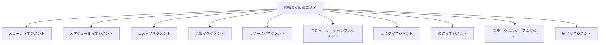
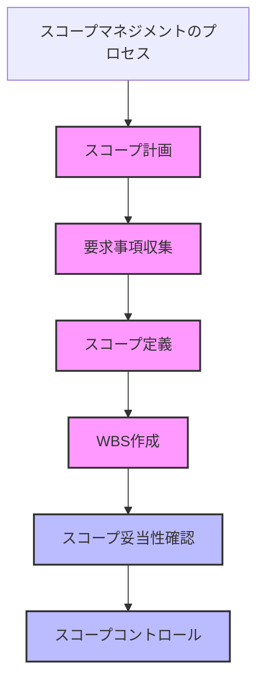
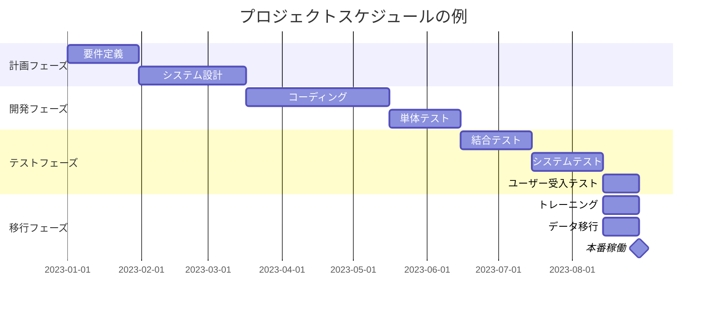
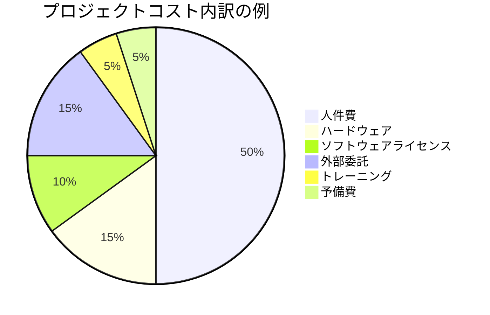
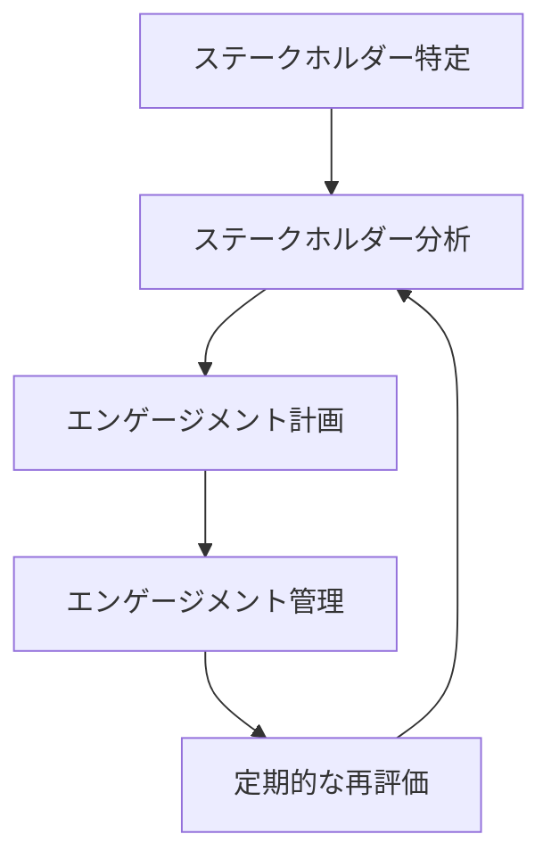

# PMBOKを3賢者と学ぶ
## ～これからのIT企業のプロジェクトマネジメント～

---

## はじめに

本書は、世界的に著名な経営思想家であるピーター・ドラッカー氏、ジム・コリンズ氏、大前研一氏による架空の対談を通じて、プロジェクトマネジメント知識体系（PMBOK）の理解を深めることを目的としています。司会進行役は、複雑な内容をわかりやすく解説することで知られるジャーナリスト、池上彰氏が務めます。

なお、本書に登場する対談はフィクションであり、実際に行われたものではありません。各思想家の著書や講演から、その思想や理論を忠実に再現することを試みていますが、発言内容はあくまで著者の解釈に基づくものです。

それでは、PMBOKの世界へと皆様をご案内いたします。

---

## 第1章 PMBOKとは何か？ ～プロジェクトマネジメントの基礎～

**池上：** 皆様、本日はお忙しい中お集まりいただき、ありがとうございます。私、ジャーナリストの池上彰が司会を務めさせていただきます。今回のテーマは「PMBOKとこれからのIT企業のプロジェクトマネジメント」です。まずは簡単に自己紹介をお願いできますか？ドラッカーさんからお願いします。

**ドラッカー：** ピーター・ドラッカーです。私は20世紀を通じて、マネジメントという概念を探求してきました。組織とは何か、マネジャーの役割とは何か、そして成果を上げるための方法論について考察してきました。私の基本的な考え方は「マネジメントとは、人を通じて成果を上げること」です。今日は、プロジェクトマネジメントという視点からこの考え方を深掘りできればと思います。

**コリンズ：** ジム・コリンズです。私は「なぜある企業は偉大になれるのか」という問いを中心に研究を続けてきました。偉大な企業には共通の特徴があり、それを体系的に理解することで、組織の持続的な成功につながると考えています。特に「レベル5のリーダーシップ」や「フライホイール効果」などの概念を通じて、組織の卓越性を追求してきました。プロジェクトマネジメントは、この卓越性を実現するための具体的な方法論として非常に重要だと考えています。

**大前：** 大前研一です。私は長年、グローバルな視点から経営戦略を研究し、実践してきました。特に「競争戦略」や「イノベーション」の観点から、企業がどのようにして変化の激しい環境で生き残り、成長していくかを考えてきました。日本企業の課題として、プロジェクトマネジメントの質の向上は喫緊の課題だと捉えています。今日はその観点からお話しできればと思います。

**池上：** ありがとうございます。それでは本題に入りましょう。まず基本的なところから、PMBOKとは何なのか、なぜそれが重要なのかについて、ドラッカーさんから伺いたいと思います。

**ドラッカー：** PMBOKとは、Project Management Body of Knowledge、つまりプロジェクトマネジメントの知識体系のことです。プロジェクトマネジメント協会（PMI）によって体系化された、プロジェクトを成功に導くための方法論と言えます。

私がかつて言ったように、「知識労働者の生産性」が21世紀の経済発展の鍵となります。その中でも、プロジェクトという形で成果を生み出す能力は極めて重要です。PMBOKは、そのための体系的な知識と実践を提供しているのです。

**池上：** なるほど。PMBOKとは単なるガイドラインではなく、知識労働者の生産性を高めるための体系なのですね。コリンズさん、あなたの視点からはPMBOKをどのように捉えていますか？

**コリンズ：** 私は「規律ある思考」と「規律ある行動」が組織の卓越性の基盤だと考えています。PMBOKは、まさにその「規律」を提供するものです。プロジェクトという不確実性の高い取り組みを、体系的かつ規律ある方法で進めるための枠組みといえます。

私の研究では、偉大な企業は、単に「何を」するかだけでなく、「どのように」するかにこだわります。PMBOKは、そのプロセスの「どのように」の部分を具体化した知恵の集積なのです。

**池上：** 「規律」という観点から見るとPMBOKの価値がよく分かりますね。大前さんはどのようにお考えですか？

**大前：** 私は常々、「思考の質が結果の質を決める」と言ってきました。PMBOKは、プロジェクトという枠組みの中で、思考の質を高めるための体系です。

特に日本企業の課題として、プロジェクトの成功率が国際的に見ても低いという現実があります。その背景には、体系的なプロジェクトマネジメントの知識と実践が不足していることが挙げられます。PMBOKは、こうした課題に対する解決策を提供するものです。

**池上：** 皆さんのお話を伺うと、PMBOKは単なる手順書ではなく、知識労働の質を高め、組織の卓越性を実現するための知恵の集大成だということですね。では、具体的にPMBOKにはどのような内容が含まれているのでしょうか？



**ドラッカー：** PMBOKは10の知識エリアから構成されています。図に示されているように、プロジェクト全体を統合する「統合マネジメント」を中心に、「スコープ」「スケジュール」「コスト」「品質」「リソース」「コミュニケーション」「リスク」「調達」「ステークホルダー」という9つの知識エリアがあります。

私の視点から特に重要なのは、これらが相互に関連し合っているという点です。一つの要素を変えれば、他の要素にも影響します。マネジメントとは、これらの要素を全体として調和させる技術なのです。

**コリンズ：** 私が興味深いと思うのは、PMBOKが「プロセス」に焦点を当てている点です。各知識エリアには、「計画」「実行」「監視・コントロール」というプロセスがあります。これは私が提唱している「規律あるプロセス思考」そのものです。

成功するプロジェクトには、明確なプロセスと、それを忠実に実行する規律があります。PMBOKは、その規律の具体的な形を示しています。

**大前：** 私からは戦略的な視点を加えたいと思います。PMBOKの各知識エリアは、プロジェクトという「小さな事業」を運営するための要素です。つまり、経営の縮図とも言えます。

特に「ステークホルダーマネジメント」は近年重視されています。プロジェクトの成功は、技術的な側面だけでなく、人間的・組織的な側面に大きく依存するからです。日本企業が苦手としているのも、実はこの部分ではないでしょうか。

**池上：** なるほど。PMBOKは単に「やるべきこと」のリストではなく、プロジェクトを成功に導くための思考法や規律、そして戦略的視点を提供しているわけですね。

---

## 第2章 スコープマネジメント ～プロジェクトの境界線を引く技術～

**池上：** 続いて、PMBOKの知識エリアについて具体的に掘り下げていきましょう。まずは「スコープマネジメント」から始めたいと思います。スコープとは、プロジェクトの範囲や境界線を定義するものですが、なぜこれが重要なのでしょうか？

**ドラッカー：** スコープマネジメントの本質は、「何をするか」と同時に「何をしないか」を明確にすることにあります。私はかつて「効果的な意思決定の第一歩は、それが何についての意思決定であるかを明確にすることである」と述べました。同様に、プロジェクトの第一歩は、そのプロジェクトが何についてのものであるかを明確にすることです。

スコープの定義が曖昧だと、いわゆる「スコープクリープ」という現象が起こります。これは、プロジェクトの範囲が少しずつ拡大していき、最終的にはリソースの分散や納期の遅延につながる危険な現象です。

**池上：** スコープクリープとは、具体的にどのような現象なのでしょうか？

**大前：** 例えば、ウェブサイト制作プロジェクトを想像してみてください。当初は「企業情報と製品カタログを掲載するサイト」という明確なスコープでした。しかし、プロジェクトが進むにつれて、「やはりオンラインショップ機能も欲しい」「SNS連携も入れよう」「多言語対応も必要だ」と要件が追加されていきます。

これがスコープクリープです。個々の追加は小さく見えますが、積み重なると本来の計画から大きく逸脱してしまいます。日本企業に多いのが、この「言われたことは断れない」文化から生じるスコープクリープです。

**コリンズ：** 私の研究では、偉大な企業は「何をするか」よりも「何をしないか」「何をやめるか」の決断に優れていることがわかっています。「ストップ・ドゥイング・リスト」という考え方です。

スコープマネジメントも同様で、プロジェクトの境界線を守る規律が重要です。それには、時に「No」と言う勇気が必要です。先ほどの大前さんの例でいえば、「それは次期プロジェクトで対応します」と明確に線引きする決断が求められるのです。

**池上：** では、効果的なスコープマネジメントのためには、具体的にどのようなプロセスが必要なのでしょうか？

**ドラッカー：** スコープマネジメントで最も重要なのは、「計画プロセス」です。以下のステップが含まれます：

1. スコープ計画：スコープを定義・管理するための計画を立てる
2. スコープ収集：ステークホルダーの要求事項を集める
3. スコープ定義：詳細なプロジェクト範囲記述書を作成する
4. WBS作成：作業を管理可能な単位に分解する
5. スコープ妥当性確認：成果物が要求を満たしているか確認する
6. スコープコントロール：スコープの変更を管理する

特にWBS（Work Breakdown Structure：作業分解構造）の作成は、「全体を部分に分解する」という分析的思考の実践であり、非常に重要です。

**大前：** 私はスコープマネジメントについて、「3C分析」の視点から考えることを提案します。

- Customer（顧客）：誰のために、どのような価値を提供するのか
- Competitor（競合）：他の選択肢と比較して、どのような優位性があるのか
- Company（自社）：自社の強みを活かせるスコープになっているか

この3Cの視点からスコープを再検討することで、戦略的な価値のあるプロジェクト定義が可能になります。

**池上：** 3C分析とは、市場における自社の位置づけを明確にするための分析フレームワークですね。これをスコープマネジメントに応用するという発想は興味深いです。コリンズさんはどのようにお考えですか？

**コリンズ：** 私は「大きな岩」の概念を提案したいと思います。プロジェクトには通常、多くの作業が含まれますが、その中で真に重要な「大きな岩」、つまり核となる成果物や価値を特定することが重要です。

スコープを定義する際には、これらの「大きな岩」を先に特定し、それを中心にスコープを構築することで、プロジェクトの本質を見失わないようにできます。

**ドラッカー：** それはまさに、私が提唱している「重要な少数」と「重要でない多数」を区別する考え方と共通していますね。スコープの中でも、真に価値を生み出す「重要な少数」の要素に集中することが成功の鍵です。



**池上：** スコープマネジメントについて、多角的な視点から解説いただきました。それでは、実際のIT企業では、スコープマネジメントの課題にどのように対応すべきでしょうか？

**大前：** 日本のIT企業における最大の課題は、「曖昧な要件定義」と「過剰な顧客志向」だと思います。「お客様の言うことは全て聞く」という姿勢が、実はプロジェクトの破綻を招いているケースが少なくありません。

解決策は、初期段階での徹底した要件定義と、変更管理の厳格化です。変更は受け入れるべきですが、それに伴うコストや期間の見直しも同時に行うべきです。

**コリンズ：** 同感です。優れた企業は、顧客の言うことを「全て」聞くのではなく、顧客の「本当のニーズ」を理解し、それに最適な解決策を提案します。時には、顧客自身も気づいていないニーズを掘り起こすことも必要です。

スコープマネジメントは、単なる制約ではなく、プロジェクトの成功を導くための「規律」なのです。

**ドラッカー：** そして忘れてはならないのは、スコープは「静的」なものではなく、「動的」なものだということです。ビジネス環境の変化に応じて、スコープも適切に調整する必要があります。

ただし、その変更は無秩序に行うのではなく、体系的な変更管理プロセスを通じて行うべきです。変更の影響を評価し、プロジェクト全体のバランスを保つことが重要です。

---

## コラム：スコープクリープとの闘い
### 〜池上彰の「なぜ？」に3賢者が答える〜

**池上：** 多くの方から「スコープクリープをどう防げばいいのか」という質問をいただきます。これは読者の皆さんも直面している課題かもしれませんね。3賢者の皆さん、実践的なアドバイスをいただけますか？

**大前：** シンプルですが効果的な方法は「スコープ・チェンジ・リクエスト」の仕組みを厳格に適用することです。いかなる変更も文書化し、その影響（コスト、スケジュール、品質など）を評価した上で、正式な承認プロセスを経るというルールを徹底するのです。

日本企業では「口頭での変更依頼」が多いですが、これは厳に慎むべきです。「変更依頼書に記入していただければ検討します」という姿勢を貫くことが重要です。

**コリンズ：** 私は「チームのコミットメント」の観点から考えたいと思います。スコープクリープが起きるのは、しばしばチーム内で「これが本当に必要な変更なのか」という議論が不足しているためです。

優れたチームでは、変更要求に対して「なぜこの変更が必要なのか」「プロジェクトの成功にどう貢献するのか」を徹底的に議論します。表面的な要求ではなく、根底にある真のニーズを理解することで、より適切な対応が可能になるのです。

**ドラッカー：** 私は「マネジャーの役割」という視点から考えたいと思います。プロジェクトマネジャーの重要な役割の一つは「境界線の管理者」としての機能です。

効果的なマネジャーは、顧客と開発チームの間に立ち、双方の利益を守ります。顧客に対しては「変更の影響」を明確に説明し、チームに対しては「不必要な混乱」から守る。このバランス感覚がスコープクリープを防ぐ鍵となります。

**池上：** なるほど。スコープクリープを防ぐには、「変更管理の仕組み」「チームの議論の質」「マネジャーの境界管理能力」という3つの要素が重要というわけですね。読者の皆さんも、自社のプロジェクトでこれらの点を見直してみてはいかがでしょうか。

---

## 第3章 スケジュールマネジメント ～時間との闘い方～

**池上：** 続いては「スケジュールマネジメント」について考えていきましょう。特にIT企業では、納期の遅延が大きな問題となっていますが、これについて皆さんはどのようにお考えですか？

**コリンズ：** スケジュールマネジメントで最も重要なのは「規律ある計画」と「現実的な見積もり」のバランスだと思います。私の研究では、卓越した企業は「誇大な約束」をせず、「達成可能な目標」に全力を尽くす傾向があります。

IT業界では特に「希望的観測」に基づくスケジュールが横行していますが、これが多くのプロジェクト失敗の原因となっています。

**ドラッカー：** その通りです。私は「時間は最も希少な資源である」と言ってきました。スケジュールマネジメントは、この希少資源をいかに効果的に活用するかという問題です。

重要なのは、「作業の依存関係」を正確に把握することです。どの作業が他の作業に先行する必要があるのか、どの作業が並行して行えるのか。これを体系的に整理するのが、クリティカルパス法（CPM）やPERT（Program Evaluation and Review Technique）などの技法です。

**大前：** 日本のIT企業の課題として、「パレート分析」の視点が不足していると感じます。全ての作業に均等にリソースを配分するのではなく、プロジェクト成功に大きく影響する20%の作業に80%のリソースを集中させるべきです。

また、スケジュール策定時に「バッファ」を適切に設定することも重要です。特に不確実性の高い作業には十分なバッファを設け、クリティカルパス上の遅延リスクを軽減する必要があります。

**池上：** スケジュールマネジメントの具体的なプロセスについて教えていただけますか？

**ドラッカー：** スケジュールマネジメントは、以下のプロセスで構成されています：

1. スケジュール計画：スケジュール管理の方針と手順を定める
2. アクティビティ定義：成果物を生み出すために必要な作業を特定する
3. アクティビティ順序設定：作業間の依存関係を特定する
4. リソース見積もり：各作業に必要なリソースを見積もる
5. 所要期間見積もり：各作業の所要期間を見積もる
6. スケジュール作成：依存関係、制約、期間を考慮してスケジュールを作成する
7. スケジュールコントロール：スケジュールの変更を管理する



**池上：** 図にあるように、スケジュールはガントチャートで視覚化されることが多いですね。これにより、各作業の期間や依存関係が一目でわかります。

**コリンズ：** 私が特に強調したいのは、スケジュール作成における「チームの関与」です。トップダウンで押し付けられたスケジュールではなく、実際に作業を行うチームメンバーが見積もりに参加することで、より現実的なスケジュールが作成できます。

これは私が提唱する「正しい人材を正しいポジションに」という原則にも通じます。作業の見積もりは、その作業を最もよく理解している人が行うべきなのです。

**大前：** アジャイル開発の普及により、スケジュールマネジメントの概念も変化しています。伝統的なウォーターフォールモデルでは、プロジェクト全体のスケジュールを初めに固定しますが、アジャイルでは反復的に計画を見直します。

PMBOKもこの変化を取り入れ、アジャイル/ハイブリッド環境でのスケジュールマネジメントについても言及しています。重要なのは、どのアプローチが自社のプロジェクトに最適かを見極めることです。

**ドラッカー：** そして忘れてはならないのは、スケジュールは「目的」ではなく「手段」だということです。スケジュールの目的は、プロジェクトの成功を導くことにあります。

時に、当初のスケジュールに固執するあまり、品質を犠牲にしたり、チームを疲弊させたりすることがありますが、これは本末転倒です。状況に応じて、スケジュールを柔軟に調整する勇気も必要です。

**池上：** スケジュール遅延が発生した場合、どのように対処すべきでしょうか？

**大前：** まず「原因分析」が重要です。遅延の原因は多岐にわたります：

- 見積もりの甘さ
- スコープクリープ
- リソースの不足
- 技術的な障害
- 外部依存の遅延

原因に応じて対策も変わります。例えば、見積もりの甘さが原因なら、残りの作業の再見積もりが必要です。スコープクリープなら、優先順位の再検討が必要でしょう。

**コリンズ：** 私は「透明性」を重視します。遅延が発生した場合、それを隠さず、早期にステークホルダーに伝えることが重要です。そして、リカバリープランを明確に示すことで、信頼関係を維持できます。

優れた組織は、「失敗を隠す文化」ではなく、「失敗から学ぶ文化」を持っています。遅延を早期に認識し、対応することで、より大きな失敗を防ぐことができるのです。

**ドラッカー：** その通りです。そして、遅延への対応としては、以下の選択肢を検討すべきです：

1. スコープの削減：優先度の低い機能を後回しにする
2. リソースの追加：ただし、「9人の妊婦が1ヶ月で赤ちゃんを産めない」という原則を忘れないこと
3. 並行作業の増加：リスクは高まるが、全体期間を短縮できる可能性がある
4. 期限の延長：時には、これが最も誠実な選択肢となる

マネジャーの役割は、これらの選択肢の中から最適なものを選び、ステークホルダーの合意を得ることです。

---

## 第4章 コストマネジメント ～予算の賢い使い方～

**池上：** 続いては「コストマネジメント」について議論していきましょう。ITプロジェクトは予算超過が多いと言われていますが、この問題にどう対処すべきでしょうか？

**大前：** コストマネジメントで最も重要なのは「全体最適」の視点です。単にプロジェクト予算を削減するのではなく、企業全体の価値創造という観点から考える必要があります。

例えば、システム開発の予算を削減したために品質が低下し、運用コストが増大するというケースがよくあります。これは「部分最適」であり、「全体最適」ではありません。

**ドラッカー：** その通りです。私は「コストの問題は、実はマネジメントの問題である」と言ってきました。コスト超過の多くは、見積もりの不正確さや、スコープクリープ、リスク管理の不備など、マネジメント上の問題に起因しています。

コストマネジメントの本質は「資源の効果的な配分」です。限られた予算を、最大の成果を生み出すように配分することが求められます。

**コリンズ：** 私の研究では、偉大な企業は「財務規律」と「成長への投資」のバランスに優れていることがわかっています。同様に、優れたプロジェクトマネジメントでは、コスト削減と価値創造のバランスが重要です。

「安かろう悪かろう」ではなく、「適正なコストで最大の価値を」という考え方が必要です。

**池上：** PMBOKでは、コストマネジメントをどのようなプロセスで行うのでしょうか？

**ドラッカー：** コストマネジメントは、以下のプロセスで構成されています：

1. コスト計画：コスト管理の方針と手順を定める
2. コスト見積もり：各作業に必要なコストを見積もる
3. 予算設定：承認された予算を各作業に配分する
4. コストコントロール：コストの変動を監視し、変更を管理する



**大前：** 日本企業の課題は「コスト見積もりの甘さ」です。特に人件費の見積もりが不正確なケースが多いと感じます。工数を過小評価したり、必要なスキルレベルを考慮しなかったりすることで、結果的にコスト超過を招いています。

解決策は「過去の実績データの活用」です。類似プロジェクトの実績を基に見積もりを行うことで、より正確な予測が可能になります。

**コリンズ：** もう一つの重要な視点は「価値とコストのバランス」です。プロジェクトの各要素が生み出す価値と、それに要するコストを比較することで、「投資対効果」の高い要素に資源を集中できます。

これは私が提唱する「ヘッジホッグ・コンセプト」、つまり「最も得意なことに集中する」という考え方にも通じます。プロジェクトでも、最も価値を生み出す要素に集中すべきなのです。

**ドラッカー：** そして忘れてはならないのは「予備費」の重要性です。どんなプロジェクトにも不確実性は存在し、予期せぬコストが発生します。健全なプロジェクト予算には、適切な予備費が含まれているべきです。

典型的には、プロジェクト総予算の5〜10%程度を予備費として確保することが推奨されます。

**池上：** 予算超過が発生した場合、どのように対処すべきでしょうか？

**大前：** まず「原因分析」が重要です。予算超過の原因は多岐にわたります：

- 見積もりの不正確さ
- スコープの拡大
- 予期せぬ技術的課題
- 外部要因（為替変動など）

原因に応じて対策も変わります。例えば、スコープ拡大が原因なら、追加スコープに対する追加予算の承認を求めるべきでしょう。技術的課題なら、代替アプローチの検討が必要かもしれません。

**コリンズ：** 私は「早期警戒システム」の重要性を強調したいと思います。予算超過は突然発生するものではなく、通常は徐々に進行します。早期に兆候を捉え、対応することが重要です。

具体的には、「アーンドバリュー・マネジメント（EVM）」などの手法を用いて、コストとスケジュールの進捗を定期的に測定し、問題を早期に発見することができます。

**ドラッカー：** そして、予算超過への対応として、以下の選択肢を検討すべきです：

1. 予算の増額：追加価値に見合う場合は正当化できる
2. スコープの削減：優先度の低い機能を削除する
3. コスト削減策の実施：より効率的な方法を模索する
4. 代替アプローチの検討：より費用対効果の高い技術や方法を検討する

マネジャーの役割は、これらの選択肢の中から最適なものを選び、ステークホルダーの合意を得ることです。

**池上：** IT企業における効果的なコストマネジメントのためのアドバイスをいただけますか？

**大前：** 私からは「トータルコスト・オブ・オーナーシップ（TCO）」の視点を持つことをお勧めします。開発コストだけでなく、運用・保守コストも含めた総所有コストで判断することが重要です。

安価な開発手法が結果的に高い運用コストを招くことがあります。逆に、初期投資は大きくても、長期的なコスト削減につながる選択肢もあります。

**コリンズ：** 私からは「投資としてのIT」という視点を提案します。IT投資を単なるコストではなく、事業価値を創出するための投資と捉えることで、より戦略的な意思決定が可能になります。

例えば、「このシステムによって、どのようなビジネス価値が創出されるのか？」「それはコストに見合うものなのか？」という問いを常に持つことが重要です。

**ドラッカー：** 最後に、私からは「継続的改善」の重要性を強調したいと思います。コストマネジメントは一度で完成するものではなく、プロジェクトの進行とともに継続的に改善していくべきものです。

定期的にコスト実績を分析し、見積もり精度を向上させることで、組織全体のコストマネジメント能力を高めることができます。

---

## ケーススタディ：成功するITプロジェクトのコストマネジメント

A社は金融機関向けの新しいクラウドベースのシステムを開発するプロジェクトを開始しました。当初予算は1億円、期間は1年でした。以下は、同社がコストマネジメントを成功させるために行った取り組みです。

### 1. 精緻な見積もり

A社は過去の類似プロジェクトのデータを分析し、作業タイプ別の平均工数を算出しました。さらに、不確実性の高い部分には「三点見積法」（最悪値・最良値・最頻値の平均を取る方法）を適用し、より精緻な見積もりを実現しました。

### 2. 適切な予備費の設定

プロジェクト予算の8%を予備費として確保しました。これにより、途中で発生した予期せぬ要件変更にも対応することができました。

### 3. 段階的投資アプローチ

プロジェクト全体を4つのフェーズに分け、各フェーズの終了時にコスト実績を評価し、次のフェーズへの投資判断を行いました。これにより、早期に問題を発見し、方向性の修正が可能になりました。

### 4. アーンドバリュー・マネジメントの導入

毎週のプロジェクトレビューで、予定コスト（PV）、実績コスト（AC）、出来高（EV）を測定し、コスト効率指数（CPI）とスケジュール効率指数（SPI）を算出しました。CPI < 0.95の場合は警告とし、是正措置を講じました。

### 5. 透明性の確保

コスト状況を経営層や顧客と定期的に共有し、変更が必要な場合は早期に合意形成を図りました。

### 結果

最終的に、A社のプロジェクトは当初予算の3%増で完了しました。この増加分は顧客から要請された追加要件に対応するためのものであり、追加予算として承認されていました。

顧客からは「コスト面の透明性が高く、安心してプロジェクトを進められた」という評価を得ました。また、社内でも同様のアプローチを他のプロジェクトにも展開することになりました。

---

## 第5章 リスクマネジメント ～不確実性との向き合い方～

**池上：** 続いて「リスクマネジメント」に移りましょう。ITプロジェクトは不確実性が高いと言われていますが、このリスクにどう対処すべきでしょうか？

**ドラッカー：** 私はかつて「最大のリスクは、リスクを取らないことである」と述べました。しかし、これは無謀なリスクテイクを推奨するものではありません。「賢明なリスクテイク」が重要です。

リスクマネジメントの本質は、「不確実性を特定し、評価し、対応すること」にあります。これにより、プロジェクトの予測可能性と成功確率を高めることができます。

**コリンズ：** 私の研究では、偉大な企業は「運命の紡錘」という考え方を持っています。これは、「制御できる要素に集中し、制御できない要素に適応する」という姿勢です。

リスクマネジメントも同様に、「制御可能なリスク」と「制御不能なリスク」を区別し、それぞれに適した対応を取ることが重要です。

**大前：** 日本企業の課題は「リスク回避」に偏りがちな点です。リスクを完全に避けようとするあまり、機会も逃してしまうことがあります。

重要なのは「リスクと機会のバランス」です。リスクを取ることで得られる機会と、リスクが顕在化した場合の影響を比較し、合理的な判断を下すことが求められます。

**池上：** PMBOKでは、リスクマネジメントをどのようなプロセスで行うのでしょうか？

**ドラッカー：** リスクマネジメントは、以下のプロセスで構成されています：

1. リスク計画：リスク管理の方針と手順を定める
2. リスク特定：プロジェクトに影響を与える可能性のあるリスクを特定する
3. 定性的リスク分析：リスクの優先順位付けを行う
4. 定量的リスク分析：リスクが目標に与える影響を数値化する
5. リスク対応計画：リスクへの対応策を計画する
6. リスクコントロール：対応策の実施と新たなリスクの監視を行う

```mermaid
quadrantChart
    title リスク評価マトリックス
    x-axis 発生確率 --> 低 --> 高
    y-axis 影響度 --> 小 --> 大
    "データ移行失敗": [0.2, 0.8]
    "主要開発者の離職": [0.3, 0.9]
    "要件の頻繁な変更": [0.7, 0.6]
    "外部ベンダーの納期遅延": [0.5, 0.5]
    "予算削減": [0.4, 0.7]
    "新技術採用の困難": [0.6, 0.4]
```

**池上：** 図にあるように、リスクは「発生確率」と「影響度」の2軸で評価されることが多いですね。右上の象限にあるリスク、つまり「発生確率が高く、影響度も大きい」リスクが最優先で対応すべきものということになります。

**大前：** リスク対応戦略には主に4つのアプローチがあります：

1. **回避**：リスクの原因を排除する（例：実績のない新技術の採用を見送る）
2. **転嫁**：リスクの影響を第三者に移転する（例：保険、外部委託契約）
3. **軽減**：リスクの発生確率や影響度を低減する（例：追加テスト、バックアップ体制）
4. **受容**：リスクをそのまま受け入れる（例：影響が小さい場合、対応コストが過大な場合）

プロジェクトの性質や状況に応じて、最適な戦略を選択する必要があります。

**コリンズ：** 私が強調したいのは「リスク文化」の重要性です。リスクマネジメントは単なるプロセスではなく、組織文化の問題でもあります。

優れた組織では、リスクを識別し報告することが奨励されます。「問題を指摘した人が罰せられる」という文化では、リスクが隠蔽され、やがて大きな問題として顕在化してしまいます。

**ドラッカー：** そして忘れてはならないのは、リスクマネジメントは「静的」なものではなく、「動的」なプロセスだということです。プロジェクトの進行に伴い、新たなリスクが発生し、既存のリスクの状況も変化します。

定期的なリスクレビューを通じて、リスク状況を継続的に監視し、必要に応じて対応策を調整することが重要です。

**池上：** IT企業における効果的なリスクマネジメントのためのアドバイスをいただけますか？

**大前：** 私からは「早期警戒指標」の設定をお勧めします。リスクが顕在化する前に、その兆候を捉えるための指標を設定することで、事前に対応することができます。

例えば、テスト工程でのバグ発見率が予想を上回る場合、品質リスクの兆候と捉え、追加のテストやコードレビューを実施するといった対応が考えられます。

**コリンズ：** 私からは「仮説検証型アプローチ」を提案します。不確実性の高い要素については、小規模な実験を通じて検証し、リスクを低減することが効果的です。

例えば、新技術の採用リスクがある場合、本格的な開発の前に、プロトタイプを作成して検証することで、リスクを具体化し、対応策を見出すことができます。

**ドラッカー：** 最後に、私からは「リスクと機会のバランス」の重要性を強調したいと思います。リスクマネジメントの目的は、リスクをゼロにすることではなく、リスクと機会のバランスを取ることにあります。

過度にリスクを回避すれば革新は阻害され、無謀にリスクを取ればプロジェクトは失敗します。賢明なリスクテイクが、プロジェクトの成功と組織の成長を導くのです。

---

## 第6章 ステークホルダーマネジメント ～関係者との信頼構築～

**池上：** 最後に「ステークホルダーマネジメント」について考えていきましょう。プロジェクトの成功には、技術だけでなく人間関係も重要ですね。

**大前：** ステークホルダーマネジメントは、日本企業が最も苦手とする分野の一つだと感じています。日本では「暗黙の了解」や「報連相」という独自の文化があり、明示的なステークホルダーマネジメントの重要性が過小評価されがちです。

しかし、複雑化するビジネス環境では、多様なステークホルダーの利害を理解し、調整することが不可欠です。

**ドラッカー：** 私はかつて「マネジメントの本質は、人を通じて成果を上げること」と述べました。ステークホルダーマネジメントも同様に、「人との関係を通じてプロジェクトの成果を上げること」と言えます。

重要なのは、ステークホルダーを単なる「障害」や「要求元」と見るのではなく、「プロジェクトの成功のためのパートナー」と捉えることです。

**コリンズ：** 私の研究では、偉大な企業は「ステークホルダーとの長期的な信頼関係」を構築しています。短期的な利益のために長期的な信頼を犠牲にすることはありません。

プロジェクトマネジメントでも同様に、一時的な問題を隠蔽するのではなく、透明性を持って対応することで、長期的な信頼関係を構築することが重要です。

**池上：** PMBOKでは、ステークホルダーマネジメントをどのようなプロセスで行うのでしょうか？

**ドラッカー：** ステークホルダーマネジメントは、以下のプロセスで構成されています：

1. ステークホルダー特定：プロジェクトに影響を与える、または影響を受ける個人や組織を特定する
2. ステークホルダー分析：各ステークホルダーの期待、影響力、関心度を分析する
3. ステークホルダーエンゲージメント計画：各ステークホルダーとの関わり方を計画する
4. ステークホルダーエンゲージメント管理：計画に基づいて関係を構築・維持する



**大前：** ステークホルダー分析では、「影響力／関心マトリックス」を用いることが有効です。ステークホルダーを「影響力」と「関心度」の2軸で分類し、それぞれに適したエンゲージメント戦略を立てます：

- **高影響力・高関心**：積極的に管理（密接なコミュニケーション、意思決定への参加）
- **高影響力・低関心**：満足させる（定期的な情報提供、問題の早期解決）
- **低影響力・高関心**：情報を提供（詳細な情報共有、質問への迅速な対応）
- **低影響力・低関心**：監視（基本的な情報提供、状況変化に注意）

**コリンズ：** 私が強調したいのは「正直なコミュニケーション」の重要性です。良いニュースも悪いニュースも、適切なタイミングで共有することが信頼関係の基盤となります。

特に問題が発生した場合、「事実に直面する勇気」が試されます。問題を隠蔽すれば一時的に安心感を得られるかもしれませんが、最終的にはより大きな信頼喪失につながります。

**ドラッカー：** そして忘れてはならないのは、ステークホルダーの期待は「静的」なものではなく、「動的」に変化するということです。プロジェクトの進行に伴い、ステークホルダーの関心事や期待は変化します。

定期的にステークホルダーの期待を再確認し、必要に応じてエンゲージメント戦略を調整することが重要です。

**池上：** IT企業における効果的なステークホルダーマネジメントのためのアドバイスをいただけますか？

**大前：** 私からは「マルチレベル・コミュニケーション」の重要性を強調したいと思います。顧客組織の様々なレベル（経営層、ミドルマネジメント、エンドユーザーなど）と適切なコミュニケーションを取ることが重要です。

例えば、経営層には「ビジネス価値」、ミドルマネジメントには「運用インパクト」、エンドユーザーには「使い勝手」など、それぞれの関心事に合わせたコミュニケーションを行うことで、プロジェクトの支持を得ることができます。

**コリンズ：** 私からは「価値の共有」を提案します。プロジェクトの「何を」実現するかだけでなく、「なぜ」それが重要なのかを共有することで、ステークホルダーの理解と支持を得ることができます。

これは私が提唱する「コアイデオロギー」の考え方にも通じます。プロジェクトの本質的な価値を明確にし、それを共有することで、表面的な対立を超えた協力関係を構築できるのです。

**ドラッカー：** 最後に、私からは「貢献の視点」を強調したいと思います。ステークホルダーを「要求の源泉」としてではなく、「プロジェクトへの貢献者」として捉えることが重要です。

「このステークホルダーは、プロジェクトにどのような貢献ができるか？」という視点で考えることで、より建設的な関係を構築することができます。

---

## まとめ：3賢者に学ぶPMBOKの真髄

**池上：** 長時間にわたる議論、ありがとうございました。最後に、PMBOKの真髄について、それぞれの視点からまとめていただけますか？

**ドラッカー：** PMBOKの真髄は「目的と規律のバランス」にあると思います。プロジェクトは単なる作業の集合ではなく、価値を創造するための取り組みです。

その実現のためには、明確な目的意識と、それを支える規律あるプロセスの両方が必要です。PMBOKが提供するのは、まさにこの「規律あるプロセス」です。しかし、それは目的のための手段であって、目的そのものではないことを忘れてはなりません。

**コリンズ：** 私はPMBOKの真髄を「卓越性への体系的アプローチ」と捉えています。偉大な組織が偶然に生まれないのと同様に、成功するプロジェクトも偶然には生まれません。

PMBOKは、プロジェクトの成功要因を体系化し、再現可能なプロセスとして提供しています。しかし、それを機械的に適用するのではなく、プロジェクトの特性や組織の文化に合わせて適応させることが重要です。

**大前：** 私はPMBOKの真髄を「変化への適応力」と考えています。ビジネス環境は急速に変化しており、プロジェクトマネジメントもその変化に適応する必要があります。

PMBOKも進化を続けており、最新版ではアジャイルやハイブリッドなアプローチも取り入れられています。重要なのは、PMBOKを「不変の教義」ではなく、「進化する知恵の集積」として捉え、自社の状況に合わせて柔軟に適用することです。

**池上：** 素晴らしいまとめをありがとうございます。PMBOKは単なる手順書ではなく、プロジェクトを成功に導くための「知恵の体系」であり、それを自社の状況に合わせて適用することが重要だということですね。

本日の議論が、読者の皆様のプロジェクトマネジメントの実践に少しでも役立てば幸いです。ドラッカーさん、コリンズさん、大前さん、貴重なお話をありがとうございました。

---

## 付録：PMBOKの基本用語集

- **プロジェクト**：特定の成果物を創出するための一時的な取り組み
- **プログラム**：複数の関連するプロジェクトを調整して管理する取り組み
- **ポートフォリオ**：戦略目標達成のために選択・管理されるプロジェクト・プログラムの集合
- **WBS（Work Breakdown Structure）**：プロジェクト作業を階層的に分解した構造
- **クリティカルパス**：プロジェクトの最短完了時間を決定する作業の連鎖
- **マイルストーン**：プロジェクト進捗における重要な中間地点
- **ステークホルダー**：プロジェクトに影響を与える、または影響を受ける個人や組織
- **リスク**：プロジェクト目標に影響を与える不確実な事象
- **品質**：要求事項を満たす度合い
- **スコープクリープ**：管理されていないプロジェクト範囲の拡大
- **アーンドバリュー**：完了した作業の予算上の価値
- **アジャイル**：反復的・漸進的なアプローチでプロジェクトを進める手法
- **ウォーターフォール**：フェーズを順次進める伝統的なプロジェクト管理手法
- **PMO（Project Management Office）**：組織内のプロジェクト管理を標準化・最適化する部門
