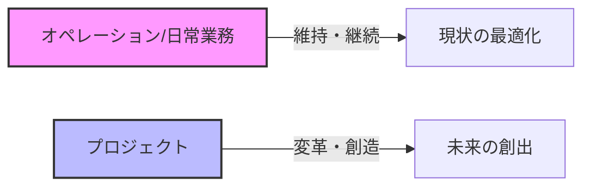
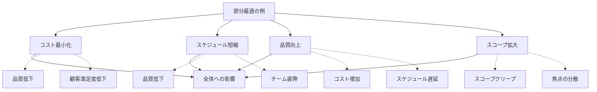
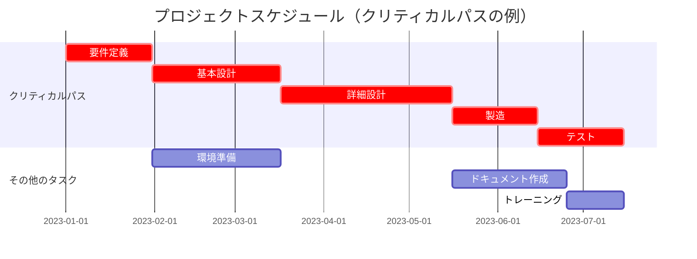
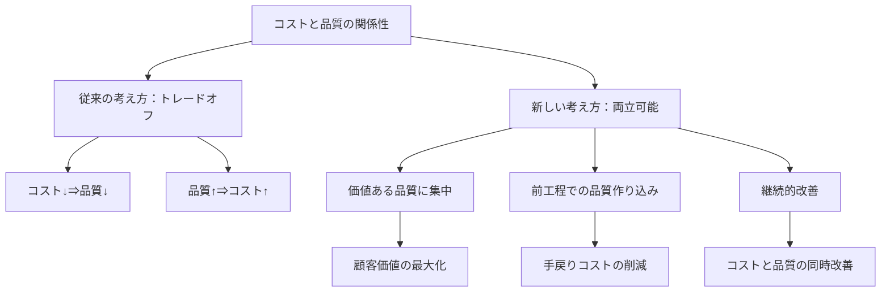
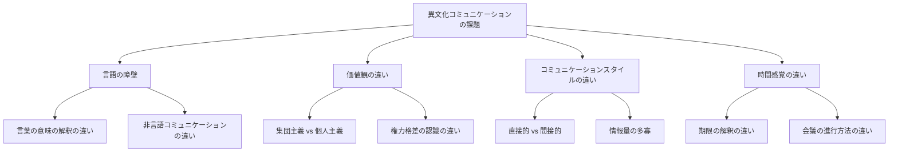
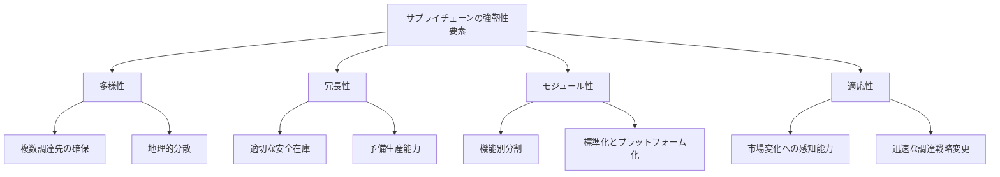
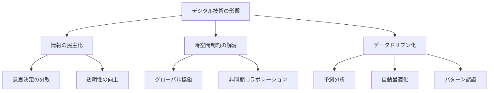
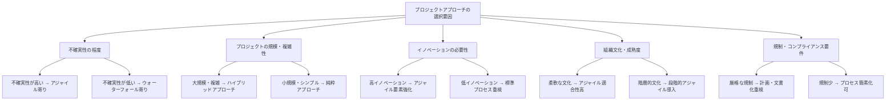
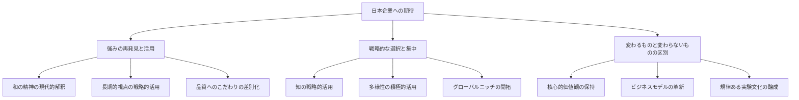

# PMBOKを3賢者と学ぶ～これからのマネジメント～

## はじめに

本書は、マネジメント思想の巨人である「ピーター・ドラッカー」「ジム・コリンズ」「大前研一」の三賢者が一堂に会し、プロジェクトマネジメントの知識体系「PMBOK（Project Management Body of Knowledge）」について語り合う、架空の対談を記録したものです。司会は、分かりやすい解説で定評のある池上彰氏が務めます。

もちろん、この対談は架空のものであり、登場する三賢者の発言は各々の著作や講演から推察される思想や理念に基づいて再構成したものです。しかし、彼らの知見を通してPMBOKの本質に迫ることで、これからのマネジメントの在り方を探る一助となれば幸いです。

## 目次

**第1章：PMBOKとは何か**
- 三賢者による自己紹介
- PMBOKの基本概念と歴史
- なぜ今PMBOKが注目されているのか

**第2章：プロジェクトマネジメントの本質**
- プロジェクトとオペレーションの違い
- 成功するプロジェクトマネジャーの条件
- 日本型プロジェクトマネジメントの特徴

**第3章：プロジェクト統合マネジメント**
- 全体最適とは何か
- 部分最適の罠
- 日本企業における統合マネジメントの課題

**第4章：スコープとスケジュールのマネジメント**
- 要求の明確化と優先順位付け
- 「時間」という資源の使い方
- 日本企業における残業問題とスケジュール管理

**第5章：コストと品質のマネジメント**
- コストと品質のトレードオフは本当か
- 日本企業の品質へのこだわりとコスト競争力
- 適正品質という考え方

**第6章：リソースとコミュニケーションのマネジメント**
- 人材育成とプロジェクト配置の秘訣
- 異文化コミュニケーションの課題
- リモートワーク時代のコミュニケーション戦略

**第7章：リスクと調達のマネジメント**
- リスクマネジメントの本質
- サプライチェーンの脆弱性と強靭性
- グローバル調達の新潮流

**第8章：ステークホルダーマネジメント**
- 多様なステークホルダーとの関係構築
- 利害対立の解消法
- 日本型ステークホルダー資本主義の可能性

**第9章：これからのプロジェクトマネジメント**
- デジタル時代のプロジェクトマネジメント
- アジャイルとウォーターフォールの融合
- 持続可能なプロジェクトマネジメント

**第10章：三賢者からのメッセージ**
- マネジャーへの提言
- 日本企業への期待
- 未来のマネジメントの展望

---

# 第1章：PMBOKとは何か

## 三賢者による自己紹介

**池上彰**：皆さん、こんにちは。本日の司会を務めます池上彰です。今回は特別企画として、マネジメント思想の世界的権威であるピーター・ドラッカーさん、ジム・コリンズさん、そして大前研一さんをお迎えして、PMBOKについて深く掘り下げていきたいと思います。まずは簡単に自己紹介をお願いできますでしょうか。ドラッカーさんからお願いします。

**ピーター・ドラッカー**：ありがとうございます。ピーター・ドラッカーです。私は1909年にオーストリアのウィーンで生まれ、長くアメリカで教鞭を執ってきました。「マネジメントの父」と呼ばれることもありますが、私自身は単に社会生態学者として、組織と人間の関係性を観察してきただけです。マネジメントとは、人を通じて成果を上げることであり、そのために「何をすべきか」を問い続けることが重要だと考えています。日本には特別な関心を持っており、日本の企業や文化から多くを学びました。

**ジム・コリンズ**：ジム・コリンズです。私はビジネス研究者として、「なぜある企業は偉大なのか」という問いを中心に研究を続けてきました。スタンフォード大学ビジネススクールで教鞭を執った後、独立した研究者として「ビジット・ツー・グレートネス（Good to Great）」などの研究プロジェクトを行ってきました。私の研究の特徴は、長期にわたる徹底的なデータ分析と事例研究を組み合わせた実証的アプローチにあります。企業の持続的成功の要因を解明し、それを体系化することに情熱を注いでいます。

**大前研一**：大前研一です。マッキンゼー・アンド・カンパニーのディレクターを務めた後、現在は経営コンサルタントとして活動しています。私は常に現実を直視する「戦略思考」を重視してきました。グローバルな視点と分析的思考を組み合わせることで、複雑な経営課題を解決するアプローチを提唱しています。特に日本企業の国際競争力強化に関心があり、環境変化に適応するための戦略的思考の必要性を訴え続けています。

**池上彰**：ありがとうございます。それでは本題に入りましょう。今回のテーマは「PMBOK」です。まずはPMBOKとは何か、基本的な概念から話していただけますか？

## PMBOKの基本概念と歴史

**大前研一**：PMBOKとは「Project Management Body of Knowledge」の略で、プロジェクトマネージメント協会（PMI）が体系化したプロジェクトマネジメントの知識体系です。簡単に言えば、プロジェクトを成功に導くために必要な知識とベストプラクティスをまとめたものです。

**大前研一**：具体的に言うと、PMBOKは現在「10の知識エリア」と「5つのプロセス群」という枠組みでプロジェクトマネジメントを体系化しています。ここでその全体像を示しましょう。

```
【PMBOKの構成】

10の知識エリア:
1. 統合マネジメント
2. スコープ・マネジメント
3. スケジュール・マネジメント
4. コスト・マネジメント
5. 品質マネジメント
6. リソース・マネジメント
7. コミュニケーション・マネジメント
8. リスク・マネジメント
9. 調達マネジメント
10. ステークホルダー・マネジメント

5つのプロセス群:
1. 立ち上げ
2. 計画
3. 実行
4. 監視・コントロール
5. 終結
```

**ジム・コリンズ**：PMBOKの歴史的背景も重要ですね。1960年代から70年代にかけて、アメリカの防衛産業や航空宇宙産業を中心に、複雑なプロジェクトを管理するための方法論が発達しました。それらの知見が集約され、1996年に初めてPMBOK®ガイドとして出版されたんです。以来、時代の変化に合わせて定期的に改訂され、現在は第7版まで出ています。

**ピーター・ドラッカー**：PMBOKの重要な特徴は、それが「規範」ではなく「ガイド」だという点です。「こうすべき」という押し付けではなく、「こういった知識やツールがある」という選択肢を提示していることに価値があります。プロジェクトの状況や目的に応じて、必要な知識やツールを選び、適用することが大切なのです。

**池上彰**：なるほど。PMBOKは単なるルールブックではなく、状況に応じて活用すべき知識の宝庫なのですね。では、そもそもプロジェクトとは何でしょうか？日常業務とはどう違うのでしょうか？

**ドラッカー**：プロジェクトの本質は「一時性」と「独自性」にあります。通常の業務（オペレーション）が継続的で反復的であるのに対し、プロジェクトには明確な開始と終了があり、独自の成果物を生み出すことを目的としています。例えば、新製品の開発、工場の建設、組織改革の実施などがプロジェクトに当たります。

**大前研一**：私はよく「プロジェクトと日常業務の違いは、マラソンとリレーの違いのようなもの」と例えます。マラソン（日常業務）は一定のペースで長く走り続けることが重要ですが、リレー（プロジェクト）は明確なスタートとゴールがあり、バトンの受け渡し（連携）が成否を分けます。また、リレーではチーム全体の最適化が必要で、一人が速くても他のメンバーとの連携が悪ければ勝てません。

```
【プロジェクトとオペレーションの違い】

プロジェクト:
- 一時的（明確な開始と終了がある）
- 独自の成果物を創出
- チームは一時的に編成される
- 変化と不確実性が前提
- 例：新製品開発、システム導入、組織改革

オペレーション（日常業務）:
- 継続的、反復的
- 標準化された成果を生み出す
- 固定的な組織体制
- 安定性と予測可能性が前提
- 例：製造ライン、顧客サポート、経理処理
```

**ジム・コリンズ**：興味深い例えですね。私の研究では、偉大な企業は「両利きの組織」になることが重要だと分かっています。つまり、効率的な日常業務（オペレーション）と革新的なプロジェクトの両方を高いレベルで実行できる組織です。これは人間で言えば、左脳と右脳をバランスよく使うようなものです。

## なぜ今PMBOKが注目されているのか

**池上彰**：ここで疑問なのですが、PMBOKは1996年から存在していたのに、なぜ今日本でも特に注目されているのでしょうか？

**大前研一**：私はこれを「VUCA時代」との関連で理解しています。VUCA（Volatility：変動性、Uncertainty：不確実性、Complexity：複雑性、Ambiguity：曖昧性）が高まる現代では、従来の安定した環境を前提とした経営手法が通用しなくなっています。そこで、不確実性を前提としたプロジェクトマネジメントが重要になっているのです。

**大前研一**：例えば、従来の日本企業が得意としてきた「カイゼン」は安定した環境での漸進的改善に効果的ですが、劇的な環境変化の中ではゼロから新しい仕組みを構築する「プロジェクト型思考」が必要です。しかし、多くの日本企業はプロジェクトマネジメントが不得意です。それを克服するツールとしてPMBOKが注目されているのです。

**ドラッカー**：私は別の観点からも見ています。知識労働者の時代においては、「仕事」の定義そのものが変わってきています。ルーティンワークは自動化され、残るのは「課題を見つけ、解決する」という知的作業です。これは本質的に「プロジェクト型の仕事」なのです。つまり、あらゆる仕事がプロジェクト化していると言えるでしょう。

**ジム・コリンズ**：私は組織の「規律」という観点から見ています。私の研究では、長期的に優れた成果を上げる組織には「規律ある文化」があることが分かっています。PMBOKは単なる技術論ではなく、「規律あるプロジェクト遂行の文化」を構築するためのフレームワークとしても機能します。

**コリンズ**：例えば、私の研究で明らかになった「規律ある思考」「規律ある人材」「規律ある行動」という三つの規律は、PMBOKのプロセスとも重なるものです。プロジェクトの計画段階での厳格な現実直視（規律ある思考）、適切な人材配置（規律ある人材）、計画の着実な実行と監視（規律ある行動）は、まさにPMBOKが提唱するものです。

**池上彰**：なるほど。三者三様の観点からPMBOKの現代的意義を説明いただきました。ここで少し整理してみましょう。PMBOKが今注目される理由は：

1. VUCA時代における不確実性への対応ツールとして（大前氏）
2. 知識労働の時代における仕事の本質的変化への対応として（ドラッカー氏）
3. 組織に規律ある文化を構築するためのフレームワークとして（コリンズ氏）

ということですね。

**大前研一**：そうですね。そしてもう一つ、DX（デジタルトランスフォーメーション）の文脈でも重要です。多くの企業がDXに取り組んでいますが、これは本質的に「デジタル技術を活用したビジネスモデル変革のプロジェクト」です。ITプロジェクトの失敗率の高さを考えると、プロジェクトマネジメントの知見が不可欠なのです。

## コラム：日本企業とPMBOK

日本企業がPMBOKを取り入れる際の課題と成功要因について、三賢者が議論しました。

**大前研一**：「日本の組織文化とPMBOKの相性は決して悪くありません。日本企業の強みである『全体最適』の考え方は、PMBOKの統合マネジメントの概念と共鳴します。課題は『暗黙知』に頼りがちな日本の組織文化をPMBOKの『形式知』と融合させることです。」

**ドラッカー**：「日本企業の『長期思考』はプロジェクトの本質的成果を見極める上で大きな強みになります。一方で、『前例主義』や『集団的意思決定』がプロジェクトのスピードや決断力を損なう可能性もあります。バランスが重要です。」

**コリンズ**：「私の研究では、『規律ある文化』と『企業家精神』の両立が重要だと分かっています。日本企業はしばしば前者に優れていますが、後者が不足しがちです。PMBOKを『創造性を封じる枠組み』ではなく『創造性を発揮するための土台』と捉えることが成功の鍵です。」

---

# 第2章：プロジェクトマネジメントの本質

## プロジェクトとオペレーションの違い

**池上彰**：第2章では、プロジェクトマネジメントの本質に迫っていきましょう。先ほど少し触れていただきましたが、プロジェクトとオペレーション（日常業務）の違いについて、もう少し深掘りしていただけますか？

**ドラッカー**：本質的な違いは「目的」にあります。オペレーションの目的は「維持」です。既存のシステムを効率的に運用し、安定した成果を継続的に出すことが求められます。一方、プロジェクトの目的は「変革」です。現状とは異なる何かを生み出し、組織を新しい状態へと移行させることが求められます。

**大前研一**：私はよく「オペレーションは『今』を最適化する活動、プロジェクトは『未来』を創造する活動」と説明します。この違いは、必要なスキルセットにも影響します。オペレーションでは「効率性」や「標準化」が重視されますが、プロジェクトでは「創造性」や「適応力」が重視されるのです。

**大前研一**：日本企業の多くは、オペレーション志向が強すぎるという問題を抱えています。トヨタ生産方式に代表される「カイゼン」文化は、オペレーションの効率化においては世界最高水準ですが、ゼロから何かを創造するプロジェクト型の仕事には必ずしも適していません。

**ジム・コリンズ**：私の「ビジット・ツー・グレートネス」研究では、優れた企業は「規律あるオペレーション」と「創造的なプロジェクト」の両方に秀でていることが分かっています。これは「AND思考」の例で、「AかBか」ではなく「AもBも」という発想が必要なのです。

**ジム・コリンズ**：この両立の難しさを私はフライホイール（はずみ車）と呼んでいます。既存事業を安定的に回し続けるフライホイールと、新しい事業を創造するためのフライホイールの両方を回す必要があるのです。



**池上彰**：なるほど。オペレーションとプロジェクトは目的も手法も異なるということですね。では、プロジェクトマネジメントの本質とは何でしょうか？

**ドラッカー**：私は「成果への集中」だと考えています。プロジェクトマネジメントの目的は、「活動」ではなく「成果」にあります。「何をするか」ではなく「何を達成するか」が重要なのです。PMBOKの各プロセスも、最終的にはプロジェクトの成果を確実に生み出すための手段に過ぎません。

**大前研一**：私は「シナリオ思考」が本質だと考えています。プロジェクトは本質的に不確実性を含みます。したがって、単一の計画ではなく、複数のシナリオを想定し、状況の変化に応じて適応していく能力が不可欠です。これは私が提唱してきた「戦略思考」とも共通しています。

**大前研一**：例えば、プロジェクト計画で重要なのは、「Plan A」だけではなく、「Plan B」「Plan C」も準備しておくことです。リスク管理も同じで、「このリスクが顕在化したらこう対応する」という複数のシナリオを事前に考えておくことが重要です。

**ジム・コリンズ**：私は「規律ある実行」が本質だと考えています。どんなに優れた計画も、実行されなければ意味がありません。私の研究では、成功している企業は「20マイル行進」の原則を守っています。これは、好調な時も不調な時も、一定のペースで着実に前進し続けるという考え方です。

**ジム・コリンズ**：プロジェクトマネジメントも同じで、計画したことを着実に実行し、進捗を定期的に確認し、必要に応じて軌道修正する「規律」が成功の鍵です。PMBOKの監視・コントロールプロセスはまさにこの規律を体系化したものと言えるでしょう。

**池上彰**：三者三様の「本質」の捉え方ですね。成果への集中、シナリオ思考、規律ある実行。これらはPMBOKの中でどのように位置づけられているのでしょうか？

**大前研一**：PMBOKの10の知識エリアは、これらの本質を様々な側面から支える要素と言えます。例えば、「統合マネジメント」は全体としての成果を見失わないために、「リスクマネジメント」はシナリオ思考を実践するために、「監視・コントロール」プロセスは規律ある実行を支えるために必要なのです。

## 成功するプロジェクトマネジャーの条件

**池上彰**：ではPMBOKの観点から、成功するプロジェクトマネジャーにはどのような条件が必要でしょうか？

**ドラッカー**：私は次の5つが不可欠だと考えています：

```
【ドラッカーが考える成功するプロジェクトマネジャーの5条件】

1. 目的意識：何のためのプロジェクトかを常に意識し、関係者と共有する
2. 貢献思考：自分や組織の貢献は何かを考え、成果を定義する
3. 集中力：重要な成果に資源を集中させる
4. 強みの活用：チームメンバーの強みを活かす人材配置を行う
5. 効果的な意思決定：適切なタイミングで必要な意思決定を行う
```

**大前研一**：私の経験からは、次の要素が重要だと思います：

```
【大前研一が考える成功するプロジェクトマネジャーの条件】

1. 戦略的思考力：全体像を把握し、最適な手段を選択できる
2. 分析力：複雑な状況を構造化し、本質を見抜ける
3. 適応力：変化する環境に柔軟に対応できる
4. コミュニケーション能力：多様なステークホルダーと効果的に対話できる
5. 決断力：不確実な状況でも必要な決断を下せる
```

**ジム・コリンズ**：私の研究からは、「レベル5リーダーシップ」がプロジェクトマネジャーにも適用できると考えています：

```
【コリンズが考える成功するプロジェクトマネジャーの条件】

1. 謙虚さと職業的意志：自分の功績を誇示せず、プロジェクトの成功に執着する
2. 現実直視：厳しい現実から目をそらさない勇気を持つ
3. 規律ある思考：感情や先入観ではなく、事実に基づいて判断する
4. 規律ある人材配置：適材適所を徹底する
5. 規律ある行動：計画したことを着実に実行する
```

**池上彰**：三者の視点を統合すると、成功するプロジェクトマネジャーには「目的志向」「戦略的思考」「現実直視」「人材活用」「規律ある実行」が求められるということですね。これらはPMBOKの知識だけでなく、人間的資質も含んでいます。

**ドラッカー**：その通りです。PMBOKは知識とツールを提供しますが、それを活かすのは人間です。知識とツールを持っているだけでは不十分で、それを適切に使いこなす「判断力」と「人間力」が不可欠なのです。

## 日本型プロジェクトマネジメントの特徴

**池上彰**：日本企業のプロジェクトマネジメントには、欧米とは異なる特徴があるように思います。三賢者のお考えはいかがでしょうか？

**大前研一**：日本型プロジェクトマネジメントの最大の特徴は「曖昧性の許容」と「集団的意思決定」でしょう。欧米型が明確な役割分担と個人の責任を重視するのに対し、日本型はチーム全体の調和と共同責任を重視します。

**大前研一**：これには長所と短所があります。長所は、予期せぬ事態への柔軟な対応力や、チーム全体の知恵を集める「集合知」の活用です。短所は、責任の所在が不明確になりやすいことや、意思決定に時間がかかることです。

**ドラッカー**：私は日本企業の「現場重視」の姿勢に関心を持っていました。トップダウンの計画よりも、現場の知恵を活かした問題解決を重視する傾向があります。これはPMBOKの「監視・コントロール」プロセスとも共鳴する部分があります。

**ドラッカー**：ただし、PMBOKが前提とする「プロジェクトマネジャーへの権限委譲」は、日本企業では必ずしも十分ではありません。「根回し」と呼ばれる非公式な合意形成プロセスが重視されるため、公式な権限だけではプロジェクトを進められないのです。

**ジム・コリンズ**：私が注目するのは「長期思考」です。四半期ごとの業績に縛られる欧米企業に比べ、日本企業は長期的な視点でプロジェクトを考える傾向があります。これは、プロジェクトの本質的成果を見極める上で強みになります。

**ジム・コリンズ**：一方で、「前例主義」や「リスク回避」の傾向も強く、革新的なプロジェクトに挑戦することへの躊躇があるように思います。私の「ビッグ・ハズーンズ（Big Hairy Audacious Goals）」の考え方からすると、もっと大胆な目標設定があってもよいと思います。

**池上彰**：日本型と欧米型、それぞれの特徴を活かしたハイブリッドなアプローチが理想的なのでしょうか？

**大前研一**：その通りです。大切なのは「何が効果的か」という視点です。日本企業は「和」を重視する文化を活かしつつ、PMBOKが提供する「形式知」を取り入れることで、より効果的なプロジェクトマネジメントが可能になるでしょう。

**大前研一**：例えば、私が提唱してきた「3C分析」（Customer：顧客、Competitor：競合、Company：自社）のフレームワークも、プロジェクトの初期段階で「なぜこのプロジェクトが必要か」を明確にする上で有効です。PMBOKのステークホルダー分析やビジネスケース作成と組み合わせることで、より説得力のある「プロジェクトの理由」を構築できます。

> **コラム：3C分析とは**
> 
> 3C分析とは、事業環境を「Customer（顧客）」「Competitor（競合）」「Company（自社）」の3つの視点から分析するフレームワークです。大前研一氏が提唱した戦略立案のための基本的な分析手法で、以下の要素を検討します。
> 
> - Customer（顧客）：顧客は誰か、顧客のニーズは何か、どのような購買行動をとるか
> - Competitor（競合）：競合は誰か、競合の強みと弱みは何か、競合はどのような戦略をとっているか
> - Company（自社）：自社の強みと弱みは何か、競合と比較した独自の価値は何か
> 
> これら3つの要素を総合的に分析することで、自社が取るべき戦略の方向性が見えてきます。プロジェクトマネジメントにおいても、プロジェクトの目的設定や範囲決定の際に活用できる分析手法です。

**池上彰**：3C分析をプロジェクトマネジメントに応用するという視点は興味深いですね。他にも日本独自の経営手法とPMBOKを融合させる例はありますか？

**ドラッカー**：私が評価している「ホスピタリティ」の概念も重要です。日本のおもてなし文化は、顧客や関係者の期待を超える価値を提供することを重視します。これはPMBOKのステークホルダーマネジメントと品質マネジメントを深化させる可能性を秘めています。

**コリンズ**：私はトヨタ生産方式の「見える化」の考え方が、PMBOKのコミュニケーションマネジメントやモニタリング・コントロールに応用できると考えています。プロジェクトの状況を「見える化」することで、問題の早期発見と対応が可能になります。

## ケーススタディ：製薬会社のグローバル臨床試験プロジェクト

日本の大手製薬会社A社が、新薬開発のためのグローバル臨床試験プロジェクトを立ち上げました。日本、米国、欧州、アジアの医療機関で同時に実施する大規模な試験です。しかし、文化的な違いや規制の違いから、プロジェクトは当初の計画から大幅に遅延していました。

**大前研一の分析**：「このケースでは、グローバルな標準（PMBOK）と各地域の特性のバランスが取れていませんでした。特に、現地の規制環境や文化的背景を十分に分析せずに一律の計画を適用しようとした点が問題でした。私なら、計画段階で3C分析を用いて、各地域の特性（Competitor）、規制当局や患者のニーズ（Customer）、自社のケイパビリティ（Company）を徹底的に分析します。」

**ドラッカーの視点**：「このケースの本質的な問題は『目的の共有』が不十分だったことです。プロジェクトの目的は単に試験を完了することではなく、安全で効果的な新薬を患者に届けることです。その目的をすべての関係者が共有していれば、各地域の特性に応じた柔軟なアプローチが取れたはずです。」

**コリンズの提言**：「このケースでは『規律ある人材』の配置が不足していました。グローバルプロジェクトでは、各地域の特性を理解し、本社と現地をつなぐ『橋渡し役』が必要です。また、『規律ある思考』に基づき、定期的に進捗状況を評価し、計画を修正する仕組みも必要でした。」

A社はこれらの教訓を活かし、PMBOKの知識体系を導入しつつ、各地域の特性に合わせたカスタマイズを行いました。特に、ステークホルダーマネジメントと通信マネジメントを強化し、「グローカル（グローバル＋ローカル）」なアプローチを採用。その結果、次のプロジェクトでは予定通りの進行を実現し、新薬の承認取得につなげることができました。

---

# 第3章：プロジェクト統合マネジメント

## 全体最適とは何か

**池上彰**：第3章では、PMBOKの知識エリアの一つである「プロジェクト統合マネジメント」について掘り下げていきましょう。まず「全体最適」とは何か、お聞かせください。

**ドラッカー**：全体最適とは、プロジェクトの個々の要素ではなく、プロジェクト全体としての目的達成を最優先する考え方です。これは私がかねてから強調してきた「目的による管理（Management by Objectives）」の考え方とも通じます。

**ドラッカー**：プロジェクトの目的を見失わず、すべての活動がその目的達成に貢献しているかを常に問い続けることが重要です。そのためには、目的を明確にし、関係者全員で共有することが第一歩となります。

**大前研一**：私は全体最適を「戦略的一貫性」と表現します。プロジェクトの各要素が相互に矛盾せず、一貫した方向性を持って進められることが重要です。例えば、スコープ、スケジュール、コスト、品質などのトレードオフを考慮した上で、最適なバランスを見つけることが統合マネジメントの本質です。

**大前研一**：全体最適を考える際に有効なのが「MECE（Mutually Exclusive, Collectively Exhaustive：相互に排他的でありながら全体として漏れがない）」の考え方です。プロジェクトの要素を漏れなく考慮しつつ、重複による非効率を排除することが重要なのです。

**ジム・コリンズ**：私は全体最適を「コアバリューとビジョンの一貫性」という観点から捉えています。優れた企業は「何のために存在するのか（コアバリュー）」と「何を目指すのか（ビジョン）」が明確です。プロジェクトも同様に、「なぜこのプロジェクトを行うのか」という根本的な理由と、「どんな成果を目指すのか」というビジョンの一貫性が重要です。

**池上彰**：なるほど。全体最適とは、単に「すべての要素を考慮する」ということではなく、「目的」「戦略的一貫性」「コアバリューとビジョン」を中心に据えた考え方なのですね。PMBOKではこれをどのように実現するのでしょうか？

**大前研一**：PMBOKでは「プロジェクト憲章」と「プロジェクトマネジメント計画書」が重要なツールとなります。プロジェクト憲章はプロジェクトの目的や期待される成果、主要マイルストーン、予算などを明確にし、プロジェクトの存在理由を公式に認めるものです。

**大前研一**：プロジェクトマネジメント計画書は、さらに詳細な計画で、スコープ、スケジュール、コスト、品質などの各要素がどのように管理されるかを定めるものです。これらのドキュメントを作成・共有することで、全体最適の基盤を作ることができます。

```
【プロジェクト統合マネジメントの主要プロセス】

1. プロジェクト憲章の作成
   - プロジェクトの公式な承認を得る
   - プロジェクトマネジャーに権限を与える

2. プロジェクトマネジメント計画書の作成
   - 各知識エリアの計画を統合する
   - プロジェクト全体の実行方法を定義する

3. プロジェクト作業の指揮・マネジメント
   - 計画に従ってプロジェクト作業を実行する
   - チームを指揮し、成果物を作成する

4. プロジェクト知識のマネジメント
   - プロジェクト知識を創出・収集・普及・蓄積する
   - 組織的学習につなげる

5. プロジェクト作業の監視・コントロール
   - 進捗状況を追跡・確認・報告する
   - 必要に応じて是正処置を講じる

6. 統合変更管理の実施
   - 変更要求を検討し、承認/却下する
   - 承認された変更を実施する

7. プロジェクトやフェーズの終結
   - プロジェクトを正式に終了する
   - 教訓を文書化し、資産を移管する
```

## 部分最適の罠

**池上彰**：全体最適の反対として「部分最適」という問題があると思います。これについてお聞かせください。

**ドラッカー**：部分最適の罠とは、プロジェクトの一部の側面だけを最適化することで、全体としての成果が損なわれてしまう状態を指します。例えば、コストだけを最小化しようとして品質を犠牲にしたり、スケジュールだけを優先して重要な機能を削ったりすることです。

**ドラッカー**：これは組織のサイロ化（縦割り組織）と関連しています。各部門が自分たちの担当領域だけを最適化しようとして、全体としての目的が見失われるのです。プロジェクトにおいても同様の問題が起こります。

**大前研一**：私はこれを「最適化の誤謬」と呼んでいます。部分の最適化が必ずしも全体の最適化につながらないという現象です。例えば、開発部門がコスト削減を最優先すると、運用部門のコストが増大することがあります。全体のライフサイクルコストを考えれば、開発段階での適切な投資が全体最適につながるケースが多いのです。

**大前研一**：日本企業でよく見られるのが、「品質の過剰最適化」です。日本企業は品質に対する こだわりが強く、時として必要以上の品質を追求することがあります。しかし、市場が求める品質レベルを超えた「過剰品質」は、コストやスケジュールを圧迫し、結果として市場競争力を損なうことになります。



**ジム・コリンズ**：私の研究では、「AND思考」の欠如が部分最適の原因となっていることがわかりました。「AかBか」という二者択一的思考ではなく、「AもBも」という両立思考が重要です。例えば、「低コストか高品質か」ではなく、「低コストでかつ高品質」を追求する思考です。

**ジム・コリンズ**：これはジレンマを創造的に解決する思考法です。プロジェクトマネジメントでも、一見矛盾するように思える要素の両立を模索することが全体最適につながります。例えば、「短期的成果と長期的価値」「詳細計画と柔軟な対応」「集中と分散」などの両立です。

**池上彰**：部分最適の罠を避けるためにはどうすればよいのでしょうか？

**ドラッカー**：最も重要なのは「成果への集中」です。何がプロジェクトの本質的な成果なのかを明確にし、それを関係者全員で共有することです。そして、あらゆる意思決定がその成果に貢献するかどうかを判断基準にすることです。

**大前研一**：私は「シナリオプランニング」と「トレードオフ分析」が有効だと考えています。各要素を個別に最適化するのではなく、全体としてどのようなシナリオが考えられるか、要素間のトレードオフをどう考えるかを分析することで、バランスの取れた意思決定が可能になります。

**ジム・コリンズ**：私は「規律ある対話」が重要だと考えています。部分最適は往々にして部門間の対話不足から生じます。データに基づき、感情や先入観にとらわれず、率直に議論することで、全体最適のための創造的解決策が生まれます。私の研究では、優れた企業は「残酷な現実と向き合う勇気」を持っていることが明らかになっています。

## 日本企業における統合マネジメントの課題

**池上彰**：日本企業が統合マネジメントを実践する上での課題や特徴はありますか？

**大前研一**：最大の課題は「曖昧な責任体制」でしょう。日本企業では「全員合意」を重視する傾向があり、それ自体は素晴らしいのですが、反面、意思決定に時間がかかったり、責任の所在が不明確になったりする問題があります。PMBOKが前提とする「プロジェクトマネジャーへの明確な権限委譲」が不十分なケースが多いのです。

**大前研一**：例えば「根回し」と呼ばれる非公式な合意形成プロセスは、日本企業の特徴的な慣行です。これにはステークホルダーの支持を得るという意味では価値がありますが、透明性に欠け、時間がかかるという課題もあります。PMBOKの統合マネジメントを日本企業に導入する際は、この文化的背景を考慮する必要があります。

**ドラッカー**：日本企業のもう一つの特徴は「暗黙知への依存」です。欧米企業が文書化とプロセス化を重視するのに対し、日本企業では経験と直感に基づく判断が重視される傾向があります。これには柔軟性という長所がある反面、知識やノウハウの体系的な蓄積と伝承が難しいという短所もあります。

**ドラッカー**：PMBOKは本質的に「形式知」の体系です。日本企業がPMBOKを効果的に活用するためには、豊かな「暗黙知」を「形式知」に変換し、体系化する努力が必要です。野中郁次郎教授の「SECIモデル」が示すように、暗黙知と形式知の相互変換が組織の知識創造には不可欠なのです。

> **コラム：SECIモデルとは**
>
> SECIモデルは、野中郁次郎教授と竹内弘高教授が提唱した知識創造理論の中心的フレームワークです。SECI（セキ）とは以下の4つのプロセスの頭文字を取ったものです：
>
> - Socialization（共同化）：暗黙知から暗黙知への変換。直接経験を共有することで知識を伝達します。
> - Externalization（表出化）：暗黙知から形式知への変換。暗黙知を言語化・文書化します。
> - Combination（連結化）：形式知から形式知への変換。既存の形式知を組み合わせて新たな知識を創造します。
> - Internalization（内面化）：形式知から暗黙知への変換。形式知を実践を通じて体得します。
>
> これら4つのプロセスが螺旋状に繰り返されることで、組織的な知識創造が行われるというモデルです。プロジェクトマネジメントにおいても、暗黙知と形式知の相互変換は重要な課題となります。

**ジム・コリンズ**：私の観点からは、日本企業の「長期思考」は統合マネジメントにとって強みになる可能性があります。短期的な成果ではなく、長期的な価値を重視する姿勢は、プロジェクトの本質的成果を見極める上で重要です。

**ジム・コリンズ**：一方で「前例踏襲」や「リスク回避」の傾向は課題となります。統合マネジメントでは、変化する環境に応じた柔軟な対応が求められます。過去の成功体験に固執せず、新たな挑戦をする勇気も必要なのです。

**池上彰**：日本企業が統合マネジメントを効果的に実践するためのアドバイスはありますか？

**大前研一**：私は「形式と実質のバランス」が重要だと考えています。PMBOKの形式的な側面だけを取り入れようとすると、「形だけ」の導入になってしまいます。一方、日本的な実質重視に偏ると、体系的なアプローチの利点を活かせません。両者のバランスを取ることが重要です。

**大前研一**：具体的には、PMBOKの枠組みを基本としつつ、日本企業の強みである「現場の知恵」や「チームワーク」を活かす方法を模索すべきです。例えば、プロジェクト憲章やプロジェクト計画書といった公式文書を作成しながらも、それを単なる「儀式」ではなく、関係者の真の合意形成と知恵の結集のプロセスとして位置づけることが重要です。

**ドラッカー**：私は「目的の明確化と共有」が最も重要だと考えています。日本企業は「和」を重視する文化から、時として本音と建前が分離することがあります。しかし、プロジェクトの本当の目的が何かを関係者全員が理解し、共有することなしに統合マネジメントは機能しません。

**ドラッカー**：勇気をもって「何のために」という問いを常に発し、その答えをプロジェクトの中心に据えることが大切です。それが形骸化を防ぎ、真に価値のある成果につながるのです。

**ジム・コリンズ**：私からは「規律と創造性の両立」を提案します。PMBOKの導入が官僚的な手続きの増加にとどまっては意味がありません。規律あるプロセスを通じて、むしろ創造性を解放することが重要です。

**ジム・コリンズ**：私の研究で明らかになった「規律ある文化」の本質は、単なるルール遵守ではなく、「正しいことを正しい理由で行う」という共通の理解です。PMBOKを「創造性を発揮するための基盤」として位置づけることで、統合マネジメントは真価を発揮するでしょう。

## ケーススタディ：自動車メーカーの新車開発プロジェクト

日本の大手自動車メーカーB社は、次世代電気自動車の開発プロジェクトを立ち上げました。このプロジェクトは従来の内燃機関車とは全く異なるアーキテクチャを採用し、自動運転技術も組み込む野心的なものでした。しかし、開発と量産の間のギャップが大きく、予定していた量産開始に向けて深刻な問題が発生していました。

**大前研一の分析**：「このケースの問題点は、開発部門と生産部門の『部分最適』にあります。開発部門は革新的な設計を追求する一方、生産部門は従来の生産システムとの整合性を重視していました。両者の間のコミュニケーションとすり合わせが不足していたのです。『3C分析』の視点では、Company（自社）の内部調整が不十分だったと言えます。」

**ドラッカーの視点**：「このケースでは『何のために』という問いが共有されていませんでした。次世代電気自動車を開発する本当の目的は何か？技術的な先進性なのか、生産効率なのか、あるいは市場における競争力なのか？その根本的な目的の共有がなければ、各部門は自分たちの『部分最適』を追求してしまうのです。」

**コリンズの提言**：「このケースには『規律ある対話』が必要でした。技術的野心と現実的制約の間には常に緊張関係がありますが、それを創造的に解決するには、事実に基づいた率直な対話が不可欠です。『レベル5リーダーシップ』を発揮し、部門間の壁を越えた協力体制を構築することが必要だったのです。」

B社はこれらの教訓を活かし、PMBOKの統合マネジメントの考え方を導入しました。具体的には、プロジェクトの初期段階から開発部門と生産部門の合同チームを編成し、共通の目標と評価基準を設定。定期的な「クロスファンクショナル・レビュー」を実施し、早期に問題を発見・解決する体制を構築しました。また、「設計・生産統合シミュレーション」というデジタルツールを導入し、設計変更が生産に与える影響を可視化しました。

その結果、次のプロジェクトでは開発から量産への移行がスムーズに行われ、予定通りの量産開始と高い品質を両立することができました。

---

# 第4章：スコープとスケジュールのマネジメント

## 要求の明確化と優先順位付け

**池上彰**：第4章では、PMBOKの重要な知識エリアである「スコープマネジメント」と「スケジュールマネジメント」について掘り下げていきます。まず、プロジェクトスコープを適切に定義するための「要求の明確化と優先順位付け」についてお聞かせください。

**ドラッカー**：要求の明確化で最も重要なのは「顧客は誰か」「顧客の価値は何か」を明確にすることです。プロジェクトの「顧客」は、最終製品やサービスのユーザーだけでなく、社内の関係部門や経営層、取引先など多岐にわたります。それぞれの「顧客」が何を価値と考えるかを理解することが、要求を明確にする第一歩です。

**ドラッカー**：例えば、新製品開発プロジェクトでは、エンドユーザーは「使いやすさ」や「問題解決能力」に価値を見出すかもしれませんが、経営層は「市場シェア拡大」や「収益性」に価値を見出すでしょう。これらの異なる価値観を理解し、明確にすることが重要です。

**大前研一**：私は要求の明確化において「オブラートに包まれた本音」を解きほぐすことが重要だと考えています。特に日本企業では、本当の要求や懸念が直接表明されないことがあります。表面的な要求の背後にある本当のニーズや懸念を理解することが必要です。

**大前研一**：例えば、「もっと機能を追加してほしい」という要求の背後には、「競合他社の製品に負けたくない」という懸念や、「自分の部署の存在意義を示したい」という組織的な動機が隠れていることがあります。これらの本音を理解することで、より適切なスコープ定義が可能になります。

**ジム・コリンズ**：私の研究では「何をやらないかを決める」ことの重要性が明らかになっています。優れた企業は「やらないことリスト」を持っています。プロジェクトスコープも同様で、何を含めるかだけでなく、何を含めないかを明確にすることが重要です。

**ジム・コリンズ**：スコープの肥大化（スコープクリープ）は多くのプロジェクトを失敗に導く要因です。これを防ぐには、プロジェクトの「核心的目標」と「それ以外」を明確に区別し、核心的目標に資源を集中させる規律が必要です。「優れた企業は何をやるかではなく、何をやめるかによって、他社と差別化される」のです。

```
【要求の優先順位付けの方法】

1. MoSCoW法
   - Must have（必須）：なければプロジェクトは失敗
   - Should have（重要）：重要だが回避策がある
   - Could have（あれば良い）：望ましいが必須ではない
   - Won't have（今回は対象外）：今回は実施しない

2. Kano Model（狩野モデル）
   - 基本要求：あって当然、なければ不満
   - 期待要求：あれば満足、なければ不満
   - 魅力的要求：あれば喜ばれる、なくても不満はない

3. コストベネフィット分析
   - 各要求の実装コストとビジネス価値を分析
   - ROI（投資収益率）の高いものから優先
```

**池上彰**：要求の優先順位付けについて、具体的な方法論はありますか？

**大前研一**：私は「2×2マトリックス」を活用した優先順位付けを勧めています。縦軸に「ビジネス価値」、横軸に「実現難易度」を取り、各要求をマッピングします。「高価値・低難易度」のものから着手し、「低価値・高難易度」のものは思い切って除外することで、効率的なスコープ定義が可能になります。

**大前研一**：また、プロジェクトライフサイクル全体を見据えた「TCO（Total Cost of Ownership：総所有コスト）」の観点も重要です。開発コストだけでなく、運用・保守コストも含めた総コストを考慮して優先順位を付けることで、長期的に最適なスコープ定義が可能になります。

**ドラッカー**：私は「貢献」という視点から優先順位を考えることを提案します。各要求が、プロジェクトの目的にどのように貢献するかを評価するのです。直接的に目的達成に貢献する要求は優先度が高く、間接的な貢献しかない要求は優先度を下げるか、別のプロジェクトに回すべきでしょう。

**ジム・コリンズ**：私は「ビッグ・ハズーンズ」の考え方を適用することを提案します。プロジェクトの「大胆で冒険的な目標」を設定し、それに直接貢献する要求を優先させるのです。そうすることで、「今、この時点で私たちが取り組むべき最も重要なことは何か」という問いに答えることができます。

**池上彰**：スコープが決まったら、次はスケジュールを考えることになります。スケジュールマネジメントの要点は何でしょうか？

## 「時間」という資源の使い方

**ドラッカー**：時間はプロジェクトにおける最も希少で、最も回復不能な資源です。経営者とプロジェクトマネジャーに共通するのは、「時間管理」が最も重要なマネジメント能力の一つだということです。

**ドラッカー**：私はかねてから「時間の記録」の重要性を強調してきました。まず自分がどのように時間を使っているかを知ることが第一歩です。同様に、プロジェクトでも「実際に作業にかかる時間」を把握することが不可欠です。多くのプロジェクトは、楽観的すぎる時間見積もりによって失敗します。

**大前研一**：私は「クリティカルパス」の概念が重要だと考えています。プロジェクトには多くの作業がありますが、全体の進捗に直接影響するのはクリティカルパス上の作業です。限られた資源を効率的に配分するには、クリティカルパスを特定し、それに集中することが重要です。

**大前研一**：例えば、新製品開発プロジェクトでは、設計、試作、評価、量産準備などの作業があります。もし設計と試作の間に強い依存関係があり、設計が1日遅れると全体が1日遅れるなら、それはクリティカルパス上の作業です。一方、並行して行える作業や、遅れても全体に影響しない作業（バッファーがある作業）はクリティカルパスではありません。



**ジム・コリンズ**：私は「20マイル行進」の原則がスケジュールマネジメントにも適用できると考えています。これは、好調な時も不調な時も、一定のペースで着実に前進し続けるという考え方です。

**ジム・コリンズ**：例えば、ソフトウェア開発では、「スプリント」と呼ばれる一定期間（例えば2週間）ごとに一定量の機能を完成させるアプローチがあります。これは「20マイル行進」の原則と共通しています。重要なのは、無理な加速や停滞を避け、持続可能なペースを維持することです。

**池上彰**：時間管理の実践的なテクニックや考え方はありますか？

**ドラッカー**：私は「拡大と集中」のアプローチを提案します。まず、プロジェクト全体を俯瞰し、主要なマイルストーンを特定します（拡大）。次に、直近のマイルストーンに向けて集中的に取り組みます（集中）。この「拡大と集中」のサイクルを繰り返すことで、短期的な進捗と長期的な方向性のバランスを取ることができます。

**大前研一**：私は「バッファーマネジメント」を重視しています。プロジェクトの計画段階でバッファー（余裕時間）を明示的に組み込むことが重要です。特にクリティカルパス上の重要な作業や不確実性の高い作業には、十分なバッファーを設けるべきです。

**大前研一**：例えば、「クリティカルチェーン法」では、個々の作業の見積もりから安全マージンを取り除き、代わりにプロジェクト全体にバッファーを設けるアプローチを取ります。これにより、「学生症候群」（期限直前まで本腰を入れない傾向）や「パーキンソンの法則」（仕事は与えられた時間いっぱいに拡大する）といった問題を軽減できます。

**ジム・コリンズ**：私は「規律ある実験」の価値を強調したいと思います。不確実性の高いプロジェクトでは、最初から詳細なスケジュールを固定するのではなく、短いサイクルで実験とフィードバックを繰り返すアプローチが有効です。これは「アジャイル」の考え方とも共通しています。

**ジム・コリンズ**：例えば、新規事業開発のような不確実性の高いプロジェクトでは、「仮説→実験→学習→調整」のサイクルを短期間で回し、学びに基づいてスケジュールを柔軟に調整していくことが重要です。ただし、これは「規律の欠如」ではなく、むしろ「規律ある柔軟性」と言えるものです。

## 日本企業における残業問題とスケジュール管理

**池上彰**：日本企業特有の問題として、残業や働き方に関する課題がスケジュール管理に与える影響についてはどうお考えですか？

**大前研一**：日本企業の残業問題は、スケジュール管理の課題と密接に関連しています。残業が常態化している組織では、「見かけ上のリソース」と「実際のリソース」にギャップがあります。例えば、公式には8時間労働でスケジュールを組んでいても、実際には10時間、12時間の労働を前提としているケースが多いのです。

**大前研一**：これは「隠れたバッファー」とも言えますが、働き方改革が進む中で、このようなバッファーに依存したスケジュール管理は持続可能ではありません。より現実的な作業量の見積もりと、適切なスコープ調整が必要です。

**ドラッカー**：私はこの問題を「生産性」の観点から見ています。長時間労働は必ずしも高い生産性を意味しません。むしろ、集中力の低下や創造性の減退を招くことが多いのです。プロジェクトマネジメントにおいても、単純に労働時間を延ばすのではなく、「成果を上げるための最適な時間の使い方」を考えることが重要です。

**ドラッカー**：具体的には、「重要な少数」と「些末な多数」を区別し、重要な作業に集中する時間を確保することです。また、チームメンバーが自律的に時間管理できるよう、権限委譲と結果責任を明確にすることも重要です。

**ジム・コリンズ**：私の研究では、持続的に優れた成果を上げる組織には「規律ある文化」があることが分かっています。これは単に長時間働くことではなく、「正しいことを正しい理由で行う」文化です。残業が常態化している組織では、「時間を費やすこと」と「成果を上げること」が混同されがちです。

**ジム・コリンズ**：持続可能なプロジェクトマネジメントのためには、「投入時間」ではなく「創出価値」を評価する文化への転換が必要です。これは「規律ある人材」の考え方とも一致します。適切な人材を適切な役割に配置し、成果に対する責任を持たせることで、無駄な残業を減らすことができるのです。

**池上彰**：具体的に日本企業がスケジュール管理を改善するためのアドバイスはありますか？

**大前研一**：私は「バックキャスティング」と「フロントローディング」の二つのアプローチを組み合わせることを提案します。バックキャスティングは、目標から逆算して計画を立てる方法で、「何をいつまでに達成すべきか」という明確な道筋を示します。フロントローディングは、プロジェクトの初期段階に資源を集中投入し、早期に問題を発見・解決する方法です。

**大前研一**：例えば、新製品開発では、市場投入日から逆算してスケジュールを立て（バックキャスティング）、企画・設計段階に十分な時間と人材を投入する（フロントローディング）ことで、後工程での問題を減らし、残業に依存しないスケジュール管理が可能になります。

**ドラッカー**：私は「予定された時間」の概念を取り入れることを提案します。これは、重要な作業に集中するための「邪魔されない時間」を意図的に確保することです。例えば、朝の2時間を「深い思考」の時間として確保し、会議やメールは午後に集中させるといった工夫です。

**ドラッカー**：また、定期的な「振り返り」の時間を設けることも重要です。「何がうまくいったか」「何が改善できるか」を振り返ることで、スケジュール管理の精度を高めることができます。これは私が提唱してきた「フィードバック分析」の考え方とも通じます。

**ジム・コリンズ**：私は「最初に大きな石を置く」という原則を提案します。これは、最も重要なタスクを最初に配置し、その後で小さなタスクを埋めていくという考え方です。プロジェクトスケジュールでも同様に、核心的な成果に直結する作業を優先的にスケジュールに組み込むことが重要です。

**ジム・コリンズ**：また、「規律ある会議」の文化も重要です。多くの組織では、不要な会議や非効率な会議が時間を浪費しています。会議の目的を明確にし、必要な参加者だけを招集し、決められた時間内で結論を出す規律が必要です。私の研究では、優れた企業は「時間の使い方」にも規律を持っていることが分かっています。

## ケーススタディ：IT企業のシステム開発プロジェクト

大手金融機関向けの新システム開発を請け負ったIT企業C社は、当初の予定から大幅に遅延し、深刻な赤字を抱えていました。クライアントからの追加要求に応じ続けた結果、スコープが肥大化し、チームは長時間残業を強いられていました。

**大前研一の分析**：「このケースの問題点は、『スコープクリープ』と呼ばれる要求の際限ない拡大です。追加要求の影響を適切に評価せず、『顧客満足』の名の下に安易に受け入れてしまった結果、プロジェクト全体のバランスが崩れました。『2×2マトリックス』で要求を評価し、『低価値・高コスト』の要求はきっぱり断る勇気が必要でした。」

**ドラッカーの視点**：「このケースでは『顧客への貢献』が誤解されています。顧客の言うことをすべて聞くことが貢献ではなく、顧客の本当の課題解決に貢献することが重要です。時には『No』と言うことも専門家としての責任です。また、チームの長時間労働は一時的には成果を生むかもしれませんが、長期的には生産性と創造性を損なうことになります。」

**コリンズの提言**：「このケースには『何をやらないかを決める』規律が欠けていました。すべての要求に応えようとするのではなく、プロジェクトの核心的目標に集中すべきでした。また、『残酷な現実と向き合う勇気』も必要です。スケジュールや予算の制約と要求のギャップを直視し、早期に対応策を講じるべきでした。」

C社はこれらの教訓を活かし、次のプロジェクトでは「スコープコントロール」のプロセスを強化しました。具体的には、要求管理システムの導入、変更管理委員会の設置、影響分析の徹底などです。また、「タイムボックス」という手法を採用し、一定期間で達成可能な機能に集中することで、スケジュールの遅延を防ぎました。残業に依存しない持続可能な開発プロセスを確立した結果、プロジェクトの収益性と品質が大幅に向上し、顧客満足度も高まりました。

---

# 第5章：コストと品質のマネジメント

## コストと品質のトレードオフは本当か

**池上彰**：第5章では、PMBOKの重要な知識エリアである「コストマネジメント」と「品質マネジメント」について掘り下げていきます。まず、よく言われる「コストと品質はトレードオフの関係にある」という考え方について、三賢者のご意見をお聞かせください。

**ドラッカー**：「コストと品質のトレードオフ」という考え方は、多くの場合、誤った二分法に基づいています。本質的な問題は「何をもって品質とするか」という定義にあります。私は品質を「顧客にとっての価値」と定義しています。この観点からすると、顧客が価値を感じない「過剰品質」にコストをかけることは、むしろ品質を損なうことになります。

**ドラッカー**：例えば、自動車の品質において、基本的な安全性や信頼性は必須ですが、一般的な乗用車に高級スポーツカー並みの加速性能を持たせることは、大多数の顧客にとって価値のない過剰品質かもしれません。重要なのは「顧客にとっての価値」を理解し、そこに資源を集中させることです。

**大前研一**：私はこの問題を「短期的視点」と「長期的視点」の違いとして捉えています。短期的にはコストと品質がトレードオフに見えることもありますが、長期的に見れば、適切な品質への投資はコスト削減につながることが多いのです。

**大前研一**：例えば、製品設計の初期段階で品質を作り込むことで、後工程での手戻りやアフターサービスのコストを大幅に削減できます。これは「フロントローディング」と呼ばれるアプローチで、初期投資は増えても、ライフサイクル全体でのコストは低減するのです。

**ジム・コリンズ**：私の研究では、優れた企業は「AND思考」を持っていることが分かっています。「低コストか高品質か」ではなく、「低コストかつ高品質」を追求するのです。これは単なる理想論ではなく、実際に多くの優れた企業が実現していることです。

**ジム・コリンズ**：例えば、トヨタは「リーン生産方式」を通じて、コスト削減と品質向上を同時に実現しました。ムダを徹底的に排除することで、コストを削減しながら、同時に顧客価値を高める品質を実現したのです。これは「創造的な解決策」の一例です。



**池上彰**：コストと品質を両立させるための具体的なアプローチはありますか？

**大前研一**：私は「バリューエンジニアリング（VE）」のアプローチが有効だと考えています。これは「機能」と「コスト」の関係に着目し、「同じ機能をより低コストで」あるいは「同じコストでより高い機能を」実現することを目指す手法です。

**大前研一**：例えば、製品の各機能について「この機能のコストは妥当か」「この機能は顧客にとって価値があるか」を評価し、コストに見合わない機能は見直す、あるいは代替手段を検討するというアプローチです。これにより、顧客にとって価値のある品質を維持しながら、コストを最適化することができます。

**ドラッカー**：私は「正しいことを行う（Effectiveness）」と「ものごとを正しく行う（Efficiency）」という区別が重要だと考えています。まず「何が顧客にとって正しい品質か」を定義し（Effectiveness）、その上で「いかに効率的にその品質を実現するか」（Efficiency）を追求するのです。

**ドラッカー**：例えば、ソフトウェア開発では、使いやすさやセキュリティなど「顧客にとって重要な品質特性」を明確にし、それを効率的に実現するための自動テストや継続的インテグレーションなどの手法を採用するというアプローチです。

**ジム・コリンズ**：私は「継続的改善の文化」が重要だと考えています。コストと品質の両立は、一度の大きな変革ではなく、日々の小さな改善の積み重ねによって実現されることが多いのです。

**ジム・コリンズ**：例えば、トヨタのカイゼン活動では、作業者自身が品質向上とコスト削減のためのアイデアを提案し、実践しています。この「規律ある改善」の文化が、コストと品質の同時向上を可能にしているのです。

## 日本企業の品質へのこだわりとコスト競争力

**池上彰**：日本企業は品質へのこだわりが強いと言われていますが、これがコスト競争力にどう影響しているのでしょうか？

**大前研一**：日本企業の品質へのこだわりは、かつては大きな競争優位でした。「Made in Japan」は高品質の代名詞となり、世界市場でのシェア拡大につながりました。しかし、近年ではこの「品質へのこだわり」が、時として「過剰品質」となり、コスト競争力を損なうケースも見られます。

**大前研一**：例えば、一部の日本の電機メーカーは、市場が求める以上の精度や耐久性を追求した結果、価格競争力を失い、市場シェアを低下させました。重要なのは「市場が評価する品質」と「企業が追求する品質」のバランスを取ることです。

**ドラッカー**：私はかねてから「顧客が定義する品質」の重要性を強調してきました。品質は企業内部の基準ではなく、顧客の視点から定義されるべきものです。日本企業の中には、内部的な「作り手の美学」に基づく品質を追求するあまり、顧客の真のニーズから乖離してしまうケースがあります。

**ドラッカー**：例えば、ある日本の家電メーカーは、極めて耐久性の高い製品を開発しましたが、その耐久性を実現するためのコストが価格に転嫁され、結果として価格競争力を失いました。顧客は「20年使える製品」よりも「10年使えて半額の製品」を選んだのです。

**ジム・コリンズ**：私の研究では、持続的に成功している企業は「価値観と進化」のバランスを取っていることが分かっています。核心的な価値観（例えば品質へのこだわり）を守りながらも、市場環境の変化に応じて戦略や手法を進化させる柔軟性を持っているのです。

**ジム・コリンズ**：日本企業の課題は、「品質」という価値観を守りながらも、変化する市場環境に合わせて「品質の定義」や「品質実現の手法」を進化させることにあります。「何を変えないか」と「何を変えるか」を見極める「規律ある思考」が必要なのです。

**池上彰**：日本企業が品質とコスト競争力のバランスを取るためのアドバイスはありますか？

**大前研一**：私はまず「3C分析」を徹底することを提案します。Customer（顧客が求める品質は何か）、Competitor（競合他社の品質とコストのバランスはどうか）、Company（自社の強みを活かせる品質領域は何か）を分析し、焦点を絞った品質戦略を構築すべきです。

**大前研一**：例えば、すべての品質特性で最高を目指すのではなく、特定の品質特性（例えば使いやすさや信頼性など）に特化した差別化戦略を取ることで、コストとのバランスを取ることができます。また、「モジュール設計」や「プラットフォーム戦略」を活用し、基本設計の共通化によるコスト削減と、カスタマイズによる付加価値の両立を図ることも有効です。

**ドラッカー**：私は「顧客セグメント」の視点を取り入れることを提案します。すべての顧客に同じ品質を提供するのではなく、セグメントごとに異なる品質レベルとコストのバランスを提供することです。例えば、高級ラインと普及ラインを分けることで、品質へのこだわりを維持しながらも、幅広い市場に対応できます。

**ドラッカー**：例えば、ある日本の自動車メーカーは、高級ブランドと大衆ブランドを明確に分け、それぞれのセグメントに適した品質とコストのバランスを実現しています。重要なのは、各セグメントで「何が顧客にとっての価値か」を理解し、それに集中することです。

**ジム・コリンズ**：私は「品質文化の進化」を提案します。品質へのこだわりという価値観は維持しながらも、その実現方法を時代に合わせて進化させることです。例えば、かつての「検査による品質保証」から「プロセスによる品質作り込み」へ、さらには「自己組織化チームによる継続的改善」へと進化させることが重要です。

**ジム・コリンズ**：具体的には、デジタル技術を活用した品質管理手法の導入や、顧客フィードバックを迅速に取り込むアジャイルなプロセスの採用などが考えられます。優れた企業は、核心的な価値観（品質へのこだわり）を保ちながらも、その実現方法を時代に合わせて進化させているのです。

## 適正品質という考え方

**池上彰**：「適正品質」という考え方について掘り下げていただけますか？

**ドラッカー**：適正品質とは、顧客が価値を感じ、コストに見合う品質レベルのことです。これは「最高品質」とは異なります。適正品質は「顧客の視点」から定義されるもので、「顧客が何に価値を見出すか」を理解することが出発点となります。

**ドラッカー**：例えば、ビジネスホテルと高級リゾートホテルでは、適正品質が異なります。ビジネスホテルの顧客は「清潔で機能的な客室」と「適切な価格」に価値を見出しますが、高級リゾートホテルの顧客は「豪華な設備」や「パーソナライズされたサービス」に価値を見出します。それぞれの顧客セグメントに適した品質を提供することが重要なのです。

**大前研一**：私は適正品質を「価値と機能の最適化」と考えています。すべての機能や品質特性を最高レベルにするのではなく、顧客が価値を感じる機能に集中し、それ以外はコスト効率を優先するというアプローチです。

**大前研一**：例えば、スマートフォンの場合、一般ユーザーはカメラの性能やバッテリー寿命に価値を見出しますが、プロセッサの細かいスペックには大きな関心を示さないかもしれません。この場合、カメラとバッテリーに資源を集中し、プロセッサは十分な性能を確保しつつもコスト効率を重視するという判断があり得ます。

**ジム・コリンズ**：私は適正品質を「コアバリューとの一貫性」という観点から捉えています。企業の核心的価値観に基づいて、「この品質特性だけは妥協しない」という明確な基準を持ち、それ以外の側面では市場の要求に柔軟に対応するというアプローチです。

**ジム・コリンズ**：例えば、ある航空会社は「安全性」に関しては一切妥協せず最高水準を維持しながらも、機内食や座席快適性などの側面では、顧客セグメントに応じて異なるレベルのサービスを提供しています。「何を変えず、何を変えるか」を明確にすることが、適正品質を実現する鍵なのです。

```
【適正品質を実現するためのフレームワーク】

1. 品質特性の分類
   - 必須特性：顧客の基本的期待を満たす特性（品質レベルは妥協不可）
   - 差別化特性：競合との差別化につながる特性（高品質を追求）
   - 補助特性：あれば好ましいが必須ではない特性（コスト効率を優先）

2. 顧客セグメント別の品質戦略
   - プレミアムセグメント：高品質・高価格
   - 標準セグメント：標準品質・適正価格
   - エコノミーセグメント：基本品質・低価格

3. ライフサイクルを考慮した品質・コスト最適化
   - 開発コスト、生産コスト、運用コスト、廃棄コストを総合的に考慮
   - 前工程での品質作り込みによる後工程でのコスト削減
```

**池上彰**：PMBOKではコストと品質のマネジメントをどのように捉えているのでしょうか？

**大前研一**：PMBOKでは、コストマネジメントと品質マネジメントは独立した知識エリアとして扱われていますが、プロジェクト統合マネジメントを通じてバランスを取ることが想定されています。コストマネジメントでは「予算の策定と管理」、品質マネジメントでは「品質計画と品質保証、品質管理」が中心的なプロセスです。

**大前研一**：重要なのは、これらのプロセスを機械的に適用するのではなく、プロジェクトの特性や組織の文化に合わせてカスタマイズすることです。例えば、新製品開発プロジェクトでは品質に重点を置き、コスト削減プロジェクトではコスト管理に重点を置くといった判断が必要です。

**ドラッカー**：PMBOKの価値は「何をすべきか」を示すプロセスを提供することにありますが、「どうすべきか」の判断はプロジェクトマネジャーの責任です。コストと品質のバランスも同様で、PMBOKはバランスを取るためのプロセスを提供しますが、最終的な判断は人間が行うものです。

**ジム・コリンズ**：私の視点からは、PMBOKの各プロセスを「規律ある文化」の中で実践することが重要です。形式的にプロセスを回すのではなく、プロジェクトの本質的な成功に貢献するように、プロセスを実践することが大切です。コストと品質のバランスも、この「規律ある文化」の中で、創造的に解決していくものなのです。

## ケーススタディ：食品メーカーの新製品開発プロジェクト

大手食品メーカーD社は、健康志向の若い世代をターゲットにした新しいスナック菓子の開発プロジェクトを立ち上げました。しかし、開発チームは「ヘルシーさ」と「おいしさ」の両立に苦戦し、コストも大幅に超過していました。市場投入の期限が迫る中、プロジェクトは危機的状況に陥っていました。

**大前研一の分析**：「このケースの問題点は、『品質の定義』が明確でなかったことです。『ヘルシー』と『おいしい』という二つの品質特性のバランスが取れていませんでした。3C分析を用いれば、Customer（若い健康志向層が求める具体的な価値）、Competitor（競合商品の強みと弱み）、Company（自社の技術的強み）を明確にし、焦点を絞った品質戦略を立てられたはずです。」

**ドラッカーの視点**：「このケースでは『顧客にとっての価値』の理解が不足していました。『ヘルシー』と『おいしい』の両方を最高レベルで実現しようとするのではなく、ターゲット顧客にとって『十分にヘルシーで、十分においしい』レベルを見極めることが重要でした。過剰品質を追求することで、コストが膨らみ、結果として顧客価値を損なっているのです。」

**コリンズの提言**：「このケースには『核心的価値と妥協可能な領域の区別』が必要でした。健康志向商品としての基本的価値（例えば特定の添加物を使用しないなど）は絶対に譲らないとしても、そこから派生する要素（例えば香りや食感など）では市場の要求に応じて柔軟に対応するといった『規律ある柔軟性』が必要だったのです。」

D社はこれらの教訓を活かし、プロジェクトの方向性を修正しました。まず、ターゲット顧客に対する詳細な調査を行い、「ヘルシー」と「おいしい」の両面で「必須要素」と「あれば良い要素」を明確に区別。必須要素（例：カロリー30%カット、特定のアレルゲン不使用）に集中的に資源を投入し、それ以外の要素ではコスト効率を優先しました。また、試作品を使った顧客テストを繰り返し、フィードバックを迅速に反映するアジャイルな開発プロセスを採用しました。

その結果、予算内で「十分にヘルシーで、十分においしい」製品を開発することに成功。市場投入後は目標を上回る売上を達成し、健康志向スナック市場での地位を確立することができました。

> **コラム：品質の多面性**
> 
> 品質は多面的で、一つの側面だけでは評価できません。狩野紀昭教授が提唱した「狩野モデル」では、品質要素を次のように分類しています：
> 
> 1. **当たり前品質（Must-be Quality）**：あって当然と考えられる品質。これが欠けると不満を生じるが、充足しても満足にはつながらない。
> 2. **一元的品質（One-dimensional Quality）**：充足すれば満足、不充足なら不満を生じる品質。
> 3. **魅力的品質（Attractive Quality）**：充足されれば満足を生むが、不充足でも不満にはならない品質。顧客が明示的に要求していない「驚き」の要素。
> 
> プロジェクトマネジメントにおいては、これらの品質要素のバランスを考慮することが重要です。当たり前品質は確実に満たし、一元的品質と魅力的品質のバランスを、コストとの兼ね合いで最適化することが求められます。

---

# 第6章：リソースとコミュニケーションのマネジメント

## 人材育成とプロジェクト配置の秘訣

**池上彰**：第6章では、PMBOKの「リソースマネジメント」と「コミュニケーションマネジメント」について掘り下げていきます。まず、プロジェクトにおける人材育成と適切な配置について、三賢者のご意見をお聞かせください。

**ドラッカー**：私はかねてから「人は強みを活かして貢献する」という考え方を提唱してきました。プロジェクトにおける人材配置でも同様で、各人の強みを活かせる役割に配置することが成功の鍵です。

**ドラッカー**：多くの組織は人の弱みに焦点を当て、それを「改善」しようとしますが、それは非効率です。むしろ、各人の強みを見出し、その強みを最大限に発揮できる役割に配置することで、プロジェクト全体のパフォーマンスが向上します。同時に、弱みが「致命的な障害」にならないよう対策を講じることも必要です。

**大前研一**：私は「スキルマトリックス」を活用した人材配置を提案します。これはプロジェクトに必要なスキルと、チームメンバーの保有スキルを可視化し、最適な配置を検討するアプローチです。この分析を通じて、スキルギャップを特定し、トレーニングや外部リソースの活用を計画することも重要です。

**大前研一**：また、「T型人材」の育成と配置も重要です。これは一つの専門領域で深い知識・スキルを持ちながら（縦棒のT）、他の領域についても広い理解を持つ人材（横棒のT）を指します。プロジェクトでは専門性と協働性の両方が求められるため、T型人材は特に価値があります。

```
【スキルマトリックスの例】

|  スキル / メンバー  | 田中 | 鈴木 | 佐藤 | 伊藤 | 山田 |
|-------------------|------|------|------|------|------|
| プロジェクト計画    | ★★★ | ★★  | ★   | ★★  | ★★★ |
| リスク分析         | ★★  | ★   | ★★★ | ★   | ★★  |
| テクニカルスキルA   | ★   | ★★★ | ★★  | ★★  | ★   |
| テクニカルスキルB   | ★   | ★★  | ★   | ★★★ | ★★  |
| ステークホルダー管理 | ★★★ | ★   | ★★  | ★   | ★★★ |
| ドキュメンテーション | ★★  | ★★  | ★★★ | ★★  | ★   |

★: 基本レベル  ★★: 中級レベル  ★★★: 上級レベル
```

**ジム・コリンズ**：私の研究では「適材適所」の重要性が明らかになっています。これは単にスキルと役割のマッチングだけではなく、「情熱」と役割のマッチングも含みます。私は「ヘッジホッグ・コンセプト」として、「情熱を持てること」「最高になれること」「経済的な成果を上げられること」の重なる領域を見つけることの重要性を提唱してきました。

**ジム・コリンズ**：プロジェクトにおいても、メンバーがそれぞれ「情熱を持って取り組める役割」に就くことで、高いモチベーションと成果が生まれます。単に「できる人」を配置するのではなく、「情熱を持ってできる人」を配置することが重要なのです。

**池上彰**：プロジェクトを通じた人材育成という観点ではいかがでしょうか？

**ドラッカー**：プロジェクトは「学びの場」としても重要です。日常業務では得られない経験や視点を得る機会となります。重要なのは「意図的な学び」です。単に経験するだけでなく、その経験から何を学ぶかを意識することが重要です。

**ドラッカー**：例えば、プロジェクトの節目ごとに「何がうまくいったか」「何が課題だったか」「どのような学びがあったか」を振り返るセッションを設けることで、個人の成長とともに組織の知恵も蓄積されていきます。これは私が提唱してきた「フィードバック分析」の考え方とも通じます。

**大前研一**：私は「ストレッチアサインメント」の有効性を強調したいと思います。これは現在の能力よりもやや難易度の高い役割を与えることで、成長を促すアプローチです。ただし、「適度なストレッチ」が重要で、能力を大きく超える役割を与えると失敗のリスクが高まります。

**大前研一**：例えば、次世代リーダー候補には「サブプロジェクトマネジャー」としての役割を与え、全体のプロジェクトマネジャーの指導のもとでリーダーシップを発揮する機会を提供するといった方法が考えられます。このような「段階的な責任拡大」が効果的な人材育成につながります。

**ジム・コリンズ**：私は「レベル5リーダーシップ」の育成という視点から見ています。優れたリーダーは「謙虚さ」と「職業的意志」を兼ね備えています。プロジェクトは、この両面を育成する絶好の機会となります。

**ジム・コリンズ**：例えば、困難なプロジェクトに立ち向かい、チームと協力して目標を達成する経験は、「職業的意志」を養います。同時に、チームの貢献を認め、自分の限界を知り、失敗から学ぶ姿勢は「謙虚さ」を育みます。メンバーにフィードバックを提供し、自己評価を促す文化が、こうしたリーダーシップの育成につながります。

## 異文化コミュニケーションの課題

**池上彰**：グローバルプロジェクトや異なる組織間のプロジェクトでは、コミュニケーションの課題が特に重要だと思います。異文化コミュニケーションについて、三賢者のご意見をお聞かせください。

**ドラッカー**：異文化コミュニケーションの基本は「相手の視点を理解する」ことです。同じ言葉でも、文化によって意味や重みが異なることがあります。例えば、「できるだけ早く」という表現は、ある文化では「今すぐ」を意味し、別の文化では「都合の良いときに」を意味することもあります。

**ドラッカー**：重要なのは「受け手の論理」です。自分がどう言ったかではなく、相手がどう理解したかが重要なのです。異文化コミュニケーションでは、この「受け手の論理」を常に意識し、理解の確認を丁寧に行うことが不可欠です。

**大前研一**：私は「明示的コミュニケーション」の重要性を強調したいと思います。日本人は「察する文化」に慣れていますが、グローバルな環境では「言わなければ伝わらない」という前提で行動する必要があります。特に、期待や懸念、前提条件などを明確に言語化することが重要です。

**大前研一**：例えば、日本企業の海外プロジェクトでよく見られるのが、「理解していないことを理解していないと言わない」問題です。これは日本文化では「無知を示すことは恥」という価値観があるためですが、グローバルプロジェクトでは「わからないことは質問する」文化を意識的に育成する必要があります。



**ジム・コリンズ**：私の視点からは「共通の目的と価値観」が異文化コミュニケーションの橋渡しになると考えています。文化的背景が異なっても、共通の目的に向かって協力する意識があれば、多くの障壁は乗り越えられます。

**ジム・コリンズ**：例えば、私の研究では、優れた企業は「何のために存在するのか（Purpose）」と「何を大切にするのか（Values）」を明確にしています。プロジェクトでも同様に、「このプロジェクトの目的は何か」「私たちはどのような価値観を大切にするのか」を共有することで、文化的な違いを超えた一体感を醸成することができます。

**池上彰**：異文化コミュニケーションの課題を乗り越えるための具体的な方法はありますか？

**ドラッカー**：私は「コミュニケーションの構造化」を提案します。これは、重要な情報や決定事項を体系的に整理し、共有するアプローチです。例えば、会議の後には必ず議事録を作成し、決定事項と行動計画を明確にする、週次報告の様式を統一するなどの工夫です。

**ドラッカー**：また、「フィードバックループ」の構築も重要です。一方通行ではなく、相手の理解を確認し、必要に応じて補足説明する習慣を作ることで、誤解を減らすことができます。「理解できましたか？」と聞くのではなく、「どのように理解されましたか？」と問いかけることで、より正確に理解度を確認できます。

**大前研一**：私は「コミュニケーション・プロトコル」の確立を提案します。これはプロジェクトにおける情報共有のルールを明確にすることです。例えば、「どのような情報を」「どのようなタイミングで」「どのような手段で」共有するかを事前に合意しておくことで、情報の偏りや遅延を防ぐことができます。

**大前研一**：具体的には、「リスク情報は発見次第直ちにメールとチャットで共有する」「週次進捗はテンプレートに沿って水曜日までに提出する」といったルールを設け、それを「プロジェクト・コミュニケーション計画」として文書化することが有効です。

**ジム・コリンズ**：私は「定期的な対面機会」の重要性を強調します。テクノロジーの発達でリモートコミュニケーションが容易になりましたが、信頼関係の構築には対面の機会が不可欠です。特にプロジェクト開始時や重要な節目には、可能な限りチームメンバーが一堂に会する機会を設けるべきです。

**ジム・コリンズ**：また、「文化的インテリジェンス（CQ）」の育成も重要です。これは異なる文化的背景を持つ人々と効果的に交流する能力で、「文化的違いの認識」「文化的知識の習得」「文化的適応能力の開発」の3要素から成ります。プロジェクトリーダーはこのCQを高める努力をすると同時に、チームメンバーのCQ向上を支援することが求められます。

## リモートワーク時代のコミュニケーション戦略

**池上彰**：コロナ禍を経て、リモートワークが一般化しました。リモートでのプロジェクトコミュニケーションについて、三賢者のご意見をお聞かせください。

**ドラッカー**：リモートワークの本質的な課題は「非公式コミュニケーションの欠如」にあります。オフィスでは廊下での立ち話や昼食時の会話など、計画されていない交流が自然に生まれますが、リモートではそれが失われがちです。しかし、こうした非公式コミュニケーションは、信頼関係の構築や創造的アイデアの発生に重要な役割を果たします。

**ドラッカー**：したがって、リモートワークでは「意図的な非公式コミュニケーション」の場を創出することが重要です。例えば、週に一度の「バーチャルランチ」や、議題のないカジュアルな「コーヒーブレイク」セッションを設けるといった工夫が考えられます。

**大前研一**：私は「情報の非対称性」の解消が重要だと考えています。リモートワークでは、情報へのアクセスに格差が生じやすくなります。特に、決定プロセスの透明性や背景情報の共有が不足すると、チームの一体感や意思決定の質が損なわれます。

**大前研一**：例えば、「デジタル的見える化」を徹底することが有効です。プロジェクト管理ツールを活用して進捗状況、課題、リスクを常に可視化する、すべての会議は録画して共有する、意思決定の背景や検討過程をドキュメント化するといった取り組みです。また、チームメンバー全員が等しく情報にアクセスでき、意見を述べられる環境の構築も重要です。

**ジム・コリンズ**：私は「目的と規律の明確化」がリモートワークの成功の鍵だと考えています。対面での監視がないリモート環境では、各自が自律的に働くことが求められます。そのためには、「何のために」「どのような成果を目指して」働くのかを明確にし、共有することが不可欠です。

**ジム・コリンズ**：例えば、「OKR（Objectives and Key Results）」のようなフレームワークを用いて、チーム全体の目標と各自の目標を明確にし、定期的に進捗を確認する仕組みを作ることが有効です。また、「規律ある会議」の実践も重要です。開始・終了時間の厳守、明確なアジェンダ、役割分担（司会、記録係）、アクションアイテムの確認といった規律を徹底することで、リモート会議の効率と効果を高めることができます。

```
【リモートワークにおけるコミュニケーション戦略】

1. コミュニケーションの多層化
   - 公式コミュニケーション（定例会議、報告書）
   - 準公式コミュニケーション（チームチャット、メール）
   - 非公式コミュニケーション（バーチャルコーヒーブレイク）

2. デジタルツールの戦略的活用
   - 同期ツール：ビデオ会議、チャット
   - 非同期ツール：プロジェクト管理システム、ナレッジベース
   - ハイブリッドツール：デジタルホワイトボード、共同編集ドキュメント

3. 情報共有の原則（5W1H+Why）
   - What：何を共有するか（情報の種類と詳細度）
   - When：いつ共有するか（タイミングと頻度）
   - Where：どこで共有するか（プラットフォームの選択）
   - Who：誰が・誰に共有するか（情報の送り手と受け手）
   - How：どのように共有するか（形式とフォーマット）
   - Why：なぜ共有するか（共有の目的と背景）
```

**池上彰**：リモートとオフィスを組み合わせた「ハイブリッドワーク」が主流になりつつありますが、これについてはどうお考えですか？

**ドラッカー**：ハイブリッドワークの本質は「最適な場の選択」にあります。どの業務がリモートに適し、どの業務がオフィスに適しているかを見極め、最適な組み合わせを見つけることが重要です。例えば、深い集中を要する個人作業はリモートに適していますが、創造的な議論や信頼関係の構築にはオフィスでの対面が効果的です。

**ドラッカー**：重要なのは「目的に応じた場の選択」です。「月曜と水曜はオフィス、火曜と木曜はリモート」といった機械的な区分ではなく、「新しいアイデアを生み出すブレインストーミングはオフィスで」「データ分析や文書作成はリモートで」といった目的に基づく使い分けが効果的です。

**大前研一**：私は「インクルーシブなハイブリッド」の実現が課題だと考えています。ハイブリッド環境では、オフィスにいるメンバーと、リモートで参加するメンバーの間に情報格差や発言機会の不均衡が生じがちです。これを克服するには、意識的な工夫が必要です。

**大前研一**：例えば、会議ではリモート参加者を大画面に映し、発言を促す「リモートファースト」の姿勢を持つこと、オフィスでの非公式な会話もチャットで共有すること、重要な決定はリモート参加者も含めた場で行うことなどが重要です。テクノロジーの活用も鍵で、360度カメラやインタラクティブディスプレイなどを用いて、リモート参加者の存在感を高める工夫も有効です。

**ジム・コリンズ**：私の視点からは「ハイブリッドワークの哲学」が重要です。これは単なる「場所の柔軟性」ではなく、「仕事の本質を見つめ直す機会」だと捉えるべきです。「どこで働くか」だけでなく、「なぜ働くのか」「何を成し遂げたいのか」という本質的な問いに立ち返ることで、より意義のある働き方が実現できるのです。

**ジム・コリンズ**：例えば、オフィスに集まる日には「なぜ今日、私たちは一堂に会しているのか」を明確にし、その目的（例：チームビルディング、創造的議論、重要決定など）に集中することで、オフィスでの時間の価値を最大化できます。ハイブリッドワークは「制約」ではなく「選択」であり、最良の選択をするための「規律ある思考」が求められるのです。

## ケーススタディ：グローバル製薬会社の国際共同研究プロジェクト

グローバル製薬会社E社は、日本、米国、欧州の研究チームによる新薬開発の国際共同研究プロジェクトを立ち上げました。しかし、時差、言語、文化の違いからコミュニケーションがうまく機能せず、研究の進展が遅れていました。特にリモートワークが標準となったコロナ禍以降、状況が悪化していました。

**大前研一の分析**：「このケースの問題点は、コミュニケーションの『構造』と『内容』の両面にあります。構造面では、各拠点のコミュニケーションパターンが異なり、情報共有のタイミングや方法が統一されていませんでした。内容面では、専門用語や暗黙の前提に関する理解の差が、誤解や遅延の原因となっていました。戦略的なコミュニケーション計画が不可欠でした。」

**ドラッカーの視点**：「このケースでは『受け手の論理』が無視されていました。同じメッセージでも、文化的背景によって解釈が異なることを理解し、その違いを前提としたコミュニケーション設計が必要でした。また、情報の『プッシュ型』と『プル型』のバランスも重要です。定期的な情報発信（プッシュ）と、必要な時に参照できる情報リポジトリ（プル）の両方を整備すべきでした。」

**コリンズの提言**：「このケースには『規律あるコミュニケーション』が必要でした。国際的なチームが協働するには、『相互理解』と『相互尊重』を育む意図的な取り組みが欠かせません。例えば、プロジェクト開始時に各拠点の代表が集まり、共通の目的と価値観を確認する『基礎固め』のセッションが有効だったでしょう。また、規則的なリズムでのコミュニケーション（例：週次進捗会議、月次レビュー）も重要です。」

E社はこれらの教訓を活かし、コミュニケーション戦略を根本から見直しました。まず、プロジェクト全体の「コミュニケーション憲章」を作成し、情報共有の原則とルールを明確化。次に、デジタルコラボレーションプラットフォームを導入し、「いつでもアクセス可能な単一の情報源」を確立しました。また、定期的な「バーチャルコーヒーブレイク」や「文化交流セッション」を設け、チームメンバー間の相互理解を促進。四半期に一度はリアル会議を開催し、対面でのつながりも維持しました。

さらに、「コミュニケーション・アンバサダー」制度を導入し、各拠点から選ばれたメンバーが情報の橋渡し役となる仕組みを作りました。これらの取り組みにより、チーム間の連携が強化され、研究の進捗が大幅に改善。予定よりも早く臨床試験段階に進むことができ、最終的には成功裏に新薬を開発することができました。

---

# 第7章：リスクと調達のマネジメント

## リスクマネジメントの本質

**池上彰**：第7章では、PMBOKの「リスクマネジメント」と「調達マネジメント」について掘り下げていきます。まず、プロジェクトにおけるリスクマネジメントの本質について、三賢者のご意見をお聞かせください。

**ドラッカー**：リスクマネジメントの本質は「不確実性の受容と対応」にあります。将来は本質的に不確実であり、完全に予測することはできません。しかし、起こり得るリスクを特定し、その影響と対応策を事前に考えておくことで、不確実性に対する「準備」ができるのです。

**ドラッカー**：私はかねてから「リスクを取る」ことの重要性を強調してきました。イノベーションにはリスクが伴いますが、リスクを避けることではなく、リスクを理解し、管理することが重要です。「計算されたリスク」を取ることが、成果につながるのです。

**大前研一**：私はリスクマネジメントを「シナリオ思考」の実践と考えています。単一の未来を予測するのではなく、複数の可能性（シナリオ）を想定し、それぞれに対する対応策を準備しておくことが重要です。これは私が提唱してきた「戦略思考」の中核をなすアプローチです。

**大前研一**：特に重要なのは「ブラックスワン（極めて稀だが影響の大きい事象）」への備えです。2008年の金融危機やコロナパンデミックなど、「起こるはずがない」と思われていた事象が実際に起こり、大きな影響をもたらしました。「想定外」を減らし、「レジリエンス（回復力）」を高めることが現代のリスクマネジメントには不可欠です。

**ジム・コリンズ**：私の研究では「生産的な偏執狂（Productive Paranoia）」の重要性が明らかになっています。これは、常に最悪の事態を想定しながらも、冷静に対策を講じる姿勢です。優れた企業のリーダーは、好調な時にこそリスクに備え、「安全マージン」を確保する傾向があります。

**ジム・コリンズ**：例えば、インテルのアンディ・グローブCEOは「成功の瞬間こそ失敗の始まり」と考え、常に変化の兆候を探し、先手を打つ姿勢を持っていました。プロジェクトマネジメントでも同様に、順調な時こそリスクを見直し、対策を強化する「規律ある警戒」が重要です。

```
【リスクマネジメントのプロセス】

1. リスク特定
   - ブレインストーミング
   - チェックリスト
   - 過去プロジェクトの教訓
   - 専門家へのインタビュー

2. リスク評価
   - 発生確率（低・中・高）
   - 影響度（低・中・高）
   - リスクスコア（確率×影響度）

3. リスク対応計画
   - 回避：リスクの原因を取り除く
   - 軽減：影響や確率を下げる
   - 転嫁：リスクを第三者に移転する
   - 受容：リスクを受け入れ、対処する

4. リスク監視
   - リスク状況の定期的レビュー
   - 新たなリスクの特定
   - 対応計画の有効性評価
```

**池上彰**：リスクマネジメントの実践において、日本企業特有の課題や強みはありますか？

**大前研一**：日本企業の強みは「オペレーショナルリスク」への対応力です。例えば、地震などの自然災害に対するBCP（事業継続計画）や、製造プロセスでの品質リスク管理などは世界的に高い水準にあります。

**大前研一**：一方で課題は「戦略的リスク」への対応力です。市場環境の変化やディスラプティブ（破壊的）イノベーションなど、ビジネスモデル自体を脅かすリスクへの感度が低い傾向があります。これは日本企業が「漸進的改善」を得意とし、「非連続的変化」への対応が苦手なことと関連しています。

**ドラッカー**：私は日本企業の「集団的意思決定」がリスクマネジメントに与える影響に注目しています。これには両面があります。一方では、多様な視点からリスクを検討できるという利点がありますが、他方では「責任の分散」によりリスク対応の決断が遅れるという欠点もあります。

**ドラッカー**：重要なのは「知るための責任」と「行動するための責任」の明確化です。リスクを特定し評価する過程では集団的知恵を活用し、対応策の決定と実行においては明確な責任者を定めるというバランスが求められます。

**ジム・コリンズ**：私の視点からは、日本企業の「長期思考」はリスクマネジメントの強みになり得ます。四半期ごとの業績に縛られる欧米企業に比べ、長期的な視点でリスクと機会を評価できる環境があります。

**ジム・コリンズ**：ただし、この「長期思考」が「現状維持バイアス」と結びつくと、変化への対応が遅れるリスクがあります。重要なのは、長期的視点を持ちながらも、「残酷な現実と向き合う勇気」を持ち、必要な変化を迅速に実行することです。これが「規律ある思考」と「規律ある行動」の本質です。

**池上彰**：効果的なリスクマネジメントのための具体的なアドバイスはありますか？

**ドラッカー**：私は「リスクの源泉」を理解することを提案します。プロジェクトのリスクは主に4つの源泉から生じます。「プロジェクト内部」（例：技術的複雑性、チームの能力）、「組織内部」（例：資源配分、優先順位の変化）、「外部環境」（例：市場変化、規制変更）、そして「ステークホルダー」（例：要求変更、期待値の相違）です。

**ドラッカー**：これらの源泉ごとにリスクを特定し、評価することで、包括的なリスク管理が可能になります。特に重要なのは「ステークホルダーリスク」で、プロジェクトの目的や成果に対するステークホルダーの期待値の違いが、多くの問題の根源となります。

**大前研一**：私は「リスクの構造化」を提案します。これはリスクを階層的に整理し、根本原因を特定するアプローチです。表面的なリスク（例：納期遅延）の背後にある原因（例：リソース不足）、さらにその背後にある根本原因（例：プロジェクト計画の甘さ）を特定することで、効果的な対策が可能になります。

**大前研一**：具体的には「リスクブレイクダウンストラクチャー（RBS）」や「特性要因図（フィッシュボーン図）」などのツールを活用し、リスクの構造を可視化することが有効です。また、「先行指標」の設定も重要で、リスクが顕在化する前に察知できる早期警戒指標を定め、監視することで、問題が大きくなる前に対処できます。

**ジム・コリンズ**：私は「リスクの受容と対応のバランス」を提案します。すべてのリスクを排除しようとするのは非現実的であり、イノベーションの阻害にもつながります。重要なのは「どのリスクを取るか」「どのリスクを避けるか」を意識的に選択することです。

**ジム・コリンズ**：例えば、核心的な価値観や存続に関わるリスク（例：安全性、倫理、財務健全性など）は徹底的に管理し、イノベーションや成長に必要なリスク（例：新技術の採用、新市場への進出など）は意識的に受け入れるというバランスが重要です。これは「規律ある冒険」とも言えるアプローチです。

## サプライチェーンの脆弱性と強靭性

**池上彰**：近年、自然災害やパンデミック、地政学的リスクなどにより、サプライチェーンの脆弱性が露呈しています。調達マネジメントの観点から、サプライチェーンの強靭性について、三賢者のご意見をお聞かせください。

**大前研一**：サプライチェーンの脆弱性は、過度な「効率性追求」の結果生じた側面があります。ジャストインタイム（JIT）やグローバルな単一調達などは、平時には効率的ですが、有事には脆弱性をもたらします。今求められているのは「効率性」と「強靭性（レジリエンス）」のバランスです。

**大前研一**：具体的には、「多様性」「冗長性」「モジュール性」「適応性」という4つの要素がサプライチェーンの強靭性を高めます。例えば、複数の調達先を確保する（多様性）、適切な在庫を保持する（冗長性）、サプライチェーンを機能別に分割し、一部の問題が全体に波及しないようにする（モジュール性）、環境変化に応じて迅速に調達戦略を変更できる体制を整える（適応性）などが重要です。

**ドラッカー**：私はサプライチェーンを「関係性のネットワーク」として捉えることの重要性を強調したいと思います。単なる取引関係ではなく、相互に価値を創造し、リスクを共有するパートナーシップとして発展させることが、強靭なサプライチェーンの基盤となります。

**ドラッカー**：例えば、調達先と長期的な関係を構築し、互いの事業計画や課題を共有すること、共同で問題解決に取り組むこと、公正な利益配分を実現することなどが重要です。こうした関係性の質が、有事における協力体制の強さを決定づけるのです。

**ジム・コリンズ**：私の視点からは、サプライチェーンの強靭性は「規律ある準備」から生まれると考えています。これは日々の運用での規律と、危機に備えた計画と訓練の両方を含みます。

**ジム・コリンズ**：例えば、定期的なサプライチェーンリスクの評価、代替調達先の事前確保、緊急時対応計画の策定と訓練などが重要です。優れた企業は「20マイル行進」の原則に従い、好調な時にこそこうした準備を怠らず、長期的な視点でサプライチェーンの健全性を維持します。



**池上彰**：日本企業のサプライチェーンマネジメントの課題と強みについてはどうお考えですか？

**大前研一**：日本企業の強みは「系列」や「取引先との長期的関係」にあります。これはドラッカー博士が指摘された「関係性のネットワーク」の一形態と言えるでしょう。こうした関係性は信頼に基づく協力体制を可能にし、危機時の対応力を高めます。

**大前研一**：一方で課題は「変化への適応速度」です。長期的関係が固定化し、新たな調達先や調達方法への転換が遅れることがあります。また、デジタル技術の活用やグローバルな視点でのサプライチェーン最適化においても、欧米企業に比べて遅れている側面があります。

**ドラッカー**：日本企業のもう一つの強みは「現場力」です。サプライチェーンの問題を現場レベルで迅速に検知し、対応する能力は高いと言えます。トヨタ生産方式における「異常の見える化」や「止める文化」はその好例です。

**ドラッカー**：課題としては「グローバル化とローカル化のバランス」があります。グローバルに統一された調達基準と、各地域の特性に応じた柔軟性をどうバランスさせるかという問題です。過度に中央集権的なアプローチは柔軟性を損ない、過度に分権的なアプローチは統制力を弱めます。

**ジム・コリンズ**：私の研究では、持続的に成功している企業は「核心的価値観と変化への適応」のバランスを取ることが分かっています。日本企業の課題もここにあると考えます。「品質重視」「長期的関係」といった核心的価値観を保ちながらも、環境変化に応じてサプライチェーンの構造や管理方法を進化させる柔軟性が求められています。

**池上彰**：PMBOKの「調達マネジメント」の観点から、実践的なアドバイスはありますか？

**ドラッカー**：私は「調達戦略の明確化」を提案します。何を自社で行い、何を外部に委託するかという「境界線」の決定は戦略的判断です。この判断は「コア・コンピタンス」（自社の核心的な強み）に基づいて行われるべきです。コア・コンピタンスに直結する領域は内部で保持し、それ以外は戦略的に外部委託するという考え方です。

**ドラッカー**：また、調達関係はコスト面だけでなく「価値創造」の観点から評価することも重要です。最低価格の追求だけでなく、イノベーション、品質、リスク分担など総合的な価値を考慮した調達先選定が求められます。

**大前研一**：私は「調達ポートフォリオ管理」のアプローチを提案します。これは調達する製品・サービスを「戦略的重要性」と「調達の複雑性・リスク」という二軸で分類し、それぞれに適した調達戦略を適用するというものです。

**大前研一**：例えば、戦略的重要性が高く、調達の複雑性も高い品目は「戦略的パートナーシップ」で調達し、戦略的重要性が低く、調達が容易な品目は「効率的調達」を行うといった区別です。一律の調達アプローチではなく、品目の特性に応じた最適な調達方法を選択することが重要です。

**ジム・コリンズ**：私は「調達におけるガバナンスとモニタリング」の重要性を強調します。外部委託が増えるほど、パフォーマンスとリスクの監視が重要になります。単なる契約管理ではなく、戦略的な関係管理が求められるのです。

**ジム・コリンズ**：具体的には、明確なパフォーマンス指標の設定、定期的なレビュー、問題の早期発見と対応のメカニズム、そして相互の期待値の定期的な調整などが重要です。これらは「規律ある監視」の実践であり、長期的な調達関係の健全性を保証するものです。

## グローバル調達の新潮流

**池上彰**：グローバル調達の領域で、近年どのような新しい潮流が見られるでしょうか？

**大前研一**：最も顕著な変化は「地政学的リスクの高まり」への対応です。米中対立の深刻化や各国の保護主義的政策により、純粋な経済合理性だけではなく、地政学的考慮が調達戦略に影響を与えるようになっています。

**大前研一**：これを受けて、「チャイナ・プラスワン」や「フレンドショアリング」（友好国へのシフト）といった戦略が広がっています。また、「重要物資の国内回帰」の動きも見られます。半導体や医療用品など、国家安全保障に関わる物資の調達については、コスト効率よりも安定供給を重視する傾向が強まっています。

**ドラッカー**：もう一つの重要な潮流は「ESG（環境・社会・ガバナンス）要素の重視」です。調達先の選定において、価格や品質だけでなく、環境への配慮、労働条件、人権、企業倫理などの要素が重要になっています。これは「調達の社会的責任」と呼べるものです。

**ドラッカー**：例えば、サプライチェーン全体での温室効果ガス排出量の把握と削減、児童労働や強制労働の防止、公正な労働条件の確保などが調達基準に組み込まれています。「安いだけでは十分ではない」という認識が広がっているのです。

**ジム・コリンズ**：私が注目するのは「デジタル技術の活用」による調達改革です。AI、ブロックチェーン、IoTなどのテクノロジーが調達プロセスを根本から変えつつあります。これにより、透明性の向上、リアルタイムの追跡、予測的分析などが可能になっています。

**ジム・コリンズ**：例えば、ブロックチェーン技術を用いたサプライチェーンの透明化、AIによる需要予測と最適調達量の算出、IoTセンサーによる物流のリアルタイム追跡などが実用化されています。こうしたデジタル技術の活用は、調達の効率性と強靭性の両方を高める可能性を秘めています。

```
【グローバル調達の新潮流】

1. 地政学的リスクへの対応
   - チャイナ・プラスワン（中国以外の生産拠点の確保）
   - フレンドショアリング（友好国からの調達強化）
   - 重要物資の国内回帰

2. ESG要素の重視
   - 環境負荷の少ない調達（グリーン調達）
   - 人権・労働条件に配慮した調達（エシカル調達）
   - サプライチェーン全体の透明性確保

3. デジタル技術の活用
   - ブロックチェーンによるトレーサビリティ向上
   - AIによる需要予測と最適調達
   - デジタルプラットフォームによる調達プロセスの効率化
```

**池上彰**：こうした新潮流に日本企業はどう対応すべきでしょうか？

**大前研一**：日本企業にとって重要なのは「リスク分散と効率性のバランス」です。従来の単一調達や極端な効率性追求から脱却し、適度な冗長性と分散を備えたサプライチェーンを構築することが求められます。

**大前研一**：具体的には、「戦略的調達マップ」の作成が有効です。これは主要な調達品目ごとに「調達先の地政学的リスク」「代替調達先の有無」「在庫水準」「リードタイム」などを可視化し、リスクの高い領域を特定するツールです。これに基づいて、調達先の分散、地理的配置の見直し、適切な安全在庫の保持などの対策を講じることができます。

**ドラッカー**：私は「調達のミッションの再定義」を提案します。従来の「コスト削減」や「安定調達」という目標から、「価値創造」や「社会的責任」を含むより広範なミッションへと発展させることが重要です。

**ドラッカー**：例えば、「サステナブル調達方針」の策定と公表、調達担当者の評価基準にESG要素を組み込む、サプライヤーとの協働によるイノベーション促進など、調達の役割を戦略的に拡大することが求められます。これは「調達部門の変革」であると同時に、「企業文化の変革」でもあります。

**ジム・コリンズ**：私は「段階的かつ一貫したアプローチ」を提案します。新潮流への対応は一朝一夕にはできません。長期的なビジョンを持ちながら、着実に前進する「20マイル行進」の原則が重要です。

**ジム・コリンズ**：例えば、3年、5年、10年という時間軸での調達戦略ロードマップを作成し、優先順位の高い領域から段階的に取り組むことが効果的です。重要なのは「方向性の一貫性」です。経営環境が変化しても、核心的な価値観に基づいた一貫した方向性を維持することが、持続的な変革の鍵となります。

## ケーススタディ：自動車部品メーカーのリスク対応

自動車部品メーカーF社は、主要な電子部品を特定の海外サプライヤーから調達していました。コスト効率と品質の安定性から、長年この調達体制を維持していましたが、自然災害と国際情勢の変化により、供給が突然途絶。生産ラインの停止を余儀なくされ、顧客である自動車メーカーにも大きな影響を与えました。

**大前研一の分析**：「このケースの根本的問題は『過度な効率性追求』と『リスク評価の不足』です。単一調達により短期的コスト削減を実現していましたが、そのリスクが適切に評価されていませんでした。3C分析の観点では、Company（自社）の強みを活かしつつ、Customer（顧客）の安定供給への期待に応え、Competitor（競合）との差別化を図るためには、調達戦略の抜本的見直しが必要でした。」

**ドラッカーの視点**：「このケースでは『見えないコスト』が無視されていました。直接的な調達コストは最小化されていましたが、供給途絶のリスクという『見えないコスト』が考慮されていなかったのです。また、サプライヤーとの関係が『取引』にとどまり、『パートナーシップ』に発展していなかったことも問題でした。相互の事業計画や課題の共有、共同での問題解決がなされていれば、リスクの早期発見と対応が可能だったかもしれません。」

**コリンズの提言**：「このケースには『規律ある準備』が欠けていました。好調な時にこそリスクを想定し、対策を講じる姿勢が重要です。具体的には、代替調達先の事前確保、適切な安全在庫の保持、サプライチェーンの定期的なストレステストなどが有効だったでしょう。また、『規律ある思考』に基づき、短期的な効率性と長期的な強靭性のバランスを取ることも重要でした。」

F社はこの教訓を活かし、調達戦略を根本から見直しました。まず「調達リスク評価委員会」を設置し、主要部品の調達リスクを総合的に評価。その結果に基づき、重要部品については複数調達先の確保、地理的分散、適切な安全在庫の保持などの対策を実施しました。また、主要サプライヤーとの関係強化のため、定期的な情報共有会議の開催、共同技術開発プロジェクトの立ち上げなど、パートナーシップの深化にも取り組みました。

さらに、調達プロセスのデジタル化も推進。リアルタイムの在庫・物流可視化システムの導入、AIを活用した需要予測と最適在庫管理、ブロックチェーンによるサプライチェーン透明化などのデジタル技術を積極的に採用しました。これらの取り組みにより、コスト効率を大きく損なうことなく、サプライチェーンの強靭性を大幅に向上させることに成功し、その後の様々な危機においても安定供給を維持することができました。

---

# 第8章：ステークホルダーマネジメント

## 多様なステークホルダーとの関係構築

**池上彰**：第8章では、PMBOKの「ステークホルダーマネジメント」について掘り下げていきます。プロジェクトにおける多様なステークホルダーとの関係構築について、三賢者のご意見をお聞かせください。

**ドラッカー**：ステークホルダーマネジメントの出発点は「誰がステークホルダーか」を正確に特定することです。多くのプロジェクトでは、直接的な関係者（例：スポンサー、チームメンバー、顧客）は認識されていますが、間接的な関係者（例：規制当局、地域社会、他部門）が見落とされがちです。

**ドラッカー**：私は「貢献」という観点からステークホルダーを捉えることを提案します。「各ステークホルダーはプロジェクトにどのような貢献をするか」と同時に「プロジェクトは各ステークホルダーにどのような貢献をするか」を明確にすることで、互恵的な関係を構築できます。

**大前研一**：私は「影響力と関心のマッピング」が有効だと考えています。これはステークホルダーを「プロジェクトへの影響力」と「プロジェクトへの関心度」という二軸でマッピングし、それぞれに適したコミュニケーション戦略を立てるアプローチです。

**大前研一**：例えば、影響力も関心も高い「主要ステークホルダー」には密接な協力関係を構築し、影響力は高いが関心が低い「満足させるべきステークホルダー」には十分な情報提供を行い、影響力は低いが関心が高い「情報を提供すべきステークホルダー」には定期的な報告を行うといった区別です。

```
【ステークホルダーマッピング】

高 ┌───────────┬───────────┐
  │            │            │
  │ 満足させる  │   主要    │
影 │            │            │
響 │            │            │
力 ├───────────┼───────────┤
  │            │            │
  │ 監視する   │ 情報提供   │
  │            │            │
低 └───────────┴───────────┘
      低         関心度        高
```

**ジム・コリンズ**：私の研究では「一貫した価値観に基づく関係構築」の重要性が明らかになっています。優れた企業は、利益追求だけでなく、社会的使命や核心的価値観に基づいて行動します。これはステークホルダー関係にも適用されます。

**ジム・コリンズ**：ステークホルダーとの関係は「取引」ではなく「共通の目的に向けた協力」という観点から構築されるべきです。プロジェクトの本質的な目的と価値観を明確にし、それに共感するステークホルダーとの関係を深めることが重要です。

**池上彰**：具体的なステークホルダーマネジメントの手法や考え方はありますか？

**ドラッカー**：私は「期待値の管理」が鍵だと考えています。プロジェクトの失敗の多くは、技術的な問題ではなく、ステークホルダーの期待値とプロジェクトの現実のギャップから生じます。このギャップを最小化するには、期待値の明確化と継続的な調整が必要です。

**ドラッカー**：例えば、プロジェクト開始時に各ステークホルダーの期待値を明示的に確認し、文書化すること、定期的に期待値の変化を把握し、必要に応じて調整すること、実現不可能な期待値には早期に「No」と言う勇気を持つことなどが重要です。

**大前研一**：私は「立場の違いの理解」を重視します。各ステークホルダーは異なる立場、目標、制約の中で行動しています。この違いを理解せずにコミュニケーションを図っても、真の共感は生まれません。

**大前研一**：例えば、経営層は「事業戦略との整合性」や「ROI（投資収益率）」に関心がある一方、エンドユーザーは「使いやすさ」や「自分の業務への影響」に関心があります。こうした関心の違いを理解し、各ステークホルダーの「言語」で語りかけることが重要です。

**ジム・コリンズ**：私は「信頼の構築」を最も重視します。信頼は一度の取引や会話では築けず、一貫した行動と時間をかけた関係構築によって初めて得られるものです。

**ジム・コリンズ**：具体的には、「言行一致」（約束したことを実行する）、「透明性」（良いニュースも悪いニュースも共有する）、「敬意」（相手の意見や懸念を真摯に受け止める）の3つが信頼構築の柱となります。これは私が提唱してきた「レベル5リーダーシップ」の要素でもあります。

**池上彰**：日本企業のステークホルダーマネジメントの特徴や課題はありますか？

**大前研一**：日本企業の特徴は「暗黙のステークホルダー優先順位」にあります。欧米企業が株主価値を最優先する傾向があるのに対し、日本企業は従業員や取引先、地域社会といったステークホルダーを重視する傾向があります。これには長所と短所があります。

**大前研一**：長所は長期的な信頼関係の構築と社会的責任の実践につながる点です。短所は意思決定の遅さやリスクテイクの消極性につながる可能性がある点です。また、ステークホルダー間の利害調整が「暗黙の了解」に基づいて行われることが多く、グローバルなコンテキストでは誤解を生じさせることがあります。

**ドラッカー**：私が注目するのは「集団的意思決定」の文化です。日本企業では「根回し」と呼ばれる非公式な合意形成プロセスが重視されます。これはステークホルダーの懸念を早期に把握し、対応するという点で優れていますが、透明性に欠け、時間がかかるという課題もあります。

**ドラッカー**：重要なのは「形式と実質のバランス」です。ステークホルダーマネジメントの形式的なプロセス（例：文書化された計画、正式な会議など）と、実質的な関係構築（例：非公式なコミュニケーション、信頼関係の構築など）のバランスを取ることが求められます。

**ジム・コリンズ**：私の観点からは「変化への適応」が課題だと考えています。日本企業のステークホルダー観は、高度経済成長期の安定した環境下で形成されたものです。しかし、グローバル化、デジタル化、世代交代などにより、ステークホルダーの期待値や力関係が大きく変化しています。

**ジム・コリンズ**：例えば、ESG投資の拡大による投資家の変化、SNSの普及による消費者の発言力強化、働き方改革による従業員の価値観変化などが挙げられます。こうした変化に対応しながらも、核心的な価値観を守るバランスが求められているのです。

## 利害対立の解消法

**池上彰**：プロジェクトでは、ステークホルダー間の利害対立がしばしば発生します。これを解消するための方法について、三賢者のご意見をお聞かせください。

**ドラッカー**：利害対立の解消には「目的への回帰」が有効です。個々のステークホルダーの要求に焦点を当てるのではなく、「プロジェクトの本質的な目的は何か」という原点に立ち返ることで、対立を超えた共通基盤を見出すことができます。

**ドラッカー**：例えば、品質向上を求める技術部門とコスト削減を求める財務部門の対立があった場合、「顧客価値の最大化」というプロジェクトの本質的目的に立ち返り、「どうすれば顧客価値を最大化できるか」という観点から議論を再構築することで、創造的な解決策が生まれる可能性があります。

**大前研一**：私は「データに基づく客観的議論」の重要性を強調します。利害対立の多くは、感情や主観的判断、あるいは部分的な情報に基づいています。こうした対立を解消するには、客観的なデータと分析に基づく議論が不可欠です。

**大前研一**：例えば、「機能追加」と「納期厳守」の対立があった場合、「各機能の顧客価値」「開発工数」「リスク」などを定量的に分析し、可視化することで、感情的な対立ではなく、合理的な判断が可能になります。これは私が提唱してきた「戦略思考」の本質でもあります。

**ジム・コリンズ**：私の視点からは「創造的解決」の可能性を探ることが重要です。利害対立は一見すると「ゼロサムゲーム」（一方の利益は他方の損失）に見えますが、創造的な解決策によって「プラスサムゲーム」（双方が利益を得る）に転換できることがあります。

**ジム・コリンズ**：これは私が提唱してきた「AND思考」の実践です。「AかBか」ではなく「AもBも」という発想で解決策を探すのです。例えば、「品質向上かコスト削減か」ではなく、「品質向上とコスト削減を同時に実現する方法は何か」と問いを立て直すことで、イノベーティブな解決策が生まれることがあります。

```
【利害対立を解消するための5ステップ】

1. 事実関係の明確化
   - 客観的なデータと情報の収集
   - 各ステークホルダーの立場と関心の理解

2. 本質的目的の確認
   - プロジェクトの根本的な目的の再確認
   - 共通の価値観や目標の特定

3. 創造的解決策の模索
   - 「AND思考」による選択肢の拡大
   - ブレインストーミングと複数案の検討

4. 合意形成と決定
   - 各案のメリット・デメリットの評価
   - 合理的な意思決定プロセスの実行

5. フォローアップと学習
   - 決定事項の実施状況の監視
   - プロセスからの学びの記録と共有
```

**池上彰**：具体的な利害対立の解消テクニックはありますか？

**ドラッカー**：私は「共通の評価基準の確立」を提案します。対立の原因の一つは、各ステークホルダーが異なる基準で判断していることにあります。例えば、ある部門は「技術的完成度」を重視し、別の部門は「市場投入スピード」を重視するといった具合です。

**ドラッカー**：こうした対立を解消するには、プロジェクト全体として「何を成功と見なすか」という評価基準を明確にし、共有することが重要です。具体的には、「優先順位マトリックス」のようなツールを用いて、複数の評価基準間の優先関係を明示的に定め、意思決定の指針とすることが有効です。

**大前研一**：私は「構造化された交渉プロセス」を提案します。これは利害対立を感情的な対立ではなく、解決すべき「問題」として捉え、体系的に取り組むアプローチです。ハーバード交渉学派が提唱する「原則立脚型交渉法」が参考になります。

**大前研一**：この方法の要点は、「人と問題を切り離す」「立場ではなく利害に焦点を当てる」「相互利益となる選択肢を創出する」「客観的基準を用いる」の4つです。例えば、「あなたの部門の提案は受け入れられない」（立場）ではなく、「納期遅延のリスクを懸念している」（利害）という表現に変えることで、建設的な議論が可能になります。

**ジム・コリンズ**：私は「対立を学びの機会と捉える」姿勢を提案します。利害対立は必ずしも否定的なものではなく、多様な視点や考え方を理解し、より良い解決策を見出すための貴重な機会でもあります。

**ジム・コリンズ**：例えば、「残酷な現実と向き合う勇気」の一環として、対立する意見を積極的に求め、真摯に耳を傾けることが重要です。また、「調和の中の不協和音」を許容する文化づくりも重要です。意見の対立を恐れるのではなく、それを建設的に活用する文化が、より良い意思決定とイノベーションにつながります。

**池上彰**：プロジェクトマネジャーがステークホルダー間の対立を仲裁する際のアドバイスはありますか？

**ドラッカー**：私は「中立的なファシリテーター」としての役割を強調します。プロジェクトマネジャーは特定のステークホルダーの味方をするのではなく、プロジェクト全体の目的を代表する立場を取るべきです。

**ドラッカー**：具体的には、「事実と意見の区別」を明確にし、議論を事実に基づいたものにすること、「発言の公平性」を確保し、すべてのステークホルダーが意見を述べる機会を持てるようにすること、「建設的なフィードバック」を促し、批判ではなく解決策を志向する議論にすることなどが重要です。

**大前研一**：私は「戦略的妥協」の技術を提案します。すべての要求を満たすことは不可能であり、何らかの妥協は避けられません。重要なのは「どこで妥協するか」を戦略的に判断することです。

**大前研一**：例えば、「コアとなる要求」と「交渉可能な要求」を区別すること、「短期的な譲歩」と「長期的な利益」のバランスを考慮すること、「取引（give and take）」の発想を取り入れることなどが有効です。また、「段階的アプローチ」も重要で、一度にすべての対立を解決しようとするのではなく、合意できる部分から段階的に進めていくことも効果的です。

**ジム・コリンズ**：私は「規律ある決断」の重要性を強調します。対立を調整し、最終的な決断を下すのはプロジェクトマネジャーの重要な責務です。すべてのステークホルダーが完全に満足する解決策が見つからない場合でも、決断を先送りにすることなく、最善の判断を下す勇気が必要です。

**ジム・コリンズ**：ただし、この決断は「独裁的」であってはならず、「規律ある思考」に基づくものであるべきです。事実に基づき、多様な意見を考慮し、プロジェクトの本質的目的に照らして判断する。そして、一度決断したら、その理由を明確に説明し、チーム全体がその方向に進むよう導くことが重要です。

## 日本型ステークホルダー資本主義の可能性

**池上彰**：近年、世界的に「株主資本主義」から「ステークホルダー資本主義」への転換が議論されています。日本企業は伝統的にステークホルダーを重視してきたと言われますが、これからの時代における「日本型ステークホルダー資本主義」の可能性について、三賢者のご意見をお聞かせください。

**ドラッカー**：私はかねてから「企業の目的は顧客の創造にある」と主張してきました。企業は社会の機関であり、その存在理由は社会的な貢献にあります。この観点から見れば、日本企業が伝統的に持ってきた「社会との調和」や「多様なステークホルダーとの共存」という価値観は、現代のステークホルダー資本主義の理念と共鳴するものです。

**ドラッカー**：ただし、課題は「形式」ではなく「実質」にあります。単に「ステークホルダーを大切にする」と宣言するだけでなく、それを具体的な経営判断や事業活動に反映させ、成果として示すことが重要です。例えば、「顧客価値の創造」「従業員の成長と満足」「社会的課題の解決」などを定量的・定性的に評価し、継続的に改善していく仕組みが必要です。

**大前研一**：私は日本型ステークホルダー資本主義の強みと弱みを冷静に分析する必要があると考えています。強みは「長期的視点」と「関係性の重視」です。四半期決算に縛られない長期的な経営判断や、取引先との信頼関係構築などは、持続可能な成長には不可欠な要素です。

**大前研一**：一方、弱みは「変化への適応速度」と「明確な優先順位付けの欠如」です。多様なステークホルダーの利害のバランスを取ることは重要ですが、それが意思決定の遅さや曖昧さにつながることもあります。これからの日本型ステークホルダー資本主義は、長期的視点と関係性重視という強みを保ちながらも、より明確な優先順位付けと迅速な意思決定を可能にする進化が求められます。

**ジム・コリンズ**：私の研究では、持続的に優れた成果を上げる企業は「利益を超えた目的」を持っていることが分かっています。単なる利益最大化ではなく、社会的価値の創造を目指す企業こそが、長期的に優れたパフォーマンスを発揮するのです。この点で、日本型ステークホルダー資本主義には大きな可能性があります。

**ジム・コリンズ**：ただし、重要なのは「曖昧な理想」ではなく「規律ある実践」です。ステークホルダー資本主義を掲げながらも、実際の行動や意思決定に反映されなければ意味がありません。日本企業の課題は、ステークホルダー重視の理念を「規律ある行動」に落とし込み、具体的な成果として示すことにあります。例えば、「ステークホルダー価値創造指標」の設定と計測、その結果に基づく経営判断の実践などが重要になるでしょう。

**池上彰**：三賢者のご意見を総合すると、日本型ステークホルダー資本主義の可能性を活かすためには、どのような取り組みが必要でしょうか？

**ドラッカー**：私は「目的の明確化と共有」が基本だと考えています。企業の存在理由は何か、誰のために、何のために存在するのかを明確にし、すべてのステークホルダーと共有することが出発点です。その上で、その目的の実現に向けた「貢献」を各ステークホルダーに対して明確にすることが重要です。

**ドラッカー**：また、「顧客第一」の原則は今後も変わりません。顧客価値の創造なくして、他のステークホルダー価値も創造できないからです。ステークホルダー資本主義は「顧客か、他のステークホルダーか」という二者択一ではなく、顧客価値を基盤として、他のステークホルダー価値も追求するものであるべきです。

**大前研一**：私は「明示的なステークホルダー戦略」の策定を提案します。これは「誰が主要ステークホルダーか」「各ステークホルダーにどのような価値を提供するか」「そのためにどのような資源配分を行うか」「どのように成果を測定するか」を明確にするものです。

**大前研一**：特に重要なのは「トレードオフの明確化」です。すべてのステークホルダーの要求を同時に満たすことは現実的ではありません。どのステークホルダーの価値を優先するか、どのような場合に優先順位が変わるかを明確にすることで、意思決定の透明性と一貫性を確保することができます。

**ジム・コリンズ**：私は「ステークホルダー価値創造の継続的測定」を提案します。「測定できないものは管理できない」という原則は、ステークホルダー資本主義にも当てはまります。財務指標だけでなく、顧客満足度、従業員エンゲージメント、サプライヤー関係、環境負荷、社会的貢献などの非財務指標も継続的に測定し、改善していく仕組みが必要です。

**ジム・コリンズ**：さらに、「トップリーダーの率先垂範」も不可欠です。ステークホルダー資本主義は、トップから始まります。経営トップ自身が多様なステークホルダーとの関係構築に時間を割き、短期的な利益よりも長期的な価値創造を重視する姿勢を示すことで、組織全体のカルチャーに影響を与えることができるのです。

```
【日本型ステークホルダー資本主義の進化の方向性】

1. 明示的な目的と価値観
   - 社会的存在理由の明確化
   - 多様なステークホルダーへの貢献の定義

2. 戦略的優先順位の設定
   - ステークホルダーマップの作成
   - トレードオフの原則の明確化

3. 定量的・定性的評価システム
   - 多元的な価値創造指標の設定
   - 継続的な測定と改善

4. 透明性の向上
   - ステークホルダーとの双方向対話
   - 意思決定プロセスの可視化

5. デジタル技術の活用
   - ステークホルダーエンゲージメントの拡大
   - データに基づく価値創造の最適化
```

## ケーススタディ：電機メーカーの工場移転プロジェクト

大手電機メーカーG社は、老朽化した国内工場の移転プロジェクトを立ち上げました。当初は単なる物理的な移転として計画されていましたが、地域社会、従業員、取引先、株主など多様なステークホルダーから様々な懸念や要求が寄せられ、プロジェクトは難航していました。

**大前研一の分析**：「このケースの問題点は、プロジェクトの初期段階で『ステークホルダー分析』が不十分だったことです。工場移転は単なる設備の移動ではなく、多様なステークホルダーの利害に関わる問題です。3C分析の視点では、Company（自社）の経済合理性だけでなく、Customer（顧客）への影響や、Community（地域社会）との関係など、幅広い視点での分析が必要でした。」

**ドラッカーの視点**：「このケースでは『目的の共有』が欠けていました。工場移転の真の目的は何か、その移転によって各ステークホルダーにどのような価値を提供できるのかが明確にされていませんでした。単なるコスト削減や効率化という文脈ではなく、『持続可能な価値創造のための変革』という目的を掲げ、それを各ステークホルダーと共有することが重要だったのです。」

**コリンズの提言**：「このケースには『規律あるステークホルダーエンゲージメント』が必要でした。ステークホルダーとの関わりを受動的な『対応』ではなく、能動的な『協働』として捉えることが重要です。例えば、移転計画の初期段階から主要ステークホルダーを巻き込み、共に解決策を探るプロセスを設計することで、より創造的で持続可能な解決策が生まれる可能性があったのです。」

G社はこれらの教訓を活かし、プロジェクトアプローチを根本から見直しました。まず「ステークホルダー協議会」を設立し、従業員代表、地域代表、取引先代表、投資家代表などが参加する場を作り、工場移転の目的と課題を共有。次に、「共創ワークショップ」を複数回開催し、各ステークホルダーの懸念や提案を集約し、移転計画に反映させました。

特に注目されたのは「トリプルボトムライン評価」の導入です。経済的価値（コスト削減、生産性向上など）だけでなく、社会的価値（雇用維持、地域活性化など）、環境的価値（CO2削減、資源効率など）の3つの観点から移転計画を評価し、最適化を図る取り組みです。これにより、単なるコスト削減ではなく、持続可能な価値創造を目指すプロジェクトへと転換しました。

また、「デジタルエンゲージメントプラットフォーム」を構築し、移転計画の進捗や意思決定プロセスを透明化。ステークホルダーからのフィードバックも常時受け付け、計画に反映させる仕組みを整えました。これらの取り組みにより、当初は反対の声も多かった工場移転プロジェクトが、最終的には多くのステークホルダーの支持を得て成功裏に完了。G社は「ステークホルダー共創モデル」として、この事例を社内外に展開し、企業価値の向上につなげています。

> **コラム：ステークホルダーマネジメントの国際比較**
> 
> ステークホルダーマネジメントのアプローチは、国や文化によって大きく異なります。三賢者が語る各国の特徴を紹介します。
> 
> **ドラッカー**：「アメリカでは伝統的に株主価値が重視されてきましたが、近年は『企業の社会的責任』や『ESG』の観点から、より広範なステークホルダーを考慮する動きが強まっています。ただし、その基盤には明確な説明責任と透明性があります。各ステークホルダーへの価値提供が定量的に測定され、報告される傾向があります。」
> 
> **大前研一**：「欧州では『共同決定制度』に代表されるように、従業員や地域社会などのステークホルダーが経営意思決定に参加する制度が発達しています。これは単なる『配慮』ではなく、制度として組み込まれている点が特徴です。一方、アジアでは儒教的価値観を背景に、『和』や『調和』を重視するステークホルダー観が見られますが、制度化の程度は国によって異なります。」
> 
> **コリンズ**：「私の研究では、文化的背景に関わらず、持続的に成功している企業は『核心的価値観と変化への適応』のバランスを取っています。重要なのは、自社の文化や価値観に根ざしたステークホルダーマネジメントを実践しながらも、グローバルな文脈での普遍的な原則（透明性、公正性、責任）も取り入れることです。」

---

# 第9章：これからのプロジェクトマネジメント

## デジタル時代のプロジェクトマネジメント

**池上彰**：第9章では、これからのプロジェクトマネジメントについて展望していきます。まず、デジタル技術の進化がプロジェクトマネジメントにどのような影響を与えるのか、三賢者のご意見をお聞かせください。

**ドラッカー**：デジタル技術の本質は「情報の民主化」にあります。かつて情報は一部の人々が独占するものでしたが、デジタル技術によって誰もが情報にアクセスし、共有できるようになりました。これはプロジェクトマネジメントにも大きな変革をもたらします。

**ドラッカー**：具体的には、「意思決定の分散化」が進むでしょう。情報が広く共有されることで、現場レベルでの意思決定が可能になり、階層的な承認プロセスの必要性が減少します。これにより、プロジェクトの進行スピードが上がり、変化への対応力も高まります。また、「透明性の向上」も重要な変化です。プロジェクトの進捗状況や課題がリアルタイムで可視化されることで、問題の早期発見と対応が可能になります。

**大前研一**：私はデジタル技術がもたらす「時間と空間の制約からの解放」に注目しています。従来のプロジェクトは、同じ時間・同じ場所にいる人々によって進められることが多かったですが、デジタル技術によってこの制約が取り払われています。

**大前研一**：例えば、クラウドベースのプロジェクト管理ツールやコラボレーションプラットフォームにより、世界中の専門家が24時間体制でプロジェクトに参加できるようになりました。これは「グローバルな専門知の活用」「継続的な進捗」「多様な視点の取り込み」などを可能にします。一方で、「バーチャルチームの効果的なマネジメント」「文化的・時間的な障壁の克服」「帰属意識と一体感の醸成」などの新たな課題も生じています。

**ジム・コリンズ**：私はデジタル技術がもたらす「データドリブンな意思決定」の可能性に注目しています。AIや機械学習などの技術により、プロジェクトのパフォーマンスデータを分析し、より客観的で精度の高い意思決定が可能になっています。

**ジム・コリンズ**：例えば、過去のプロジェクトデータから学習したAIが、リスク予測やスケジュール最適化、リソース配分などを支援することで、「人間の直感」と「データの洞察」を組み合わせた意思決定が可能になります。これは私が提唱してきた「規律ある思考」を強化するものですが、同時に「データへの過度の依存」や「人間の判断の軽視」といったリスクにも注意が必要です。重要なのは、テクノロジーを「思考の代替」ではなく「思考の拡張」として活用することです。



**池上彰**：具体的にどのようなデジタルツールや技術がプロジェクトマネジメントに影響を与えると思われますか？

**大前研一**：私は以下の5つの技術が特に重要だと考えています：

1. **AIと機械学習**：過去のデータから学習し、リスク予測、工数見積もり、スケジュール最適化などを支援。
2. **プロジェクト管理プラットフォーム**：クラウドベースの統合環境で、計画、実行、監視、報告などのプロセスをシームレスに連携。
3. **コラボレーションツール**：仮想会議、共同編集、チャット、知識共有などの機能を提供し、分散チームの協働を支援。
4. **データ分析とダッシュボード**：プロジェクトデータをリアルタイムで分析し、視覚化することで、状況把握と意思決定を支援。
5. **自動化ツール**：定型的なタスクや報告業務を自動化し、プロジェクトメンバーが創造的業務に集中できる環境を提供。

**大前研一**：これらのツールは単体ではなく、統合的に活用することで真価を発揮します。例えば、プロジェクト管理プラットフォームがコラボレーションツールやAI予測と連携することで、「情報の一元化」「リアルタイムの意思決定支援」「先行的リスク対応」などが可能になります。

**ドラッカー**：テクノロジーの進化も重要ですが、私はその「使い方」がより重要だと考えています。どんなに優れたツールも、それを活用する人間の目的意識や判断力がなければ、その価値を発揮できません。

**ドラッカー**：例えば、「何のためにこのツールを使うのか」「このツールは何に貢献するのか」という問いを常に持つことが大切です。また、ツールの導入自体が目的化する「手段の目的化」には注意が必要です。デジタルツールは「プロジェクトの本質的成果を達成するための手段」であり、その評価基準も「ツールの機能や先進性」ではなく「成果への貢献度」であるべきです。

**ジム・コリンズ**：私は「テクノロジーのパラドックス」に注目しています。これは「テクノロジーは重要だが、それだけでは十分でない」という考え方です。私の研究では、持続的に成功している企業は、先進的なテクノロジーを採用していますが、それを「促進剤」としてのみ位置づけており、成功の「主因」とは考えていないことが分かっています。

**ジム・コリンズ**：プロジェクトマネジメントにおいても同様です。デジタルツールは「規律ある思考」「規律ある人材」「規律ある行動」を強化するものであり、それらに取って代わるものではありません。重要なのは、テクノロジーと人間の強みを組み合わせ、両者の相乗効果を最大化することです。例えば、データ分析の客観性と人間の直感や創造性、AIの処理能力と人間の倫理的判断力などの組み合わせが、真の価値を生み出すのです。

**池上彰**：デジタル時代のプロジェクトマネジャーに求められるスキルや資質は変わるのでしょうか？

**ドラッカー**：基本的な資質は変わらないと思います。「成果への集中」「貢献思考」「強みの活用」といった基本原則は、デジタル時代になっても変わりません。ただし、その実現方法や必要なスキルセットは変化します。

**ドラッカー**：例えば、「デジタルリテラシー」は不可欠になるでしょう。これは単なるツールの操作スキルではなく、デジタル技術の可能性と限界を理解し、適切に活用する能力です。また、「情報評価能力」も重要です。膨大な情報の中から本当に重要なものを見極め、意思決定に活かす能力が求められます。さらに、「遠隔リーダーシップ」も必要です。物理的な接触が限られる環境でも、チームの一体感や方向性を維持する能力が重要になります。

**大前研一**：私は「T型スキルセット」がより重要になると考えています。これは特定の分野で深い専門性を持ちながら（Tの縦棒）、同時に幅広い知識と視野を持つ（Tの横棒）人材です。デジタル時代には、専門の壁を越えたコラボレーションがますます重要になり、自分の専門と他分野を橋渡しできる能力が求められます。

**大前研一**：具体的には、「テクノロジーと人間の仲介能力」が重要です。AIなどのテクノロジーの出力を解釈し、人間のニーズや文脈に合わせて翻訳する能力です。また、「システム思考」も必要です。複雑に絡み合う要素間の相互関係を理解し、全体最適を図る思考法が求められます。さらに、「適応力と学習能力」も不可欠です。テクノロジーの進化スピードが加速する中、常に新しい知識やスキルを吸収し、変化に適応する能力が重要になります。

**ジム・コリンズ**：私は「テクノロジーと人間性のバランス」が鍵だと考えています。優れたプロジェクトマネジャーは、テクノロジーの力を最大限に活用しながらも、プロジェクトの「人間的側面」を決して忘れません。

**ジム・コリンズ**：例えば、「目的意識の醸成」はより重要になります。テクノロジーが進化しても、人間はより大きな目的や意義を求める存在です。プロジェクトの技術的側面だけでなく、「なぜこのプロジェクトが重要なのか」という意義を伝え、共有する能力が求められます。また、「信頼構築」も不可欠です。バーチャルな環境では対面よりも信頼構築が難しくなるため、意識的に信頼関係を育む努力が必要です。さらに、「倫理的判断力」も重要です。AIなどのテクノロジーが提案する解決策が、倫理的・社会的に適切かどうかを判断する能力が求められます。

```
【デジタル時代のプロジェクトマネジャーに求められるスキル】

1. テクノロジー関連スキル
   - デジタルリテラシー
   - データ分析と解釈能力
   - テクノロジー戦略の立案能力

2. 対人関連スキル
   - バーチャルリーダーシップ
   - 異文化コミュニケーション
   - 遠隔チームビルディング

3. 認知関連スキル
   - システム思考
   - 適応力と学習能力
   - 複雑性の管理能力

4. 価値関連スキル
   - 目的意識の醸成
   - 倫理的判断力
   - バランス感覚
```

## アジャイルとウォーターフォールの融合

**池上彰**：プロジェクトマネジメントの手法として、従来の「ウォーターフォール型」と新しい「アジャイル型」がありますが、これらの関係性はこれからどうなっていくのでしょうか？

**ドラッカー**：私はこれを「二者択一」ではなく「状況適応」の問題だと考えています。ウォーターフォール型もアジャイル型も、それぞれ適した状況や目的があります。重要なのは「何を達成したいのか」「どのような制約があるのか」を明確にし、それに最適なアプローチを選択することです。

**ドラッカー**：例えば、要件が明確で変更が少ない、厳格な規制がある、多くの関係者の調整が必要などの状況では、ウォーターフォール型が適しています。一方、要件が流動的、市場環境が変化しやすい、顧客フィードバックを重視するなどの状況では、アジャイル型が効果的です。多くのプロジェクトでは、これらの要素が混在しているため、両者のアプローチを組み合わせることが現実的です。

**大前研一**：私はより実践的な「ハイブリッドアプローチ」の進化に注目しています。これは単にウォーターフォールとアジャイルを併用するだけでなく、それぞれの長所を活かしながら、新たな形態を創造するものです。

**大前研一**：例えば、「設計段階ではウォーターフォール、開発段階ではアジャイル」「大枠の計画はウォーターフォール、詳細実装はアジャイル」「コア機能はウォーターフォール、付加機能はアジャイル」といった組み合わせが考えられます。また、「SAFe（Scaled Agile Framework）」のような、大規模プロジェクトでアジャイルを実践するためのフレームワークも発展しています。重要なのは固定的な方法論ではなく、プロジェクトの特性に合わせて柔軟にアプローチを設計することです。

**ジム・コリンズ**：私の研究では、優れた企業は「核心的価値観と変化への適応」を両立させていることがわかっています。プロジェクトマネジメントにも同じことが言えます。「何が変わらないか」と「何を変えるか」を明確にすることが重要なのです。

**ジム・コリンズ**：例えば、「プロジェクトの目的」「核心的な成功基準」「倫理的原則」などは変わらない要素として維持しながら、「実現方法」「プロセス」「ツール」などは状況に応じて柔軟に変化させる。これが「規律ある適応」です。ウォーターフォールもアジャイルも、この「規律ある適応」を実現するための手段であり、どちらが「正しい」という問題ではありません。



**池上彰**：日本企業はアジャイルとウォーターフォールの融合にどう取り組むべきでしょうか？

**大前研一**：日本企業の強みは「計画性」「品質へのこだわり」「全体最適」などであり、これはウォーターフォール型との親和性が高いと言えます。一方、課題は「変化への適応速度」「顧客フィードバックの取り込み」「意思決定のスピード」などであり、これはアジャイル型が得意とする領域です。

**大前研一**：日本企業には、ウォーターフォール型の強みを保ちながら、アジャイル型の要素を段階的に取り入れる「進化的アプローチ」が適していると考えます。例えば、「計画の精度」と「変化への対応力」のバランスを取るために、「ローリングウェーブプランニング」（大枠は固定、詳細は段階的に計画）を採用する、「品質へのこだわり」と「スピード」のバランスを取るために、「継続的インテグレーション」や「自動テスト」を導入するなどの取り組みが考えられます。

**ドラッカー**：日本企業の課題の一つは「暗黙知への依存」です。ウォーターフォール型は文書化と形式知を重視し、アジャイル型はコミュニケーションと暗黙知を重視する傾向があります。日本企業は元々暗黙知の共有が得意であるため、アジャイル型の導入は比較的容易かもしれません。

**ドラッカー**：ただし、グローバルな環境や多様な人材との協働においては、暗黙知だけでは不十分です。「暗黙知と形式知のバランス」が重要になります。例えば、アジャイル型を採用しつつも、重要な決定事項や学びは形式知として文書化し、共有するという取り組みが有効でしょう。これは野中郁次郎教授のSECIモデル（暗黙知と形式知の相互変換）の実践とも言えます。

**ジム・コリンズ**：私の視点からは「実験と学習の文化」の醸成が重要です。アジャイル型の本質は「計画通りの実行」ではなく「実験と学習のサイクル」にあります。日本企業がアジャイル型を取り入れる際には、「失敗を許容し、そこから学ぶ」文化の醸成が不可欠です。

**ジム・コリンズ**：具体的には、「小さく始めて徐々に拡大する」アプローチが効果的です。組織全体を一度に変えようとするのではなく、特定のプロジェクトや部門から始め、成功事例を作り、学びを共有しながら徐々に広げていく。これは私が提唱してきた「弾丸ではなく大砲」の原則に沿ったアプローチです。小さな実験（弾丸）を繰り返し、効果が確認できたら本格的な取り組み（大砲）に移行するという考え方です。

**池上彰**：PMBOKは従来ウォーターフォール型との親和性が高いと言われていましたが、最新版ではアジャイルにも対応していると聞きます。PMBOKの進化についてはどうお考えですか？

**ドラッカー**：PMBOKも時代とともに進化しています。最新の第7版では、従来のプロセスベースのアプローチから「原則ベース」のアプローチへと進化し、より柔軟な適用が可能になっています。これは「何をすべきか」という規範から、「何を考慮すべきか」という指針へのシフトと言えるでしょう。

**ドラッカー**：例えば、「プロジェクトパフォーマンスドメイン」として、「ステークホルダー」「チーム」「開発アプローチ」「計画」などの12の領域が定義され、それぞれの領域で考慮すべき原則が提示されています。この原則ベースのアプローチにより、ウォーターフォール型にもアジャイル型にも適用可能な柔軟性が実現されています。

**大前研一**：PMBOKの進化は「一つの正解」から「状況に応じた最適解」への移行とも言えます。これは私が提唱してきた「戦略思考」の本質とも共通しています。戦略とは普遍的な答えではなく、特定の状況下での最適な選択です。

**大前研一**：PMBOKも同様に、「これが唯一の正しいプロジェクトマネジメント手法」ではなく、「これらの原則を考慮した上で、状況に応じた最適なアプローチを設計せよ」という方向に進化しています。これは「教義」から「思考の枠組み」へのシフトであり、より実践的で柔軟な活用が可能になっています。

**ジム・コリンズ**：私はPMBOKの進化を「規律ある柔軟性」の表れと見ています。規律と柔軟性は対立するものではなく、真の規律とは状況に応じた適応を含むものです。PMBOKも同様に、固定的なプロセスから原則ベースのアプローチへの移行により、「規律ある適応」を可能にしています。

**ジム・コリンズ**：重要なのは「形式的な遵守」ではなく「本質的な理解と適用」です。PMBOKを単なるチェックリストとして機械的に適用するのではなく、その背後にある原則を理解し、プロジェクトの特性に合わせて創造的に適用することが求められるのです。

## 持続可能なプロジェクトマネジメント

**池上彰**：最後に、「持続可能性」の観点からプロジェクトマネジメントの将来についてお聞きします。SDGs（持続可能な開発目標）やESG（環境・社会・ガバナンス）が重視される中、プロジェクトマネジメントはどう変わるべきでしょうか？

**ドラッカー**：私はかねてから「企業は社会の機関である」と主張してきました。企業の存在理由は社会的な貢献にあり、それはプロジェクトにも当てはまります。これからのプロジェクトマネジメントでは、「経済的価値」だけでなく「社会的価値」「環境的価値」も含めた「統合的価値創造」が重要になります。

**ドラッカー**：具体的には、プロジェクトの目的設定の段階から「このプロジェクトは社会や環境にどのように貢献するか」という問いを組み込むこと、プロジェクトの成功基準に経済的指標だけでなく社会的・環境的指標も含めること、ステークホルダーの範囲を広げ、将来世代や自然環境も考慮することなどが求められるでしょう。

**大前研一**：私は「戦略としての持続可能性」が重要だと考えています。持続可能性は単なる社会的責任や倫理的要請ではなく、ビジネス戦略の中核となりつつあります。気候変動、資源枯渇、社会的不平等などのグローバルな課題は、新たなビジネスリスクとビジネス機会の両方をもたらします。

**大前研一**：プロジェクトマネジメントにおいても、これらの持続可能性課題を「制約」ではなく「機会」として捉え、イノベーションの源泉とすることが重要です。例えば、環境負荷削減を目指すプロジェクトがコスト削減や差別化にもつながる、社会的課題解決が新たな市場創出につながるなど、「共有価値の創造」（CSV：Creating Shared Value）の考え方を取り入れることが有効です。

**ジム・コリンズ**：私の研究では、持続的に成功している企業は「利益を超えた目的」を持っていることが分かっています。これは「目的駆動型」のプロジェクトマネジメントにも通じるものです。

**ジム・コリンズ**：具体的には、プロジェクトの「存在理由」を明確にし、それをチーム全体で共有すること、短期的な成果と長期的な影響のバランスを取ること、社会や環境への貢献を評価・測定する仕組みを作ることなどが重要です。これは単なる「社会的責任」ではなく、「プロジェクトの本質的成功」のための取り組みです。社会的・環境的価値を創造することで、経済的価値も高まるという「好循環」を生み出すことが可能なのです。

```
【持続可能なプロジェクトマネジメントの要素】

1. 目的と価値
   - 社会的・環境的価値の統合
   - 多元的な成功基準
   - 長期的視点の導入

2. プロセスと手法
   - ライフサイクル全体の影響評価
   - 資源効率と循環性の最適化
   - 包摂的なステークホルダーエンゲージメント

3. 組織と人材
   - 多様性と包摂性の推進
   - 持続可能性リテラシーの向上
   - 跨境的コラボレーション

4. 測定と報告
   - 非財務指標の統合
   - 透明性の確保
   - 継続的学習と改善
```

**池上彰**：持続可能なプロジェクトマネジメントを実践するための具体的なアプローチはありますか？

**ドラッカー**：私は「目的の再定義」から始めることを提案します。従来のプロジェクト目的（スコープ、スケジュール、コストなど）に加えて、「社会的貢献」「環境的責任」などの要素を明示的に組み込むことです。

**ドラッカー**：例えば、建設プロジェクトであれば「予算内で期日までに建物を完成させる」という従来の目的に加え、「地域社会との共生」「環境負荷の最小化」「将来世代のニーズへの対応」などを目的に追加することが考えられます。これにより、意思決定の基準が拡大し、より持続可能な選択が可能になります。

**大前研一**：私は「ライフサイクル思考」の導入を提案します。プロジェクトの直接的な成果だけでなく、そのライフサイクル全体（原材料調達から廃棄・リサイクルまで）の影響を考慮することです。

**大前研一**：例えば、製品開発プロジェクトでは、開発・製造段階だけでなく、使用段階でのエネルギー消費や、使用後の廃棄・リサイクルまでを考慮した設計を行うことが重要です。これは「クレードル・トゥ・クレードル（ゆりかごからゆりかごまで）」という考え方にも通じるもので、線形経済から循環経済への移行を促進します。

**ジム・コリンズ**：私は「統合的指標」の設定を提案します。プロジェクトの成功を評価する指標として、経済的指標（ROI、利益など）だけでなく、社会的指標（雇用創出、地域貢献など）、環境的指標（CO2削減、資源効率など）を統合したものを用いることです。

**ジム・コリンズ**：例えば、「トリプルボトムライン」（経済・社会・環境の3つの観点からの評価）や「統合報告」（財務・非財務情報の統合的報告）の考え方をプロジェクト評価に応用することが考えられます。重要なのは、これらの指標を「付加的な項目」ではなく「核心的な評価基準」として位置づけることです。これにより、持続可能性が「あれば良いもの」ではなく「不可欠なもの」として認識されるようになります。

**池上彰**：日本企業が持続可能なプロジェクトマネジメントに取り組む上での強みや課題はありますか？

**大前研一**：日本企業の強みは「長期思考」「社会との調和」「もったいない精神」などの文化的背景にあります。これらは持続可能性の価値観と親和性が高く、潜在的なアドバンテージとなります。

**大前研一**：一方、課題は「定量化とコミュニケーション」です。日本企業は持続可能性に関する取り組みを行っていても、それを適切に測定し、内外に効果的に伝えることが苦手な傾向があります。また、持続可能性を「コスト要因」ではなく「価値創造の機会」として戦略的に捉える視点も強化する必要があります。

**ドラッカー**：私が注目するのは「暗黙知の形式知化」の必要性です。日本企業には「もったいない」「三方よし」など、持続可能性に通じる伝統的な知恵や価値観がありますが、それらは多くの場合「暗黙知」として存在し、体系化されていません。

**ドラッカー**：これらの暗黙知を形式知化し、プロジェクトマネジメントの方法論として体系化することで、持続可能性を「感覚的なもの」から「実践的なもの」へと転換することが可能になります。また、これにより日本独自の持続可能なプロジェクトマネジメント手法を構築し、グローバルに発信することも可能になるでしょう。

**ジム・コリンズ**：私の視点からは「価値観と行動のギャップ」が課題です。日本企業は多くの場合、持続可能性の価値観に共感し、それを企業理念などに掲げていますが、実際のプロジェクト実践において具体的な行動や判断基準として一貫して適用されているケースは限られています。

**ジム・コリンズ**：この「言行一致」を実現するには、持続可能性の原則が「例外的な考慮事項」ではなく「標準的な判断基準」として位置づけられる必要があります。例えば、プロジェクトの承認プロセスや評価基準に持続可能性の要素を明示的に組み込み、これを一貫して適用することで、価値観と行動のギャップを埋めることができるでしょう。

## ケーススタディ：建設会社のサステナブル建築プロジェクト

大手建設会社H社は、環境負荷を最小化し、地域社会との共生を図る「サステナブル・オフィスビル」の建設プロジェクトを立ち上げました。従来のコスト・品質・工期のバランスに加え、環境性能や社会的価値の創造も重視する先進的なプロジェクトでしたが、多様な目標間のトレードオフや評価基準の設定に苦戦していました。

**大前研一の分析**：「このケースの課題は『多元的価値の統合』にあります。環境性能の向上はコスト増加につながり、地域貢献活動は工期に影響するなど、異なる価値間のトレードオフをどう調整するかが問題でした。3C分析の視点では、Customer（顧客・利用者のニーズ）、Competitor（差別化要素としての持続可能性）、Company（自社の技術・コスト構造）を統合的に分析し、『最適解』ではなく『最善解』を探るアプローチが必要でした。」

**ドラッカーの視点**：「このケースでは『目的の階層化』が不十分でした。持続可能性という大きな目的の中で、『必須の要素』『重要だが代替可能な要素』『あれば望ましい要素』を区別し、優先順位をつけることが重要です。また、短期的なコストと長期的な価値のバランスも考慮すべきでした。初期投資が大きくても、ライフサイクル全体では経済的にもプラスになる要素もあります。『コストの時間軸』を広げて評価することが必要だったのです。」

**コリンズの提言**：「このケースには『核心的価値と運用柔軟性の区別』が必要でした。持続可能性に関わる『絶対に譲れない原則』と『状況に応じて調整可能な要素』を明確に区別することです。例えば、『カーボンニュートラル』は核心的価値として絶対に守り、その実現方法については柔軟性を持たせるといったアプローチです。これにより、『規律ある創造性』が発揮され、イノベーティブな解決策が生まれる可能性が高まります。」

H社はこれらの教訓を活かし、プロジェクトアプローチを根本から見直しました。まず「トリプルボトムライン評価システム」を導入し、経済的価値、社会的価値、環境的価値を統合的に評価する枠組みを構築。次に「マテリアリティ分析」を実施し、多様なサステナビリティ要素の中から、このプロジェクトで特に重視すべき要素（CO2削減、生物多様性、地域活性化など）を特定し、優先順位をつけました。

さらに、「バリューエンジニアリング」の手法を拡張し、コストと価値のバランスを多元的に評価するアプローチを採用。例えば、初期コストは高いが長期的なエネルギーコスト削減効果が大きい太陽光発電システムの導入などを決定しました。また、「ステークホルダー協創」の仕組みも導入し、設計段階から地域住民や将来の利用者を巻き込み、多様な視点を取り入れることで、社会的価値の最大化を図りました。

これらの取り組みにより、H社は当初の懸念事項だったトレードオフを創造的に解決し、経済性と持続可能性を両立するプロジェクトを成功させました。完成したビルは環境性能の高さと地域への貢献度が評価され、業界賞を受賞。また、このプロジェクトで得られたノウハウを「サステナブル・プロジェクトマネジメント・ガイドライン」として体系化し、他のプロジェクトにも展開しています。H社はこの経験を通じて、持続可能性を競争優位の源泉として位置づけ、企業価値の向上につなげることに成功しました。

> **コラム：SDGsとプロジェクトマネジメントの統合**
> 
> 国連の持続可能な開発目標（SDGs）とプロジェクトマネジメントを統合する動きが世界的に広がっています。三賢者が語るSDGs統合のポイントを紹介します。
> 
> **ドラッカー**：「SDGsはプロジェクトの『付加的な考慮事項』ではなく、『中核的な目的』として位置づけるべきです。重要なのは、17の目標の中から自社のプロジェクトに最も関連性の高いものを特定し、具体的な貢献方法を明確にすることです。すべての目標に取り組むのではなく、最も貢献できる領域に集中することが効果的です。」
> 
> **大前研一**：「SDGsを戦略的に活用するには、『リスク回避』と『機会創出』の両面から捉えることが重要です。例えば、気候変動対策（目標13）は、将来的な規制強化リスクを回避するだけでなく、低炭素技術の市場拡大という機会でもあります。SDGsを『制約』ではなく『イノベーションの源泉』として捉えることで、新たな価値創造が可能になります。」
> 
> **コリンズ**：「SDGsの本質は『長期的視点』と『システム思考』にあります。目先の成果だけでなく、将来世代への影響を考慮すること、個別の課題ではなく相互に関連した課題として捉えることが重要です。これは私が提唱してきた『時計を作るのではなく、時を語る』という考え方にも通じます。一時的な成果よりも、持続的に価値を生み出す仕組みの構築に注力すべきなのです。」

---

# 第10章：三賢者からのメッセージ

## マネジャーへの提言

**池上彰**：最終章では、三賢者から現代のマネジャーへのメッセージをいただきたいと思います。まず、プロジェクトマネジャーをはじめとするマネジャーへの提言をお願いします。

**ドラッカー**：私がマネジャーに伝えたいのは「目的への集中」の重要性です。目的とは「何のために」という問いへの答えです。技術や手法に埋もれてしまうと、この根本的な問いを見失いがちですが、常に立ち返るべきは「このプロジェクトは何のために存在するのか」という問いです。

**ドラッカー**：特に重要なのは「顧客価値」への集中です。顧客とは、最終的な製品・サービスのユーザーだけでなく、プロジェクトの成果を受け取る全ての関係者を指します。彼らにとっての価値は何か、プロジェクトはどのような貢献をするのかを常に問い続けることが、成功への鍵となります。

**ドラッカー**：もう一つ強調したいのは「自己マネジメント」です。他者をマネジメントする前に、自分自身をマネジメントする能力が不可欠です。自分の強みを知り、それを活かす。時間という限られた資源を効果的に使う。継続的に学び、成長する。こうした自己マネジメントの実践なくして、優れたマネジャーにはなれません。

**大前研一**：私がマネジャーに伝えたいのは「戦略思考」の重要性です。戦略とは「何をするか」だけでなく「何をしないか」を決めることでもあります。限られた資源の中で最大の成果を上げるには、集中すべき領域と回避すべき領域を明確にする必要があります。

**大前研一**：特に日本のマネジャーに求められるのは「グローバルな視野」と「ローカルな実行力」のバランスです。世界的な潮流や先進事例から学びつつも、自社や日本の文化・強みを活かした独自のアプローチを構築する。「模倣」ではなく「創造的適応」が重要なのです。

**大前研一**：また、「事実に基づく意思決定」も強調したいポイントです。感情や過去の経験だけでなく、客観的なデータと分析に基づいて判断する習慣を身につけることが、不確実性の高い環境での意思決定の質を高めます。ただし、データは「判断の代替」ではなく「判断の補助」であることを忘れてはなりません。最終的な意思決定は人間の責任です。

**ジム・コリンズ**：私がマネジャーに伝えたいのは「規律あるリーダーシップ」の重要性です。優れたリーダーは「カリスマ」ではなく「規律」によって成果を上げます。特に重要なのは「謙虚さ」と「職業的意志」のバランスです。自分の限界を認識し、他者から学ぶ謙虚さと、目標達成に向けて揺るがない意志の両方が必要なのです。

**ジム・コリンズ**：また、「人材第一」の原則も強調したいと思います。「誰」が「何」よりも重要です。正しい人材を正しい位置に配置することが、あらゆる戦略や戦術の前提条件となります。これは「バスに乗せる人を選び、それから行き先を決める」という私の研究で明らかになった原則です。

**ジム・コリンズ**：最後に「継続的な学習と成長」の姿勢を持つことも重要です。環境が急速に変化する現代においては、過去の成功体験に固執することが最大のリスクとなります。「私たちはまだ最高の状態ではない」という認識を持ち、常に学び、進化し続けることが、持続的な成功への道なのです。

```
【三賢者からマネジャーへの7つの提言】

1. 目的に立ち返る（ドラッカー）
   - 「何のために」という問いを常に持つ
   - 顧客価値への貢献を中心に考える

2. 自己マネジメントを実践する（ドラッカー）
   - 自分の強みを知り、活かす
   - 時間という限られた資源を効果的に使う

3. 戦略的に考える（大前研一）
   - 集中すべき領域と回避すべき領域を明確にする
   - グローバルな視野とローカルな実行力のバランスを取る

4. 事実に基づいて判断する（大前研一）
   - 客観的なデータと分析に基づく意思決定を心がける
   - 現実から目をそらさない勇気を持つ

5. 規律あるリーダーシップを発揮する（コリンズ）
   - 謙虚さと職業的意志のバランスを取る
   - 自分の限界を認識し、チームの力を引き出す

6. 人材を第一に考える（コリンズ）
   - 正しい人材を正しい位置に配置することを最優先する
   - 人材の強みを活かし、弱みを補完する体制を構築する

7. 継続的に学び、進化する（全員）
   - 過去の成功体験に固執しない
   - 常に新しい知識とスキルを吸収し、成長し続ける
```

**池上彰**：三賢者の提言は、PMBOKの知識体系と具体的にどう関連付けられるでしょうか？

**ドラッカー**：PMBOKは「知識とツール」を提供するものですが、それを「何のために使うか」という目的意識がなければ、形式的な適用に終わってしまいます。私の提言する「目的への集中」は、PMBOKの各プロセスを単なる手続きではなく、価値創造のための手段として活用するための心構えです。

**ドラッカー**：例えば、PMBOKのプロジェクト憲章作成プロセスは、単なる文書作成ではなく、プロジェクトの目的と価値を明確にし、関係者と共有するための重要なステップです。同様に、ステークホルダー分析も、単なるリスト作りではなく、各ステークホルダーとの価値共創を考えるプロセスとして捉えるべきなのです。

**大前研一**：PMBOKは包括的な知識体系ですが、すべてのプロジェクトにすべての要素を同じ重要度で適用すべきではありません。私の提言する「戦略思考」は、プロジェクトの特性や制約に応じて、PMBOKの要素に優先順位をつけ、最適化することの重要性を示しています。

**大前研一**：例えば、不確実性の高いイノベーションプロジェクトでは、リスクマネジメントやステークホルダーマネジメントに重点を置く一方、ルーティン的なプロジェクトでは、コストやスケジュール管理に重点を置くというように、状況に応じた最適化が必要です。これは単なる「適用」ではなく「翻訳」の作業であり、マネジャーの重要な役割なのです。

**ジム・コリンズ**：PMBOKは「何をすべきか」を示すものですが、「どのように実行するか」の多くは、リーダーシップと組織文化に依存します。私の提言する「規律あるリーダーシップ」と「人材第一」の原則は、PMBOKの知識を効果的に実践するための土台となるものです。

**ジム・コリンズ**：例えば、PMBOKのチームマネジメント・プロセスは、適切な人材選定と配置があって初めて機能します。また、リスクマネジメント・プロセスも、「残酷な現実と向き合う勇気」という文化がなければ、形式的な演習に終わってしまいます。つまり、PMBOKの知識体系と「規律ある文化」が相互に補完し合うことで、真の価値が生まれるのです。

## 日本企業への期待

**池上彰**：次に、日本企業へのメッセージをお願いします。日本企業がグローバル競争の中で再び輝くために、プロジェクトマネジメントの観点から何を期待されますか？

**ドラッカー**：私は日本企業に「強みの再発見と活用」を期待します。日本企業は「和」の精神、長期的視点、品質へのこだわりなど、多くの強みを持っていますが、グローバル化の中でそれらを過小評価し、欧米型のマネジメントを無批判に取り入れようとする傾向がありました。

**ドラッカー**：重要なのは、これらの強みを現代的文脈で再解釈し、新たな価値創造につなげることです。例えば、「和」の精神はチームワークや全体最適の基盤となりますが、それが「同質性の強要」や「前例踏襲」にならないよう注意すべきです。長期的視点も、単なる「変化の先送り」ではなく、「持続可能な価値創造」の土台として活かすことが重要です。

**ドラッカー**：また、「顧客創造」への回帰も期待します。かつての日本企業は、顧客の潜在的ニーズを掘り起こし、新たな市場を創造する力に優れていました。この原点に立ち返り、「誰のため」「何のため」というマネジメントの基本的な問いを大切にすることで、日本企業は再び独自の価値を創造できるでしょう。

**大前研一**：私は日本企業に「戦略的な選択と集中」を期待します。総花的なアプローチではなく、自社の強みを活かせる領域に資源を集中し、そこでグローバルな競争力を獲得することが重要です。

**大前研一**：特に重要なのは「知の戦略的活用」です。日本企業には優れた技術や知見が蓄積されていますが、それを商業的成功に結びつける「知の連鎖」が弱い傾向があります。技術開発からビジネスモデル構築、市場創造までを一貫して捉える「戦略的プロジェクト」の推進が期待されます。

**大前研一**：また、「多様性の積極的活用」も不可欠です。同質的な組織文化は意思決定の速度や柔軟性を制約します。異なる背景、経験、視点を持つ人材を積極的に登用し、その多様性を創造的な解決策につなげるマネジメント能力が求められます。これは日本企業の伝統的な強みである「和」を否定するものではなく、「多様性の中の調和」という新たな強みを創造するものです。

**ジム・コリンズ**：私は日本企業に「変わるもの」と「変わらないもの」の明確な区別を期待します。優れた企業は、核心的な価値観や目的（変わらないもの）を守りながら、戦略や戦術（変わるもの）を柔軟に適応させます。

**ジム・コリンズ**：日本企業の多くは、「変わらないもの」に長期的コミットメントや品質へのこだわりといった優れた価値観を持っています。これらを保持しながら、「変わるもの」としてのビジネスモデルやマネジメント手法を大胆に革新することが重要です。これは「保守と革新の同時追求」とも言えるアプローチです。

**ジム・コリンズ**：また、「規律ある実験文化」の醸成も期待します。不確実性の高い環境では、計画だけでなく実験と学習のサイクルが重要になります。「失敗を許容し、そこから学ぶ」文化と、「小さく始めて、成功を確認してから拡大する」アプローチが、イノベーションを加速させるでしょう。これは私が提唱してきた「弾丸ではなく大砲」の原則にも通じるものです。



**池上彰**：日本企業のプロジェクトマネジメントにおける具体的な変革のポイントは何でしょうか？

**ドラッカー**：私は「形式と実質のバランス」が重要だと考えています。PMBOKのような国際標準を導入する際、形式的な遵守に終始し、本質的な価値を見失うケースが少なくありません。重要なのは、形式的なプロセスの背後にある「意図」と「目的」を理解し、自社の文化や状況に合わせて創造的に適用することです。

**ドラッカー**：例えば、プロジェクト計画書の作成は、単なる文書作成作業ではなく、関係者の知恵を結集し、共通理解を形成するプロセスとして価値があります。同様に、リスク分析も、形式的なリスト作りではなく、将来の不確実性に対する組織的な準備として捉えるべきです。つまり、「プロセスの遵守」自体が目的ではなく、「価値創造への貢献」が本来の目的なのです。

**大前研一**：私は「意思決定プロセスの変革」が不可欠だと考えています。日本企業の多くは、根回しと集団的合意形成に基づく意思決定プロセスを取りますが、これが迅速性と明確な責任の所在を阻害することがあります。

**大前研一**：プロジェクトマネジメントにおいては、「誰が決定権を持つか」「どのような基準で判断するか」「どのような場合に上位者の承認が必要か」を明確にすることが重要です。これは単なる「権限委譲」ではなく、「責任ある自律性」の確立です。具体的には、「意思決定マトリックス」の作成や「エスカレーション基準」の明確化などが有効です。これにより、「必要な決断が必要なタイミングで行われる」環境が整います。

**ジム・コリンズ**：私は「人材育成と評価の変革」が重要だと考えています。プロジェクトの成否を左右するのは、結局のところ「人」です。日本企業の伝統的な終身雇用・年功序列システムには長所もありますが、プロジェクト型の仕事に必要な専門性や柔軟性の育成には必ずしも適していません。

**ジム・コリンズ**：具体的には、「プロジェクト経験を通じた育成」の仕組み化が重要です。様々な難易度や性質のプロジェクトを経験させることで、段階的に能力を高める「キャリアラダー」の構築などが考えられます。また、評価においても、「プロセス遵守」だけでなく「成果創出」「学習と成長」「チーム貢献」など多面的な基準を取り入れることが有効です。これにより、「規律ある行動」と「創造的な問題解決」の両方を促進することができます。

## 未来のマネジメントの展望

**池上彰**：最後に、これからのプロジェクトマネジメント、そしてマネジメント全般について、どのような展望をお持ちでしょうか？

**ドラッカー**：私は「知識社会化」の一層の進展を予測します。かつての産業社会では、「肉体労働」が価値の中心でしたが、現代では「知識労働」が価値の中心となっています。知識労働とは、課題を発見し、解決策を創造する仕事であり、これは本質的に「プロジェクト型」の仕事です。

**ドラッカー**：つまり、あらゆる仕事が「プロジェクト化」していくのです。このような環境では、マネジメントの役割は「指示と管理」から「支援と調整」へとシフトします。知識労働者は自律性と目的意識を持ち、マネジャーはその能力を最大限に引き出し、組織全体の成果につなげる役割を担うのです。

**ドラッカー**：また、「価値の多元化」も進むでしょう。経済的価値だけでなく、社会的価値、環境的価値、文化的価値など、多様な価値が評価される社会になります。マネジメントはこれらの多元的価値を統合し、持続可能な成果を生み出すことが求められるのです。プロジェクトマネジメントも同様に、多元的価値の創造と測定をその中核に据えるでしょう。

**大前研一**：私は「ボーダレス化」の加速を予測します。国境、産業、組織、専門分野などの境界が曖昧になり、多様な要素が絡み合う複雑な環境が生まれています。このような状況では、固定的な組織構造ではなく、目的に応じて柔軟に編成される「プロジェクト型組織」の重要性が高まるでしょう。

**大前研一**：特に注目すべきは「エコシステム型プロジェクト」の台頭です。これは単一組織内のプロジェクトではなく、異なる組織、個人、社会セクターが協働するプロジェクトです。複雑な社会課題の解決や、破壊的イノベーションの創出には、このようなエコシステム型アプローチが不可欠となるでしょう。

**大前研一**：この環境では、マネジメントの役割は「組織内の最適化」から「エコシステム全体の価値創造」へとシフトします。異なる背景や目的を持つアクターを繋ぎ、共通のビジョンに向けて協働を促進する「オーケストレーション能力」が、マネジャーの核心的スキルとなるでしょう。

**ジム・コリンズ**：私は「技術と人間性の融合」が未来のマネジメントの鍵になると考えています。AIやロボティクスなどの技術革新により、定型的・分析的な業務の多くは自動化されていくでしょう。この環境では、マネジメントの焦点は「人間にしかできない領域」に集中します。

**ジム・コリンズ**：具体的には「創造性」「共感性」「倫理的判断」「意味の創造」などの人間固有の能力が重要になります。テクノロジーはこれらの能力を補完し、拡張する役割を果たすでしょう。つまり、人間とテクノロジーが「競合」するのではなく「協働」する形へとシフトするのです。

**ジム・コリンズ**：この文脈でプロジェクトマネジメントも、「計画と管理」から「創造と適応」へとその重心を移すでしょう。不確実性と複雑性が高まる環境では、緻密な計画よりも、変化に適応し、創造的に問題解決する能力が重要になります。また、AIなどのテクノロジーがルーティン作業や分析を担う一方、プロジェクトマネジャーは「ビジョンの創造」「チームの鼓舞」「倫理的判断」など、人間ならではの価値に集中することになるでしょう。

```
【未来のマネジメントの3つの方向性】

1. 知識社会化とプロジェクト型労働の普及（ドラッカー）
   - 業務の「プロジェクト化」の加速
   - 「指示と管理」から「支援と調整」へのシフト
   - 経済的・社会的・環境的価値の統合

2. ボーダレス化とエコシステム型協働の台頭（大前研一）
   - 組織・産業・国境の境界の曖昧化
   - 多様なアクターによる協働の拡大
   - オーケストレーション能力の重要性の高まり

3. 技術と人間性の融合（コリンズ）
   - AIによる定型業務の自動化の進展
   - 人間固有の能力（創造性・共感性など）への集中
   - 「計画と管理」から「創造と適応」へのシフト
```

**池上彰**：このような変化の中で、個人はどのように自分のキャリアや能力開発を考えるべきでしょうか？

**ドラッカー**：私が個人に勧めるのは「自己マネジメント」の実践です。組織に依存するのではなく、自分自身のキャリアと成長に責任を持つことが重要です。具体的には、「自分の強みは何か」「自分はどのように貢献できるか」「自分の価値観は何か」といった根本的な問いに向き合うことから始まります。

**ドラッカー**：また、「継続的な学習」も不可欠です。知識の陳腐化が加速する中、生涯を通じて学び続ける姿勢が求められます。特に重要なのは「知識の統合」です。専門分野の深い知識だけでなく、異なる分野の知識を結びつけ、新たな価値を創造する能力が差別化要因となるでしょう。

**大前研一**：私が個人に勧めるのは「T型人材」から「π型人材」への進化です。一つの専門領域だけでなく、複数の専門性を持つことで、環境変化への適応力と創造性が高まります。例えば、技術と経営、データ分析と心理学、デザインとマーケティングなど、異なる領域の専門性を組み合わせることで、独自の価値を創出できます。

**大前研一**：また、「グローバルとローカルの両視点」も重要です。世界的な潮流や最先端の知見を吸収しつつ、それを特定の文脈や環境に適応させる能力が求められます。これは単なる「語学力」ではなく、異なる文化や価値観を理解し、橋渡しする「文化的知性」とも言えるものです。

**ジム・コリンズ**：私が個人に勧めるのは「本質的な目的の追求」です。外的な成功や報酬ではなく、自分にとって本当に重要なことは何か、どのような貢献をしたいのかを見極めることが、長期的な充実と成功につながります。

**ジム・コリンズ**：また、「逆境からの学び」も重要です。キャリアは常に順調に進むとは限りません。むしろ困難や失敗こそが、最大の学びと成長の機会となります。重要なのは、逆境を「終わり」ではなく「新たな始まり」として捉え、そこから学び、より強くなることです。これは私が研究してきた「偉大な企業」に共通する特徴でもあります。

**池上彰**：三賢者のお話を総合すると、これからのプロジェクトマネジメントは、単なる「手法」ではなく、未来の組織と個人のあり方を示す「思想」とも言えそうですね。

**ドラッカー**：その通りです。プロジェクトマネジメントの本質は「成果を生み出すための体系的なアプローチ」です。これは現代社会の基本的な要請でもあります。知識社会において、個人も組織も、限られた資源で最大の成果を上げることが求められるからです。

**ドラッカー**：PMBOKのような知識体系は重要ですが、それを機械的に適用するのではなく、その背後にある思想―「目的への集中」「人間の尊厳と貢献」「継続的な学習と成長」―を理解し、実践することこそが重要なのです。

**大前研一**：私も同感です。プロジェクトマネジメントは単なるスキルセットではなく、「戦略的思考」「構造化された問題解決」「多様な関係者との協働」などを統合した「思考法」です。これは未来の複雑な社会で成功するための基本的な素養となるでしょう。

**大前研一**：特に日本企業や日本人にとっては、PMBOKなどの知識体系を通じて「暗黙知の形式知化」と「形式知の実践的適用」のバランスを学ぶことが重要です。これにより、従来の強みを活かしつつ、グローバルな環境でも通用する新たな強みを構築することができるでしょう。

**ジム・コリンズ**：私から付け加えるなら、プロジェクトマネジメントは「規律ある創造性」の実践とも言えます。規律（方法論、プロセス、基準など）と創造性（革新、適応、直感など）は対立するものではなく、相互に強化し合うものです。

**ジム・コリンズ**：最終的に重要なのは「目的」です。何のためにプロジェクトを行うのか、それはどのような価値を創造するのか、それは誰のためになるのか。こうした根本的な問いに真摯に向き合い、それを実現するために規律ある行動を取ること。これこそが、未来のマネジメントの核心だと言えるでしょう。

**池上彰**：三賢者の皆様、本日は貴重なお話をありがとうございました。PMBOKという知識体系を通じて、マネジメントの本質に迫る対談となりました。読者の皆様にとって、これからのマネジメントを考える上での貴重な指針になることを願っています。

---

## おわりに

本書では、マネジメント思想の三賢者であるピーター・ドラッカー、ジム・コリンズ、大前研一の架空の対談を通じて、PMBOKの本質と実践について探求してきました。

PMBOKは単なる知識やツールの集合ではなく、プロジェクトを成功に導くための「思考の枠組み」であり「実践の指針」です。重要なのは、その背後にある原則や思想を理解し、自らの状況に適した形で創造的に適用することです。

三賢者の知見を総合すると、これからのプロジェクトマネジメントに求められるのは：

1. **目的への集中**：「何のために」という問いを常に持ち、顧客価値と社会的貢献を重視する姿勢
2. **戦略的思考**：全体像を把握し、状況に応じた最適なアプローチを選択する能力
3. **規律ある実行**：計画と現実のギャップを認識し、着実に目標達成に向けて前進する姿勢

これらは、デジタル化、グローバル化、持続可能性への関心の高まりなど、時代の変化の中でも変わらない本質的な価値です。

日本企業と日本人には、PMBOKのような国際標準を取り入れつつも、「和」の精神、長期思考、品質へのこだわりといった独自の強みを活かした、日本ならではのプロジェクトマネジメントの発展が期待されます。それは単なる「欧米の模倣」ではなく、普遍的原則と日本的価値観の創造的融合から生まれるものでしょう。

最後に、本書のテーマである「これからのマネジメント」について。未来のマネジメントは、技術的スキルと人間的資質、グローバルな視野とローカルな実践、効率性と人間性、短期的成果と長期的価値など、一見対立するように見える要素のバランスを取ることがますます重要になります。

その意味で、プロジェクトマネジメントは単なる「手法」ではなく、複雑化する世界で成果を生み出し、価値を創造するための「思想」とも言えるでしょう。本書がそうした思想の理解と実践に少しでも貢献できれば幸いです。

---

## 参考文献

1. Project Management Institute. (2021). A Guide to the Project Management Body of Knowledge (PMBOK Guide) (7th ed.). Project Management Institute.

2. Drucker, P. F. (1999). Management Challenges for the 21st Century. HarperBusiness.

3. Collins, J. C. (2001). Good to Great: Why Some Companies Make the Leap... and Others Don't. HarperBusiness.

4. Ohmae, K. (1982). The Mind of the Strategist: The Art of Japanese Business. McGraw-Hill.

5. 野中郁次郎, 竹内弘高. (1996). 知識創造企業. 東洋経済新報社.

6. Project Management Institute. (2017). Agile Practice Guide. Project Management Institute.

7. Shenhar, A. J., & Dvir, D. (2007). Reinventing Project Management: The Diamond Approach to Successful Growth and Innovation. Harvard Business School Press.

8. Nonaka, I., & Takeuchi, H. (1995). The Knowledge-Creating Company: How Japanese Companies Create the Dynamics of Innovation. Oxford University Press.

9. Porter, M. E., & Kramer, M. R. (2011). Creating Shared Value. Harvard Business Review, 89(1/2), 62-77.

10. Schwab, K. (2016). The Fourth Industrial Revolution. World Economic Forum.
